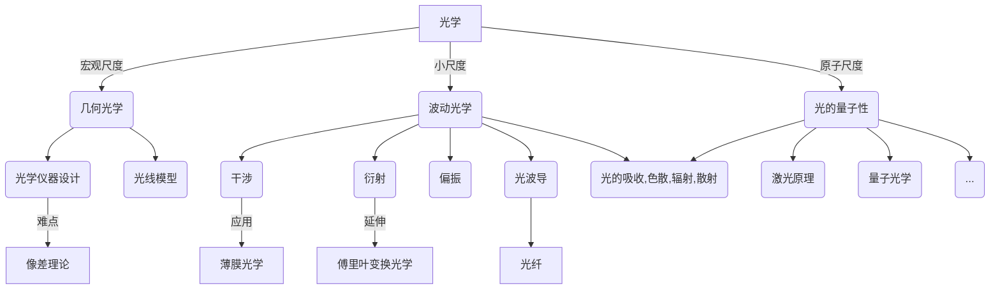

# 光学笔记

21世纪是光电子技术革命的起点，从随处可见的 LED、光纤网络再到当下热门的全息技术、VR 技术、自动驾驶技术……处处都有光电子技术的影子。正如历史上人们把法拉第发明的电磁感应发电机作为第二次工业革命（电气革命）的起点那样，几十年后人们一定会把梅曼发明第一台红宝石激光器作为光电子技术革命的起点[^激光器发明历史意义]。

光学是经典物理学向近代物理学过渡的桥梁和纽带 —— 黑体辐射导致量子论的诞生；迈克尔逊测量光在“以太”中的传播导致相对论的诞生，因此说光学是人们探索自然的指路明灯是毫不夸张的。

这份光学笔记是用 Markdown 编写而成的可分享笔记，笔记不仅可供学习备考还可用于科研、教学以及光电子设计的相关工作，需要大家一起编写，互相分享学习心得:smile:。

## 几何光学

[几何光学基础](./几何光学/几何光学基础.html)

[成像](./几何光学/成像.html)

## 波动光学

### 光的波动模型

[光波场](./波动光学/光的波动模型/光波场.html)

[光的叠加原理](./波动光学/光的波动模型/光的叠加原理.html)

[波动光学漫谈](./波动光学/光的波动模型/波动光学漫谈.html)

[波包与群速度](./波动光学/光的波动模型/波包与群速度.html)

### 干涉

[杨氏双缝干涉实验](./波动光学/干涉/杨氏双缝干涉实验.html)

[分波前的干涉装置](./波动光学/干涉/分波前的干涉装置.html)

[薄膜干涉](./波动光学/干涉/薄膜干涉.html)

[迈克尔孙干涉仪](./波动光学/干涉/迈克尔孙干涉仪.html)

[法布里-珀罗干涉仪](./波动光学/干涉/法布里-珀罗干涉仪.html)

[光的空间相干性与时间相干性](./波动光学/干涉/光的空间相干性与时间相干性.html)

### 衍射

[惠更斯-菲涅耳原理](./波动光学/衍射/惠更斯-菲涅耳原理.html)

[菲涅耳衍射](./波动光学/衍射/菲涅耳衍射.html)

[夫琅禾费衍射](./波动光学/衍射/夫琅禾费衍射.html)

[多缝夫琅禾费衍射](./波动光学/衍射/多缝夫琅禾费衍射.html)

[光栅光谱](./波动光学/衍射/光栅光谱.html)

### 偏振

[光的横波性](./波动光学/偏振/光的横波性.html)

[菲涅耳公式](./波动光学/偏振/菲涅耳公式.html)

[双折射](./波动光学/偏振/双折射.html)

[晶体光学器件](./波动光学/偏振/晶体光学器件.html)

[波片与光的偏振态](./波动光学/偏振/波片与光的偏振态.html)

[偏振光的干涉](./波动光学/偏振/偏振光的干涉.html)

## 光与物质的相互作用

[光的吸收](./光与物质的相互作用/光的吸收.html)

[光的色散](./光与物质的相互作用/光的色散.html)

[洛伦兹模型](./光与物质的相互作用/洛伦兹模型.html)

[光的散射](./光与物质的相互作用/光的散射.html)

## 傅里叶变换光学

[变换光学思想](./傅里叶变换光学/变换光学思想.html)

[透镜和棱镜的屏函数](./傅里叶变换光学/透镜和棱镜的屏函数.html)

[夫琅禾费衍射与傅里叶变换](./傅里叶变换光学/夫琅禾费衍射与傅里叶变换.html)

[阿贝成像原理](./傅里叶变换光学/阿贝成像原理.html)

[全息照相](./傅里叶变换光学/全息照相.html)

## 薄膜光学

[矩阵法薄膜光学计算](./薄膜光学/矩阵法薄膜光学计算/矩阵法薄膜光学性质计算.html)

## 激光原理

## 光纤通信

## 非线性光学

[^激光器发明历史意义]:联合国教科文组织将 5 月 16 日定为 “国际光日”(International Day of Light)，2018 年 5 月 16 日是第一个国际光日。在 1960 年的这一天，物理学家兼工程师西奥多·梅曼第一次成功产生激光。这一国际日旨在呼吁加强科学合作，发挥其促进和平与可持续发展的潜力。