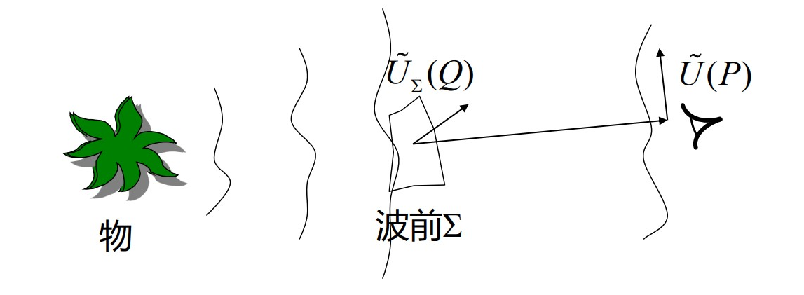
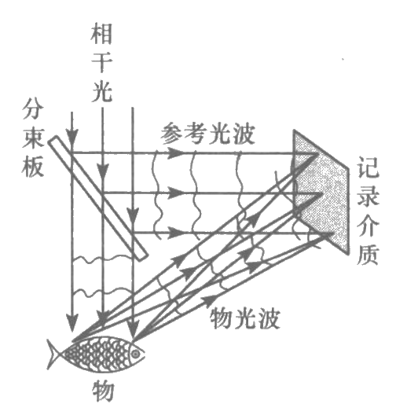
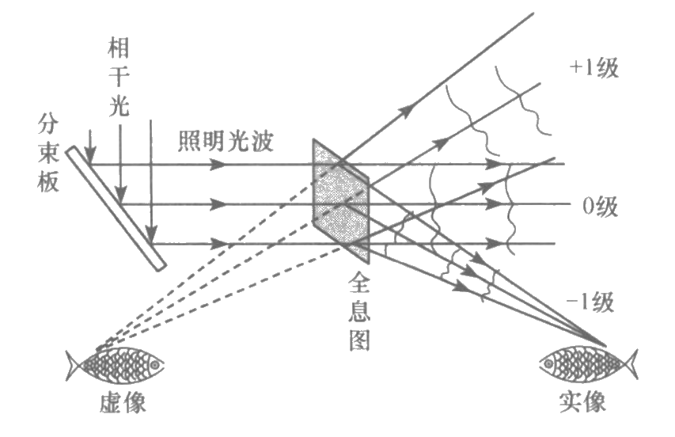

# 全息照相

[TOC]

## 全息历史

* 1948 年，Gabor 在研究提高电子显微镜分辨率的时候提出 **波前重建（Holography）** 的成像过程，现在人们把 **Holography** 叫做 **全息技术** *（源于希腊语中的 hobos 和 grammar）*
* 1960 年，激光器的诞生为全息提供了高亮度 **相干光源**，开启了全息技术革命
* 1962 年，在美国密执安大学从事雷达工作的利思和乌巴特尼克斯两个人，认识到伽博成像方法与合成孔径雷达问题的相似性，提出了 **离轴全息照相法**，并于 1963 年首先做出了第一张成功的全息照相
* 1962 年，前苏联科学家 Denisyuk 融合了 Lippmann[^李普曼]与 Gabor 的思想，首次拍摄出了 **反射式全息图**
* 1969 年，Benton 在全息图的碎片能再现物体完整像的启发下,提出了 **彩虹全息术**，首次利用 **二步法** 制成了彩虹全息图
* 1977 年，Cross 制成 **合成全息图**；1978 年，美籍华人陈选和杨振寰提出了 **一步彩虹全息**；1979 年，第一张彩色全息图问世

*全息技术是人类对 “光信息” 深刻理解的产物，是经典光学向现代光学过度时期具有里程碑意义的研究成果，被公认为是 20 世纪最伟大的发明之一* :smile:

## 全息照相基本原理

所谓 **全息照相**，就是要 **记录** 并 **再现** 物体表面的 **全部信息**，说得具体些就是能够记录并再现反映物体表面特征的光波场的振幅和相位信息

$$
\widetilde{O}(x,y)=O_0(x,y)e^{i\varphi_{_O}(x,y)}\Rightarrow\begin{cases}
    O_0(x,y)\Rightarrow物体表面各点亮度信息\\
    \varphi_{_{O}}(x,y)\Rightarrow物体表面纵向位置信息
\end{cases}
$$

因此，全息照相区别于传统照相

* 传统照相只记录了物光波的光强（振幅），相位信息丢失
* 全息照相同时记录了物光波的振幅与相位，能使光波场的全部信息再现

### 波前重建思想

从数学角度看，惠更斯-菲涅耳原理的实质就是 **无源空间中的光场分布由边界条件（波前）唯一确定**。

$$
\widetilde{U}(P)=\frac{-i}{2\lambda}\iint_{\Sigma} \widetilde{U}_0(Q) (\cos \theta_0+\cos \theta) \large\frac{e^{ikr}}{r} \small d\Sigma
$$

全息技术的理论依据正是这一点

    

$$
\begin{aligned}
    物光\Rightarrow波前函数\widetilde{U}_\Sigma(Q)&\Rightarrow P点\widetilde{U}(P)\Rightarrow人眼感受到物的存在\\
    只有波前函数\widetilde{U}_\Sigma(Q)&\Rightarrow P点\widetilde{U}(P)\Rightarrow人眼感受到物的存在
\end{aligned}
$$

即只要记录并再现了波前函数 $\widetilde{U}_\Sigma(Q)$，就能再现和物体一样的像。

### 第一步：波前函数记录

    

将物光波 $\widetilde{U}_O$ 与参考光波 $\widetilde{U}_R$ 在记录介质上相干叠加

$$
\begin{cases}
    \widetilde{U}_O=A_Oe^{i\varphi_O}\\
    \widetilde{U}_R=A_Re^{i\varphi_R}
\end{cases}
$$

记录介质上的复振幅分布

$$
\widetilde{U}(x,y)=\widetilde{U}_O+\widetilde{U}_R=A_Oe^{i\varphi_O}+A_Re^{i\varphi_R}
$$

光强分布

$$
I(x,y)=|\widetilde{U}(x,y)|^2=A_O^2+A_R^2+\widetilde{U}_O\widetilde{U}_R^*+\widetilde{U}_O^*\widetilde{U}_R
$$

光强分布中包含了关于振幅和相位的信息

### 第二步：线性冲洗得到全息图

记录介质上的光强分布需要经过线性的显影定影处理（线性冲洗），介质透过率函数与记录过程中的光强函数是线性关系

$$
\widetilde{t}(x,y)=t_0+\beta I(x,y)=t_0+\beta(A_O^2+A_R^2+\widetilde{U}_O\widetilde{U}_R^*+\widetilde{U}_O^*\widetilde{U}_R)
$$

冲洗得到的图片称作 **全息图**，全息图就是一张干涉图样，不能直接从上面看到物的形貌

### 第三步：光波场再现

用具有相干性的照明光波 $\widetilde{U}'_R=A'_Re^{i\varphi'_R}$ 照射全息图，从全息图上透射的光的复振幅为

$$
\begin{aligned}
    \widetilde{U}_T=\widetilde{U}'_R\widetilde{t}=&(t_0+\beta A_O^2+\beta A_R^2)\widetilde{U}'_R\Rightarrow0级波\\
    &+\beta A'_RA_Re^{i(\varphi'_R-\varphi_R)}\widetilde{U}_O\Rightarrow+1级波\\
    &+\beta A'_RA_Re^{i(\varphi'_R+\varphi_R)}\widetilde{U}^*_O\Rightarrow-1级波
\end{aligned}
$$

    

$+1$ 级波和 $-1$ 级波（孪生波）是物光波的再现

* $+1$ 级波是发散波，实物光强发生变化（$\beta A'_RA_R$ 作用），空间位置发生了平移（$e^{i(\varphi'_R-\varphi_R)}$ 作用）
* $-1$ 级波是会聚波，实物光强发生变化（$\beta A'_RA_R$ 作用），空间位置发生了平移（$e^{i(\varphi'_R+\varphi_R)}$ 作用）

## 全息照相的特点

* 用特定的单色光照射时，能在特定的方向和范围内再现物光束。
* 全息照片的每一部分都记录了整个物体各部分的全部信息。只是随着该部分尺寸的减小（相当于通光孔径减小），再现像的噪声增大，清晰度降低。
* 全息照片无正负之分，黑白相反时观察效果相同。全息照片易于复制。
* 一张全息照片可分别记录几个物光波，可储存信息量比普通照片多。
* 一张全息照片可对同一物体用同一参考光束进行两次曝光，显示其中的微小差别。

## 似全息而不是全息

利用干涉和衍射原理记录并再现物体真实的三维图像的全息投影技术的确是真实存在的，但并非人们在舞台表演和商业展览中常见的 “伪全息”。生活中常见的 “全息” 具有和全息投影相似的特点

* 可以裸眼观看，影像在空气中立体呈现
* 可以 360° 无死角地去观看立体影像

但它们并非真正地全息技术，它们大都采用了 **佩珀尔幻像**[^佩珀尔幻像]、边缘消隐等方法实现 3D 效果的类全息投影技术。比如，2013 年 ”虚拟” 邓丽君与周杰伦的隔空对唱，2015 年央视春晚李宇春的《蜀绣》，都是基于佩珀尔幻像的类全息。

实现 3D 显示效果的技术有很多，全息投影只是其中一种，全息技术与其他 3D 显示技术最大的区别是 **显示过程中，使用了全息图（条纹状的干涉图）**。

[^李普曼]:法国物理学家李普曼发明了基于干涉现象的彩色照相术（1891），获 1908 年诺贝尔物理学奖。
[^佩珀尔幻像]:[COMSOL博客 用射线光学解释佩珀尔幻象](http://cn.comsol.com/blogs/explaining-the-peppers-ghost-illusion-with-ray-optics/)