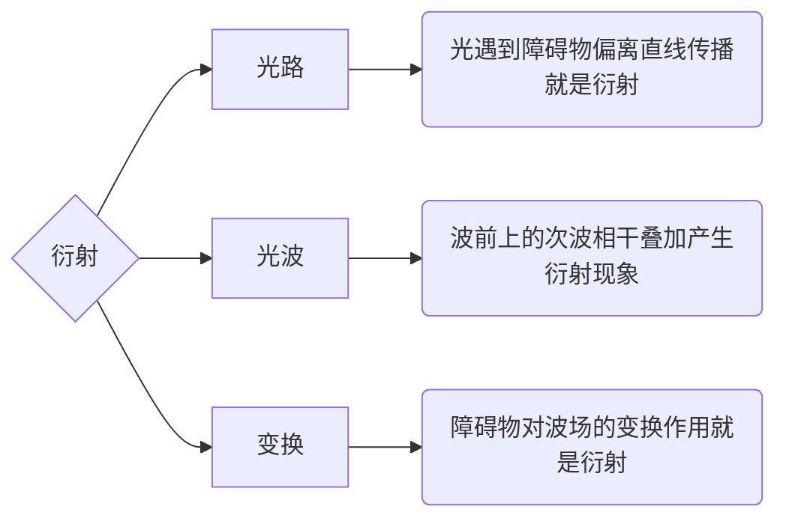
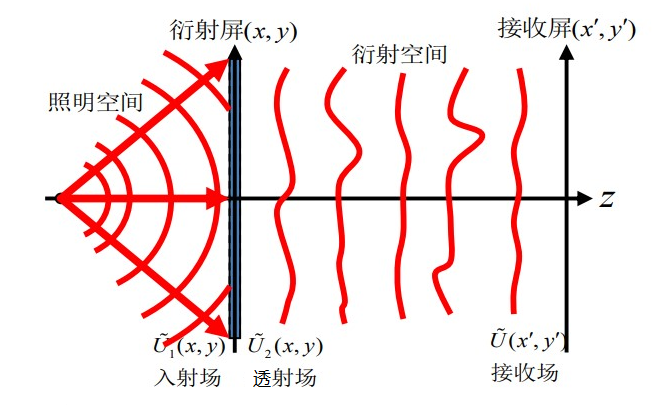

# 变换光学思想

[TOC]

## 衍射的三重理解

入射波场遇到障碍物之后，波场中各种物理量重新分布，相当于 “波前重构”。衍射障碍物将简单的入射场变换成了复杂的衍射场。因此可以从障碍物对波场的 **变换作用**，来分析衍射。

    

*从更广义的角度看，不仅仅是相干波场的障碍物，非相干系统中的一切使波场或者波面产生改变的因素，它们的作用都可以应用 **变换的方法** 来处理。*

## 衍射系统

### 衍射屏、照明空间和场

能使波前的复振幅（波前函数）发生改变的物，统称为 **衍射屏**。衍射屏将波的空间分为前场和后场，前场为 **照明空间**，后场为 **衍射空间**。波在衍射屏的前后表面处的复振幅或波前函数分别称为 **入射场**、**透射场（或反射场）**，接收屏上的复振幅为 **接收场**。

### 屏函数

衍射屏的作用是使入射场 $\widetilde{U}_1(x,y)$ 转换为透射场（或反射场）$\widetilde{U}_2(x,y)$

$$
\widetilde{t}(x,y)=\frac{\widetilde{U}_2(x,y)}{\widetilde{U}_1(x,y)}
$$

$\widetilde{t}(x,y)$ 为透过率或反射率函数，由衍射屏的特性决定，统称为 **屏函数**。屏函数为复数

$$
\begin{aligned}
    \widetilde{t}(x,y)&=t(x,y)\exp[i\varphi_t(x,y)]\\
    t(x,y)&\Rightarrow振幅的透过率\\
    \varphi_t(x,y)&\Rightarrow衍射所引起的相位改变
\end{aligned}
$$

模为常数的衍射屏称为相位型衍射屏，如透镜、棱镜等；幅角为常数的衍射屏称为振幅型衍射屏，如单缝、圆孔等。大多数衍射屏都是相幅型的，即模和幅角都不是常数。

### 接收场

确定接收场 $\widetilde{U}(x',y')$ 需要两个步骤，先根据屏函数得到透射场 $\widetilde{U}_2(x,y)$

$$
\widetilde{U}_2(x,y)=\widetilde{t}(x,y)\widetilde{U}_1(x,y)
$$

再利用菲涅耳-基尔霍夫衍射积分公式求出衍射场 $\widetilde{U}(x',y')$

$$
\widetilde{U}(x',y')=K\iint_\Sigma\widetilde{U}_1(x,y)\widetilde{t}(x,y)F(\theta_0,\theta)\frac{e^{ikr}}{r}\mathrm{d}x\mathrm{d}y
$$

其中，$r=\sqrt{(x'-x)^2+(y'-y)^2+z^2}$，$z$ 为接收屏到衍射屏的距离。

## 衍射系统的傅里叶变换方法

对于夫琅禾费系统，近轴条件下，倾斜因子 $F(\theta_0,\theta)=1$，接收屏上复振幅的衍射积分为

$$
\widetilde{U}(x',y')=K\iint_\Sigma\widetilde{U}_1(x,y)\widetilde{t}(x,y)\frac{e^{i\vec{k}\cdot\vec{r}}}{f}\mathrm{d}x\mathrm{d}y
$$

其中，入射场 $\widetilde{U}_1(x,y)$ 为平面波

$$
\widetilde{U}_1(x,y)=A\exp[ik(\sin\theta_1x+\sin\theta_2y)]
$$

相位差可以通矢量过 $\vec{r}$ 投影求解

$$
\vec{k}\cdot\vec{r}=\vec{k}\cdot(\vec{r}_0+\Delta\vec{r})=\vec{k}\cdot\vec{r}_0+k(\sin\theta'_1x+\sin\theta'_2y)
$$

因此可将接收场 $U(x',y')$ 表达为

$$
\widetilde{U}(x',y')=\frac{KA}{f}e^{i\vec{k}\cdot\vec{r}_0}\iint_\Sigma\widetilde{t}(x,y)e^{i(\omega_1x+\omega_2y)}\mathrm{d}x\mathrm{d}y\hspace{5ex}\begin{aligned}
    \omega_1&=k(\sin\theta_1+\sin\theta'_1)\\
    \omega_2&=k(\sin\theta_2+\sin\theta'_2)
\end{aligned}
$$

这个表达式告诉我们，**夫琅禾费衍射就是对于屏函数的傅里叶变换**。