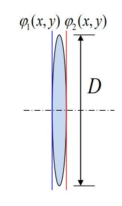
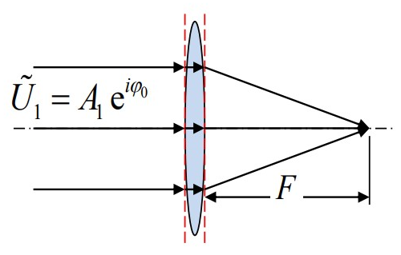
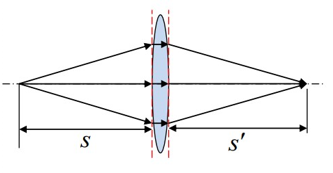
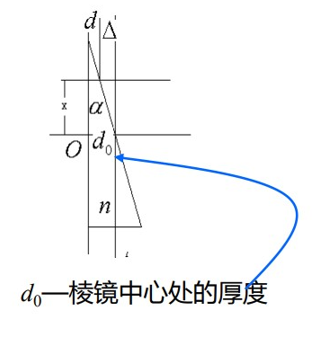

# 透镜和棱镜的屏函数

## 透镜的相位变换函数

    

有效口径为 $D$ 的透镜，透过率函数为

$$
\widetilde{t}_L=\frac{A_2}{A_1}\exp[i(\varphi_2-\varphi_1)]=\left\{\begin{aligned}
    &a(x,y)e^{i\varphi_{_L}(x,y)}&r<\frac{D}{2}\\
    &0&r>\frac{D}{2}
\end{aligned}\right.\hspace{5ex}r=\sqrt{x^2+y^2}
$$

若忽略透镜的反射与吸收，即 $A_2/A_1=1$，则

$$
\widetilde{t}_L=\exp[i\varphi_L(x,y)]=\exp\{i[\varphi_2(x,y)-\varphi_1(x,y)]\}
$$

透镜一方面限制光束范围，充当了光瞳，另一方面改变波前复振幅分布，充当衍射屏。

    

入射波前和出射波前取平面，傍轴近似下，透镜中的光线平行于光轴。经透镜后的相位差为

$$
\begin{aligned}
    \varphi_{_L}(x,y)&=\frac{2\pi}{\lambda}[\Delta_1+\Delta_2+nd(x,y)]\\
    &=\varphi_0-\frac{2\pi}{\lambda}(n-1)(\Delta_1+\Delta_2)
\end{aligned}
$$

$\varphi_0=nd_0$ 与波前上的位置 $(x,y)$ 无关，对相位变换不起作用，可略去。近轴条件下

$$
\begin{aligned}
    \Delta_1&=r_1-\sqrt{r_1^2-(x^2+y^2)}\approx\frac{x^2+y^2}{2r_1}\\
    \Delta_2&=-r_2-\sqrt{r_2^2-(x^2+y^2)}\approx-\frac{x^2+y^2}{2r_2}
\end{aligned}
$$

最终可以把相位差写为

$$
\varphi_{_L}(x,y)=-\frac{2\pi}{\lambda}\frac{n-1}{2}\left(\frac{1}{r_1}-\frac{1}{r_2}\right)(x^2+y^2)=-k\frac{x^2+y^2}{2F}\hspace{5ex}F=\frac{1}{(n-1)\left(\frac{1}{r_1}-\frac{1}{r_2}\right)}
$$

$F$ 正好与几何光学中的磨镜者公式一致，也就是说 $F$ 就是透镜焦距。因此，透镜的相位变化函数为

$$
\widetilde{t}_L(x,y)=\exp\left(-i\frac{x^2+y^2}{2F}\right)
$$

### 屏函数与几何光学

    

**平面波平行光轴入射**

$$
\begin{aligned}
    \widetilde{U}_1&=A_1e^{i\varphi_0}\\
    \widetilde{U}_2&=\widetilde{U}_1\widetilde{t}_L(x,y)=A_1\exp\left(-ik\frac{x^2+y^2}{2F}+i\varphi_0\right)
\end{aligned}
$$

出射场为汇聚到轴上 $F$ 处的球面波，焦距 $f=F$

    

**球面波入射**
$$
\begin{aligned}
    \widetilde{U}_1&=A_1\exp\left(ik\frac{x^2+y^2}{2s}\right)\\
	\widetilde{U}_2&=\widetilde{U}_1\widetilde{t}_L(x,y)=A_1\exp\left[-ik\frac{x^2+y^2}{2}\left(\frac{1}{F}-\frac{1}{s}\right)\right]
\end{aligned}
$$

出射场为汇聚于轴上 $s'$ 处的球面波

$$
\frac{1}{F}-\frac{1}{s}=\frac{1}{s'}
$$

正是几何光学中的高斯公式。

## 棱镜的相位变换函数

    

对于薄的楔形棱镜，其相位差为

$$
\varphi_{_P}(x,y)=\frac{2\pi}{\lambda}(\Delta+nd)=\varphi_0-\frac{2\pi}{\lambda}(n-1)\Delta
$$

其中，$\varphi_0=\frac{2\pi}{\lambda}nd_0$ 为常数，可略去。当交棱与 $y$ 轴平行时 $\Delta=\alpha x$；当交棱在 $xOy$ 平面内任意取向时，可用棱镜斜边与 $x$ 轴和 $y$ 轴的夹角 $\alpha_1,\alpha_2$ 表示 $\Delta$ 为

$$
\Delta=\alpha_1x+\alpha_2y
$$

因此在忽略反射与吸收的情况下，棱镜的透过率函数为

$$
\widetilde{t}_{_P}=\exp[-ik(n-1)(\alpha_1 x+\alpha_2y)]
$$