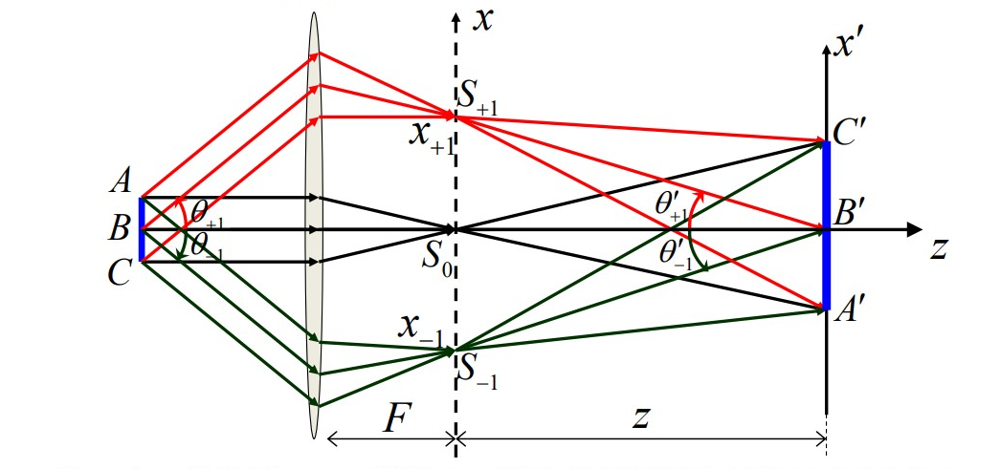
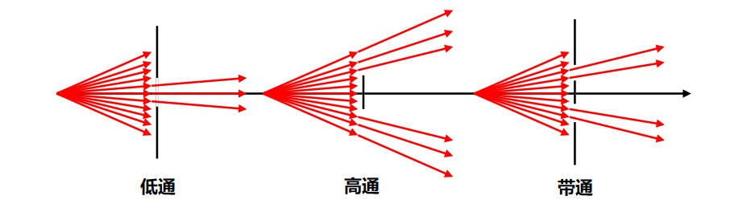
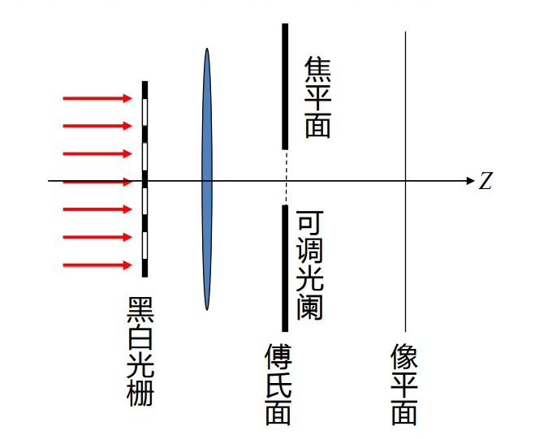
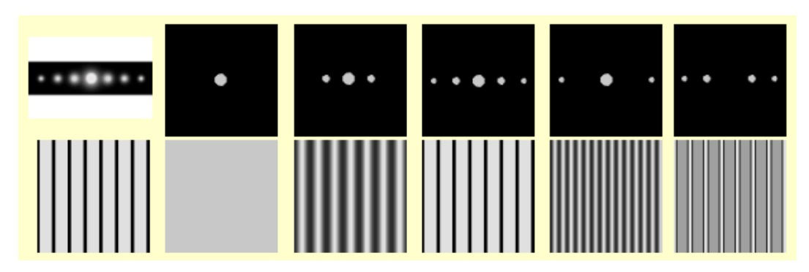
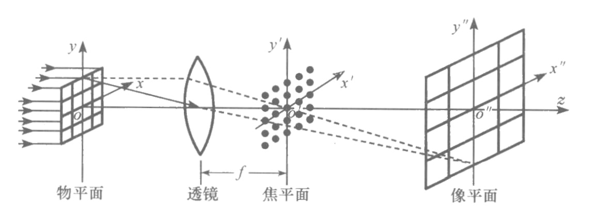
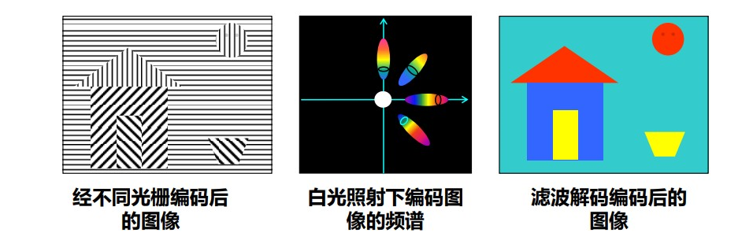

# 阿贝成像原理[^阿贝成像原理]

[TOC]

## 阿贝对成像的理解

1874 年，阿贝在 **蔡司光学公司** 任职期间对成像过程产生新的理解

* 可以从几何光学的角度，即光线的折射来说明成像过程
* 也可以从夫琅禾费衍射的角度，即对波前的变换来说明成像的过程

    

对于如图傍轴小物（单色平行相干光照明）经透镜成像问题，阿贝从（空间）频谱转换角度给出了解释，即 **阿贝成像原理** —— 物可以看成是一系列不同空间频谱的集合，相干成像分两步完成

* 第一步，物光波（屏函数的平面波）经过透镜在其焦平面上汇聚成衍射斑（点光源）
* 第二步，焦平面上的衍射斑作为相干的点光源，发出的次波在像平面上相干叠加

$$
\boxed{物\xrightarrow[衍射]{傅里叶变换}衍射斑\xrightarrow[衍射斑干涉]{傅里叶逆变换}像}
$$

阿贝用过分析正弦光栅成像给出了阿贝成像原理的数学证明，并推广至任意的傍轴小物（任意的物都可以经傅里叶变换拆解为正弦光栅的叠加）。对于正弦光栅产生的三列透射波，经透镜聚汇聚于焦平面的三个衍射斑上

$$
\begin{aligned}
    \widetilde{U}_{+1}&\propto\frac{1}{2}A_1t_1\exp(ik\overgroup{BS}_{_{+1}})\\
    \widetilde{U}_0&\propto A_1t_0\exp(ik\overgroup{BS}_0)\\
    \widetilde{U}_{-1}&\propto\frac{1}{2}A_1t_1\exp(ik\overgroup{BS}_{_{-1}})\\
\end{aligned}
$$

近轴近似下，计算三个衍射斑发出的次波在像平面上产生的复振幅

$$
\begin{aligned}
    \widetilde{U}_0(x',y')&\propto\widetilde{U}_0\exp(ik\overgroup{S_0B'})\exp\left(ik\frac{x'^2+y'^2}{2z}\right)\\
    &\propto A_1t_0\exp(ik\overgroup{BS_0B'})\exp\left(ik\frac{x'^2+y'^2}{2z}\right)\\\\
    \widetilde{U}_{\pm1}(x',y')&\propto\widetilde{U}_{\pm1}\exp(ik\overgroup{S_{_{\pm1}}B'})\exp\left(ik\frac{x'^2+y'^2}{2z}\right)\exp\left(ik\frac{x'x_{\pm1}+y'y_{\pm1}}{z}\right)\\
    &\propto\frac{1}{2}A_1t_1\exp(ik\overgroup{BS_{_{\pm1}}B'})\exp\left(ik\frac{x'^2+y'^2}{2z}\right)\exp\left(ikx'\sin\theta'_{_{\pm1}}\right)
\end{aligned}
$$

根据物像之间的等光程性得到三列波在像平面上相干叠加的干涉场为

$$
\begin{aligned}
    \widetilde{U}_I(x',y')&=\widetilde{U}_0(x',y')+\widetilde{U}_{+1}(x',y')+\widetilde{U}_{-1}(x',y')\\
    &=A_1\exp[i\varphi(x',y')]\left\{t_0+\frac{t_1}{2}[\exp(ikx'\sin\theta'_{+1})+\exp(ikx'\sin\theta'_{-1})]\right\}
\end{aligned}
$$

根据阿贝正弦条件[^阿贝正弦条件]可得

$$
kx'\sin\theta'_{_{\pm1}}=\frac{kx'\sin\theta_{_{\pm1}}}{V}=\frac{2\pi}{\lambda V}(\pm f\lambda)=\pm2\pi\frac{f}{V}x'
$$

最终发现像光波与物光波是相似的，两者的确是物像关系，阿贝对成像的理解从数学上来说是正确的

$$
\begin{aligned}
    \widetilde{U}_I(x',y')&\propto A_1e^{i\varphi(x',y')}\left[t_0+t_1\cos\left(2\pi\frac{f}{V}x'\right)\right]\\
    \widetilde{U}_O(x,y)&=A_1(t_0+t_1\cos2\pi fx)
\end{aligned}
$$

* 空间频率，$f\to f/V$ 表示像的几何放大与缩小
* 像质的反衬度：$\gamma_{_O}=\gamma_{_I}=t_1/t_1$，成像前后反衬度不变

**阿贝成像原理的要点是成像过程的中间一环（夫琅禾费衍射图样），其实质上就是物面波前的空间频谱。也就是说阿贝成像原理的真正价值在于它提供了一种新的频谱语言来描述信息，启发人们用改变频谱的手段来改造信息。可以说，现代变换光学中和空间频率打交道的东西都源于阿贝成像原理，比如空间滤波技术和光学信息处理。**

## 阿贝-波特空间滤波实验

$$
\begin{aligned}
    \underbrace{物\xrightarrow{频谱展开}衍射斑\xrightarrow{信息重建}像}_{阿贝成像原理}\hspace{1cm}\underbrace{限制衍射斑\rightarrow选频\rightarrow改变图像}_{空间滤波}
\end{aligned}
$$

光学中把能够直接改变光信息空间频谱的器件通称为 **空间滤波器**，一般是放在傅里叶面后面限制衍射斑的光阑。

    

空间滤波实验是对阿贝成像原理最好的验证。阿贝-波特空间滤波实验采用单色平行光照射（保证其相干性），以黑白光栅为物，在傅里叶面上加一可调狭缝，观察像的变化。

    

**实验1** 只让 $0$ 级级直流成分通过，则像平面被 $0$ 级斑发出的球面波照明，近轴条件下，被均匀照明。

**实验2** 只让 $0$ 级和 $\pm1$ 级通过，则像平面上是 $0$ 和 $\pm1$ 三个衍射斑发出的次波的相干叠加（正弦光栅的像）

$$
\widetilde{U}_I(x',y')\propto a_0+2a_1\cos\left(k\frac{x_1}{z}x\right)
$$

**实验3** 让 $0$ 级、$\pm1$ 级和 $\pm2$ 级通过狭缝，像平面上的复振幅

$$
\widetilde{U}_I(x',y')\propto a_0+2a_1\cos\left(k\frac{x_1}{z}x\right)+2a_2\cos\left(k\frac{x_2}{z}x\right)
$$

由于更多高频信号的加入，复振幅的分布更接近于方波，而像的黑白界限更清晰。

**实验4** 使 $0$ 级之外所有衍射斑都通过狭缝，像平面上的复振幅

$$
\widetilde{U}_I(x',y')\propto a_0+2a_1\cos\left(k\frac{x_1}{z}x\right)+2a_2\cos\left(k\frac{x_2}{z}x\right)+2a_3\cos\left(k\frac{x_3}{z}x\right)+\cdots
$$

此时，黑白光栅不透光部分在接收屏上也是亮的。

    

## 光学信息处理

### 网格滤波

空间滤波正是通过对傅里叶面的处理，实现对图像处理。比如入射物光是矩形网格，其夫琅禾费衍射衍射频谱就是二维的点，遮挡频谱中的某些成分，从而改变成像。

    

遮挡频谱的方式不同，所成的像也不同

    

### $\theta$ 滤波（分光滤波）

由于衍射角 $\sin\theta=f\lambda$ 与波长有关，波长越长，衍射角越大，因而可以在每一衍射斑上设置一个狭缝，该狭缝位置不同，则通过的波长不同，从而起到滤色的作用。

    

## 相衬显微镜

显微镜下观察无色生物切片时，由于这类样品不会引起透射光振幅的改变

$$
\tilde{t}(x,y)=e^{i\varphi(x,y)}
$$

导致图像衬比很小，不容易分辨细节。泽尼克基于阿贝成像原理提供的空间滤波的概念，提出通过 **相移** 的方式增加图像的反衬度。

平面光照射样品，物平面发出的物光波为

$$
\widetilde{U}_O(x,y)=A_1\widetilde{t}(x,y)=A_1e^{i\varphi(x,y)}=A_1\left(1+i\varphi-\frac{1}{2!}\varphi^2-\frac{i\varphi^3}{3!}+\cdots\right)
$$

衍射后在傅里叶面上形成一系列衍射斑，在傅里叶面上 $0$ 级斑处加一滴液体，使直流成分产生相移 $\delta$，则像平面的复振幅与物光波稍有不同

$$
\widetilde{U}_I(x',y')=A_1\left(e^{i\delta}+i\varphi-\frac{1}{2!}\varphi^2-\frac{i\varphi^3}{3!}+\cdots\right)=A_1[(e^{i\delta}-1)+e^{i\varphi}]
$$

在像平面产生的光强分布

$$
\begin{aligned}
    I(x',y')&=\widetilde{U}_I(x',y')\widetilde{U}^*_I(x',y')\\
    &=A_1^2(e^{i\delta}-1+e^{i\varphi})(e^{-i\delta}-1+e^{-i\varphi})\\
    &=A_1^2[3+2\cos\delta\cos\varphi+2\sin\delta\sin\varphi-2\cos\delta-2\cos\varphi]
\end{aligned}
$$

对与很薄的生物切片 $\varphi\ll1$，可作近似

$$
I(x',y')\approx A_1^2[1+2\varphi(x,y)\sin\delta]
$$

因此在相衬显微镜中，图像的反衬度取决于相移 $\delta$，当 $\delta=\pm\pi/2$ 时，反衬度最大。

>“相衬法不是在与显微镜打交道时被发现的，而是在光学领域的另一个不同的方面。它萌动于也即我对衍射光栅的兴趣，这大约始于1920年。”
>
>“我深感于人类头脑的很大局限性，我们学习模仿先人已经做过或想过的事情是多么的快，而理解也即是看到深层的联系又是多么的慢。然而，其中最慢的莫过于发现新的联系，或甚至是去运用旧观念于一个新领域。” —— 泽尼克

[^阿贝成像原理]:100 多年前，德国人阿贝在蔡司光学公司任职期间研究如何提高显微镜的分辨本领问题时，提出了关于相干成像的一个新原理。现在看来，当初的阿贝成像原理已为现代变换光学中正在兴起的空间滤波和信息处理的概念奠定了基础。—— 赵凯华《光学》
[^阿贝正弦条件]:阿贝正弦条件：$ny\sin u=n'y'\sin u'\xrightarrow{n'=n}\sin u'/\sin u=1/V$，$V$ 为像的横向放大率

