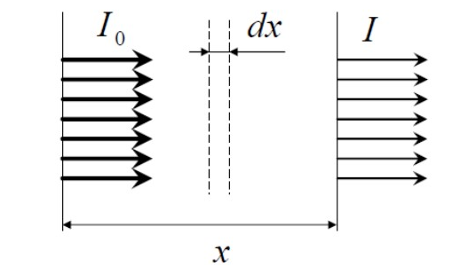
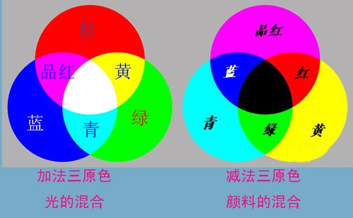

# 光的吸收

[TOC]

## 线性吸收的实验规律

    

实验研究表明，当光强不是很大时，在透明介质中，被吸收的光强与吸收体的厚度成正比。在均匀介质中取一厚度为 $\mathrm{d}x$ 的薄层，光经过薄层前后，强度由 $I$ 减为 $I+\mathrm{d}I$

$$
-\mathrm{d}I=\alpha I\mathrm{d}I
$$

光强线性微分方程的解

$$
I=I_0e^{-\alpha x}
$$

告诉我们，透明介质对光强的吸收是随厚度线性变化的，出射光的光强会随厚度指数衰减。这一规律称为 **布格尔定律** 或 **朗伯定律**。微分方程中，$\alpha$ 是与介质有关的常数[^吸收系数]，称为吸收系数。

在溶液中，光的线性吸收规律依然成立，吸收系数与溶液的浓度成正比

$$
\alpha=AC\Rightarrow I=I_0e^{ACx}
$$

$C$ 为溶液的浓度，$A$ 为与溶液有关的常数，称为吸光度。这一定律也称作 **比尔定律**。

## 复折射率

研究光的折射问题时，人们把 **折射率** 定义为真空光速与媒质光速之比 $n=c/v$，折射率能很好地描述光波的相位传递

$$
\widetilde{E}=\widetilde{E}_0\exp\left[{-i\omega\left(t-\frac{x}{v}\right)}\right]=\widetilde{E}_0\exp\left[{-i\omega\left(t-\frac{nx}{c}\right)}\right]
$$

在描述光的吸收问题时，人们引入 **复折射率** 概念

$$
\widetilde{n}=n(1+i\kappa)\Rightarrow\begin{cases}
    实部\rightarrow相位推进（折射）\\
    虚部\rightarrow强度衰减（吸收）
\end{cases}
$$

复折射率描述光强衰减为

$$
\begin{aligned}
    \widetilde{E}&=\widetilde{E}_0\exp\left[{-i\omega\left(t-\frac{\widetilde{n}x}{c}\right)}\right]\\
    &=\widetilde{E}_0e^{-n\kappa\omega x/c}\exp\left[{-i\omega\left(t-\frac{nx}{c}\right)}\right]\\\\
    I&=\left|\widetilde{E}_0\right|^2e^{-2n\kappa\omega x/c}
\end{aligned}
$$

因此，负折射率的虚部 $n\kappa$ 反映了媒质对光的吸收而使光强衰减，吸收系数 $\alpha$

$$
\alpha=\frac{4\pi}{\lambda}n\kappa
$$

## 吸收系数与波长

**普遍吸收**：吸收系数与波长无关，吸收后所有成分的光强不变。这种情况实际上是不存在的，有一些物质仅仅对某一波段的光波均匀吸收。例如，可以认为纯净的空气和玻璃对可见光普遍吸收，但对紫外光和波长更短的光有较强烈的吸收。

**选择吸收**：介质对不同波长的光有不同的吸收系数，$\alpha=\alpha(\lambda)$。选择吸收反映了物质的能级结构，介质中的原子吸收入射光（能级间隔与入射光子能量匹配，受激吸收），发生跃迁。

* **能级**（孤立原子，固体中稀土离子）$\Rightarrow$ 吸收光谱为线状谱
* **能带**（凝聚态物质）$\Rightarrow$ 吸收光谱为带状谱

## 光与色

* **色光三基色** —— 红(Red)、绿(Green)、蓝(Blue)
* **颜料三原色** —— 品红(Magenta)、黄(Yellow)、青(Cyan)

色光三基色根据加色原理混合出其他颜色的光；颜料三原色根据减色原理（反射该颜色的光，吸收其他颜色的光）混合出其他颜色的光。

    

所以，色光三基色能混合出白色光，但是颜料三原色只能混合出黑色（中国画里黑色还真的是其他颜色调出来的:smile:）。因此，色光三基色用于电视机、计算机屏幕等主动发光的场合；颜料三原色应用于各种被动发光的场合。

[^吸收系数]:在光强不是很大的情况下，吸收系数 $\alpha$ 与光强 $I$ 无关，但与光的波长（频率）有关。在强光条件下（比如激光），布格尔定律不再成立。