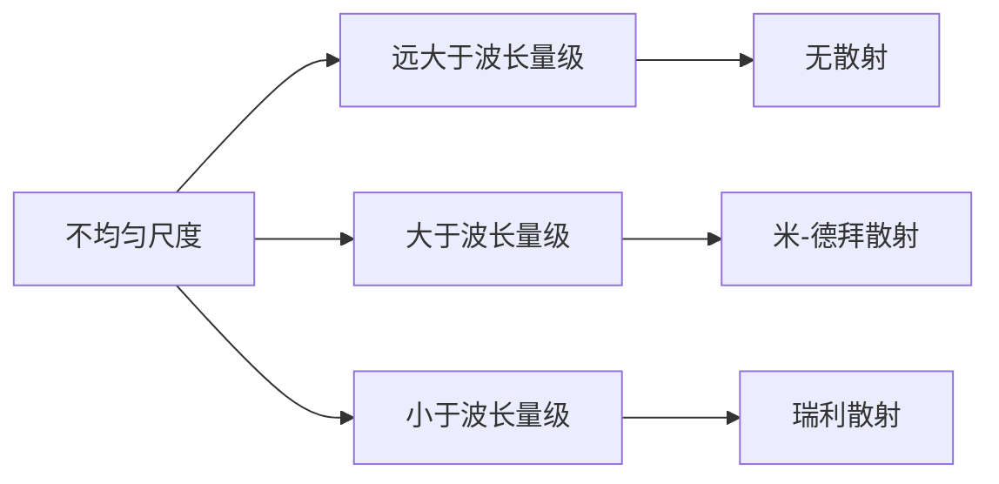
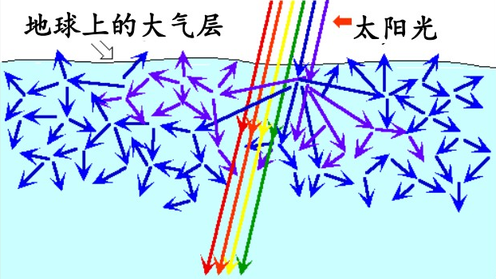
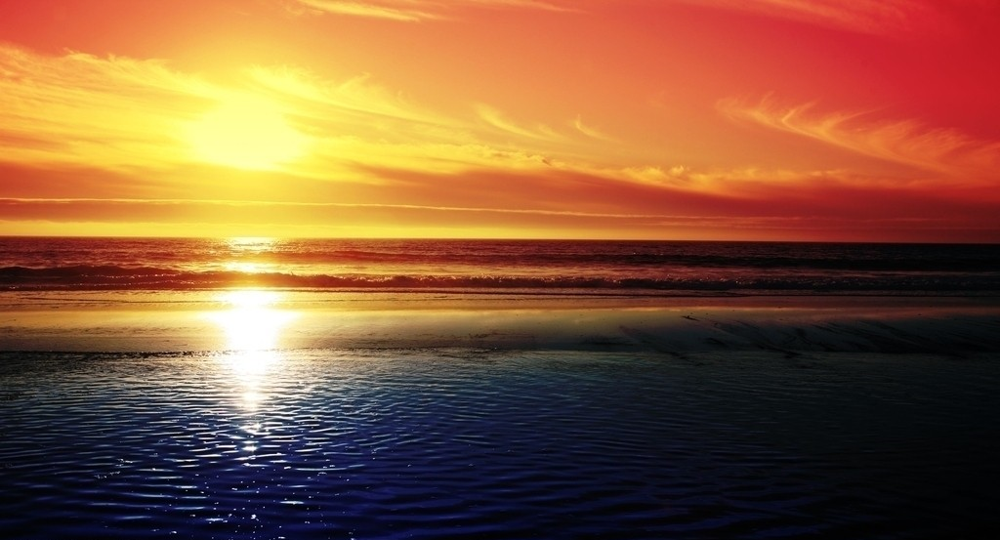
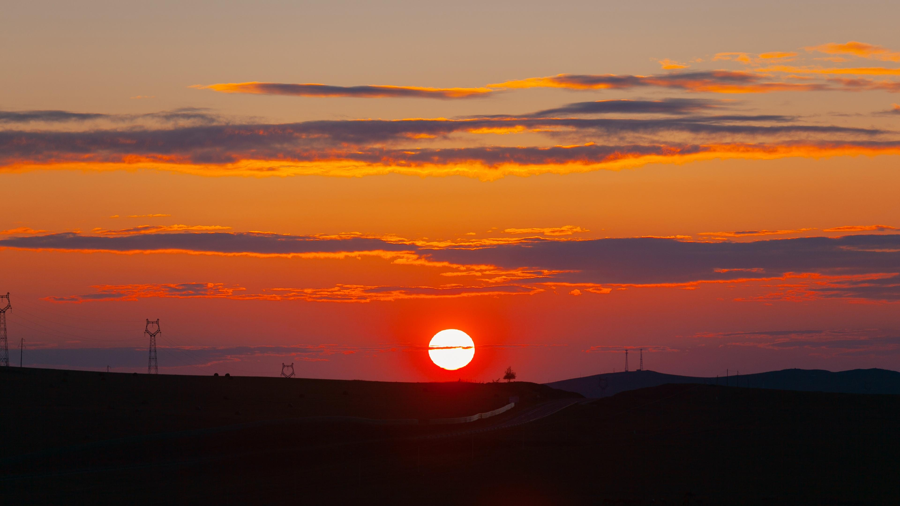

# 光的散射

[TOC]

## 散射现象

光通过 **均匀** 的透明介质时，从侧面是很难看到光线的；如果介质 **不均匀**，我们可从侧面清晰地看到光束的轨迹（胶体的丁达尔效应）。这是 **介质的不均匀性** 使得光线朝四面八方 **散射** 的结果。根据散射机制的不同，可将散射分为两类

* 悬浮质点的散射，均匀分布或悬浮在媒质中的质点，如空气中的尘埃，溶液中的胶体等。
* 分子散射，虽然介质是均匀的，但是由于分子的热运动，会在其中产生密度的起伏，从而产生散射。

## 散射定律

没有绝对的均匀，所谓均匀、不均匀都是相对波长尺度而言的。

### 瑞利散射

当散射体的尺度小于波长时，入射光中不同的波长成分有不同的散射，实验和研究表明，散射光强与入射光波长的四次方成反比

$$
I\propto\frac{1}{\lambda^4}
$$

### 米-德拜散射

当散射体颗粒度大于波长时，散射光强对波长的依赖性不强，各个波长成分的散射光强相差不大。

## 自然现象解释

### 天空为什么是蓝色的

我们能看见明亮的天空是因为太阳光被大气散射，散射光进入我们人眼（月球上没有大气，所以月球上只能看见黑茫茫的宇宙）。大气中的分子以及其中细小的尘埃颗粒会对日光产生明显的散射（瑞利散射），短波成分散射较强，使得晴朗的天空呈现蓝色。

    

### 霞光为什么是橙色的

日出、日落时，阳光经过比较厚的大气层，蓝色光散射殆尽，天色呈现橘红色

    

### 太阳的颜色为什么会变

白天时，阳光经过比较薄的大气层，蓝色光散射较少，呈现白色太阳

日出、日落时，阳光经过比较厚的大气层，蓝光散射较多，呈现橙红色太阳

    

### 云朵为什么是白色的

云雾由水滴组成，水滴的直径可以与光的波长相比，发生米-德拜散射，即水滴向四面八方散射各种颜色的光。同时空气中较大的水滴会反射太阳光，使得天上的云朵是白色的。

* 云层薄 $\Rightarrow$ 白云
* 云层厚 $\Rightarrow$ 乌云
* 日出日落 $\Rightarrow$ 彩云