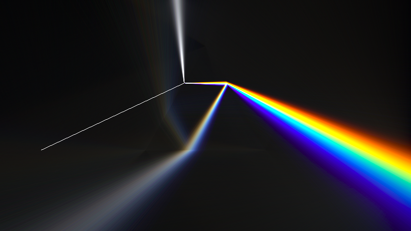
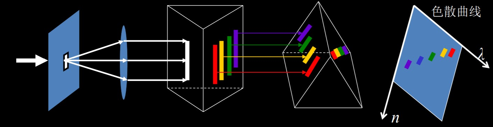
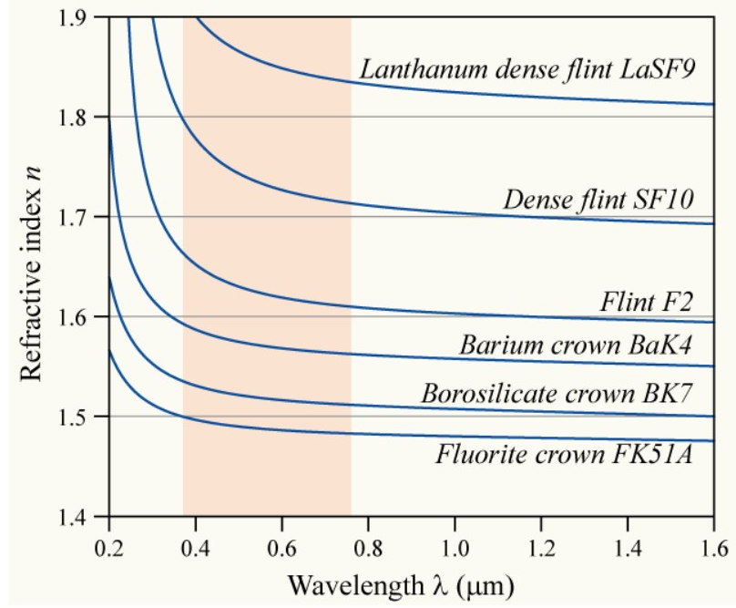

# 光的色散

[TOC]

## 色散现象

光在媒质中的传播速度或折射率随波长改变而导致不同不同波长的光在空间上分开，形成 **色散**[^色散]

$$
v=v(\lambda)\hspace{1cm}n=n(\lambda)
$$

    

## 色散规律

牛顿（就是那个坐在苹果树下的牛顿:smile:）最早用三棱镜把太阳光色散分解为彩色光带，并最早用交叉棱镜实验得到色散曲线（$n-\lambda$ 图线）

    

    

实验研究表明，凡在可见光范围内无色透明的物质，它们的色散曲线很相似

* $n$ 随 $\lambda$ 增加而单调下降
* 下降率在波长小的地方更大

这种色散被称为 **正常色散**，柯西（就是那个高数课本上的柯西:smile:）根据实验数据给出了一个正常色散的经验公式

$$
n=A+\frac{B}{\lambda^2}+\frac{C}{\lambda^4}
$$

在波长范围不是很大时，柯西公式可以只取前两项

$$
n=A+\frac{B}{\lambda^2}
$$

但是，实验[^伍德实验]表明，一般情况下物质存在一个吸收带，该波段的光会被介质强烈吸收，不能通过介质，也就无法测量这一波长范围内介质的折射率。光的色散在这一区域的表现被称为 **反常色散**。

    

其实，反常色散是任何物质在吸收线附近所共有的现象，本来就无所谓 “正常” 和 “反常”，即任何一种物质的全部色散曲线都是由一系列正常色散段和反常色散段构成。

[^色散]:广义上的色散指不同颜色（频率）的光（电磁波）在空间中散开，比如光的干涉、衍射都有可能导致色散。
[^伍德实验]:伍德用交叉棱镜法做钠蒸汽色散实验