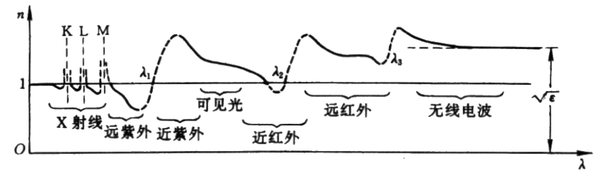

# 洛伦兹模型

[TOC]

## 经典电偶极子模型

经典电磁理论告诉我们

$$
\begin{aligned}
    静止的电荷&\xrightarrow{产生}静电场\\
    匀速运动的电荷&\xrightarrow{产生}稳恒磁场\\
    加速运动电荷&\xrightarrow{产生}电磁波
\end{aligned}
$$

在外场作用下，原子核的正电中心与核外电子的负电中心不再重合，即振幅中心分离，介质被极化，电子与离子形成 **电偶极子**。将电偶极子作为 **弹性振子** 处理，弹性系数为 $k$，振子有一个固有角频率 $\omega_0$。介质中的电偶极子被外部能源激（比如光波 $\vec{E}$）发后，做受迫振动，并辐射出电磁波。这种 **把电偶极子处理为弹性振子解释受激原子发光的模型** 最初是由洛伦兹提出的，因而也称作 **洛伦兹模型**。

### 定量计算

电偶极子在外电场 $\vec{E}$ 作用下做受迫振动

$$
m\ddot{\vec{r}}+g\dot{\vec{r}}+k\vec{r}=-e\vec{E}
$$

$m$ 为电子质量，$\vec{r}$ 为电子偏离平衡位置位移，$g\dot{\vec{r}}$ 为阻尼，$k\vec{r}$ 表示回复力。可根据谐振子模型的处理方法将受迫振动方程处理为

$$
\ddot{\vec{r}}=-\frac{e\vec{E}}{m}-\omega_0^2\vec{r}-\gamma\dot{\vec{r}}
$$

$\omega_0=\sqrt{k/m}$ 为电子本征频率，$\gamma=g/m$ 为阻尼常数。设外场电场 $\vec{E}=\vec{E}_0e^{-i\omega t}$，则受迫振动的解为

$$
\vec{r}=\frac{e\vec{E}_0}{m}\frac{1}{(\omega_0^2-\omega^2)+i\omega\gamma}e^{-i\omega t}
$$

## 单一本征频率

讨论介质中的束缚电子只有单一的本征频率。入射电场的作用下，电介质极化

$$
\widetilde{\vec{P}}=-NZe\vec{r}=\widetilde{\chi}\varepsilon_0\vec{E}
$$

$N$ 为原子的数密度，$Z$ 为每个原子中参与形成电偶极子的核外电子数。由此得到相对介电常数

$$
\begin{aligned}
    \widetilde{\varepsilon}_r&=1+\widetilde{\chi}\\
    &=1-\frac{NZe^2}{\varepsilon_0m}\frac{1}{\omega^2-\omega_0^2+i\omega\gamma}
\end{aligned}
$$

光学中的折射率（复折射率）只与相对介电常数有关

$$
\widetilde{n}^2=\widetilde{\varepsilon}_r\Rightarrow [n(1+i\kappa)]^2=1-\frac{ZNe^2}{\varepsilon_0m}\frac{1}{\omega^2-\omega_0^2+i\omega\gamma}
$$

得到电介质折射率的亥姆霍兹方程

$$
\left\{\begin{aligned}
    n^2(1-\kappa^2)&=1-\frac{ZNe^2}{\varepsilon_0m}\frac{\omega^2-\omega_0^2}{(\omega^2-\omega_0^2)^2+(\omega\gamma)^2}\\
    2n^2\kappa&=\frac{ZNe^2}{\varepsilon_0m}\frac{\omega\gamma}{(\omega^2-\omega_0^2)^2+(\omega\gamma)^2}
\end{aligned}\right.
$$

在弱吸收情况下，$\kappa\ll1$

    

$$
n^2=1-\frac{ZNe^2}{\varepsilon_0m}\frac{\omega^2-\omega_0^2}{(\omega^2-\omega_0^2)^2+(\omega\gamma)^2}
$$

可见，介质的折射率可能大于 $1$，也可能小于 $1$，甚至是负值。

* $0\leqslant\omega\leqslant\omega_0$ 时，$n>1$，$n$ 随 $\omega$ 的增加而增加，满足 Cauchy 公式，为正常色散区
* $\omega=\omega_0$ 时，$n$ 达最大值，产生共振吸收（$n\kappa$ 吸收峰），在吸收区 $MN$ 内，$n$ 随 $\omega$ 的增加而减小，为反常色散区
* $\omega_0\leqslant\omega<\infty$ 时，$n<1$，满足 Sellmeier 公式，为正常色散区

## 多个本征频率

实际上，介质中有多个原子体系，每一个原子系统有一系列本征频率

$$
\omega_1,\omega_2,\omega_3,\cdots,\omega_j,\cdots
$$

阻尼系数也各不相同

$$
\gamma_1,\gamma_2,\gamma_3,\cdots,\gamma_j,\cdots
$$

设相应模式的振子个数为

$$
f_1.f_2,f_3,\cdots,f_j,\cdots
$$

则相对介电常数 $\widetilde{\varepsilon}_r$

$$
\widetilde{\varepsilon}_r=1-\frac{Ne^2}{\varepsilon_0m}\sum_{j}\frac{f_j}{\omega^2-\omega_j^2+i\omega\gamma_j}
$$

可得到折射率的亥姆霍兹方程

$$
\left\{\begin{aligned}
    n^2(1-\kappa^2)&=1-\frac{Ne^2}{\varepsilon_0m}\sum_j\frac{f_j(\omega^2-\omega_j^2)}{(\omega^2-\omega_j^2)^2+(\omega\gamma_j)^2}\\
    2n^2\kappa&=\frac{Ne^2}{\varepsilon_0m}\frac{f_j\gamma\omega}{(\omega^2-\omega_j^2)^2+(\omega\gamma_j)^2}
\end{aligned}\right.
$$

得到的便是一系列正常色散区与反常色散区组成的色散曲线

    

