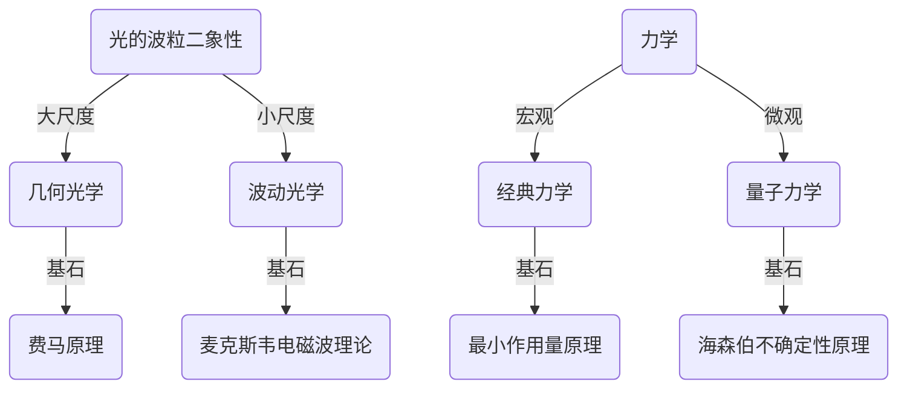

# 几何光学基础

几何光学是关于物体所发出的**光线**经**光学系统**后**成像**的理论，几何光学是建立在实验的基础之上的。在媒介物质中，光总是沿直线、折线或曲线传播，因此可以用几何光学上的线，即“光线”作为物理模型来描述和研究光的传播。

[TOC]

## 几何光学三定律

* 光的**直线传播定律**：光在均匀介质里沿直线传播
* 光的**反射定律**和**折射定律**：
   - 反射线线与折射线都在入射面内
   - 反射角等于入射角
   - 入射角与折射角的正弦之比与入射角无关，是一个与介质与光的波长有关的常数

   

### 全反射

当光线从光密介质射向光疏介质时，$n_1>n_2$，由斯涅尔定律知道，折射角 $i_2$ 大于入射角 $i_1$，当入射角增至某一数值

$$
i_c=\arcsin\left(\frac{n_2}{n_1}\right)
$$

时，折射线消失，光线全部反射。这种现象称为全反射，$i_c$ 成为全反射临界角。

* 海市蜃楼，沙漠“绿洲”
* 全反射棱镜，用于相机、望远镜中使像倒转
* 光导纤维，用于内窥光学系统、光纤通信系统

### 棱镜最小偏向角

棱镜是由透明介质（如玻璃）做成的棱柱体，截面呈三角形的棱镜叫三棱镜。过去人们常通过测量三棱镜的最小偏向角来确定三棱镜透明介质的折射率，在 $i_1=i'_1$，即入射光线与出射光线兑成时，偏向角有最小值 $\delta_{min}$

   

**证明：产生最小偏向角的充要条件是 $i_1=i'_1$ 或 $i_2=i'_2$**

根据几何关系可知偏向角 $\delta$

$$
\begin{aligned}
   \delta=(i_1-i_2)+(i'_1-i'_2)&=(i_1+i'_1)-(i_2+i'_2)\Leftarrow\alpha=i_2+i'_2\\
   &=i_1+i'_1-\alpha
\end{aligned}
$$

产生最小偏向角的必要条件是

$$
\frac{\mathrm{d}\delta}{\mathrm{d}i_1}=1+\frac{\mathrm{d}i'_1}{\mathrm{d}i_1}=0\Rightarrow\frac{\mathrm{d}i'_1}{\mathrm{d}i_1}=-1
$$

由斯涅尔定律得

$$
\begin{cases}
   n\sin i_2=\sin i_1\\
   n\sin i'_2=\sin i'_1\\
\end{cases}\Rightarrow\begin{cases}
   n\cos i_2\mathrm{d}i_2=\cos i_1\mathrm{d}i_1\\
   n\cos i'_2\mathrm{d}i'_2=\cos i'_1\mathrm{d}i'_1\\
\end{cases}\Rightarrow\frac{\mathrm{d}i'_1}{\mathrm{d}i_1}=\frac{\cos i_1\cos i'_2}{\cos i_2\cos i'_1}\frac{\mathrm{d}i'_2}{\mathrm{d}i_2}
$$

棱镜顶角 $\alpha$ 为常数，故 $\mathrm{d}i_2=-\mathrm{d}i'_2$，则产生最小偏向角的条件为

$$
\frac{\cos i_1\cos i'_2}{\cos i_2\cos i'_1}=1\Rightarrow\frac{\cos i_1}{\cos i_2}=\frac{\cos i'_1}{\cos i'_2}\Rightarrow\frac{1-\sin^2i_1}{n^2-\sin^2i_1}=\frac{1-\sin^2i'_1}{n^2-\sin^2i'_1}\Rightarrow\begin{cases}
   i_1=i'_1\\
   i_2=i'_2
\end{cases}
$$

可以对 $\frac{\mathrm{d}i'_1}{\mathrm{d}i_1}$ 再次求导证明 $\frac{\mathrm{d}^2\delta}{\mathrm{d}i^2_1}=\frac{\mathrm{d}^2i'_1}{\mathrm{d}i^2_1}>0$，即该必要条件也是产生最小偏向角的充分条件。根据产生最小偏向角的条件

$$
\begin{cases}
   i_1=i'_1\\
   i_2=i'_2
\end{cases}\Rightarrow\begin{aligned}
   i_1&=i'_1=\alpha/2\\
   i_2&=i'_2=(\alpha+\delta_{min})/2
\end{aligned}
$$

可计算透明介质折射率为

$$
n=\frac{\sin\frac{\alpha+\delta_{min}}{2}}{\sin\frac{\alpha}{2}}
$$

### 色散

一束平行的白光（复色光）从一种媒质（例如真空或是空气）射入另一种媒质时，只要入射角不等于 $0$，不同颜色的光会在空间中散开来。**牛顿棱镜实验中不同颜色的光具有不同的折射角，即不同的折射率**。

分享一位物理渲染工程师 Benedikt Bitterli 做的光线追踪模拟网站，（下面两张图是仿真出来当壁纸用的:smile:）

[https://benedikt-bitterli.me/tantalum/tantalum.html](https://benedikt-bitterli.me/tantalum/tantalum.html)

    
    

大自然中也有美丽的色散，比如雨后的彩虹，晴朗天的日晕等（在我们学校拍的:smile:）

    
    

### 变折射率光学

生活中常见的不均匀媒质，其折射率因重力、温度、湍流等因素的影响而出现渐变的情况。我们常将媒质分成一系列薄层，设每一层中的折射率是均匀的，再根据斯涅尔定律导出光线的基本方程

   

$$
\begin{aligned}
   n_j\sin i_j=n_{j+1}\sin i_{j+1}&\Rightarrow n(y)\sin i(y)=n_0 \sin i_0\\
   \frac{\Delta y}{\Delta x}=\cot i_j=\frac{\mathrm{d}y}{\mathrm{d}x}&\Rightarrow\sin i=\frac{1}{\sqrt{1+\cot^2i}}=\frac{1}{\sqrt{1+\left(\frac{\mathrm{d}y}{\mathrm{d}x}\right)^2}}\\
   \frac{1}{\sqrt{1+\left(\frac{\mathrm{d}y}{\mathrm{d}x}\right)^2}}=\frac{n_0}{n(y)}\sin i_0&\Rightarrow\boxed{\left(\frac{\mathrm{d}y}{\mathrm{d}x}\right)^2=\frac{n^2(y)-n_0^2\sin^2i_0}{n_0^2\sin^2i_0}}
\end{aligned}
$$

## 光路可逆原理

当光线方向反转时，光将逆着同一路径传播。

如果物点 Q 发出的光线经光学系统后在 Q' 点成像，则 Q' 点发出的光线经过同一系统后必然会在 Q 点成像。

   

## 费马原理

费马用光程的概念高度概括了几何光学三个实验定律，并归结成一条统一的原理

**费马原理**：<u>两点间光的实际路径，是**光程**为**平稳**的路径。</u>

$$
\delta\int_P^Q n\mathrm{d}l=0
$$

* **光程**：折射率的路径积分，物理意义为在相同时间内光线在真空中传播的距离。波动光学中两点间的相位差与光程成正比，因此常用光程差的计算代替相位差的计算。
* **平稳**：极值（极大、极小）或恒定值，数学上用变分为 $0$ 表示。

物点 Q 与像点 Q' 之间的光程总是平稳的，即不管光线经何路径，凡是由 Q 通过同样的光学系统到达  Q' 的光线都是等光程的。

### 费马原理的启示

约翰•伯努利看到费马原理的精髓 —— 光喜欢走时间最短的路径，并将之运用与最速下降曲线问题，第一次求解出最速下降线方程为摆线。约翰•伯努利的哥哥雅可比•伯努利将最速下降曲线问题一般化为一个变分问题，欧拉与拉格朗日继续发展变分学并提出了**欧拉-拉格朗日方程**，有了变分这一强大的数学工具后，**最小作用量原理**真正称为哈密顿力学的基石。

德布罗意仔细研究几何光学与波动光学的联系后，大胆提出了物质的波粒二象性，并展现了一幅神奇的物理图像。

## 几何光学定律成立的条件

* 光学系统的尺度远大于光波的波长
* 介质是各向同性的
* 光强不是很大

## 几何光学局限性

* 几何光学是关于光的唯象理论，不涉及光的物理本质
* 对于光线，无法从物理上定义其速度、波长、频率、能量等物理量