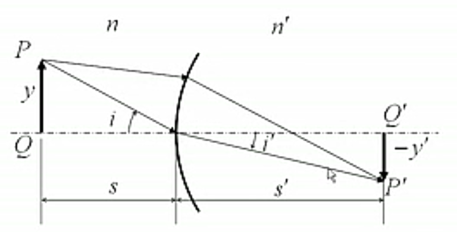
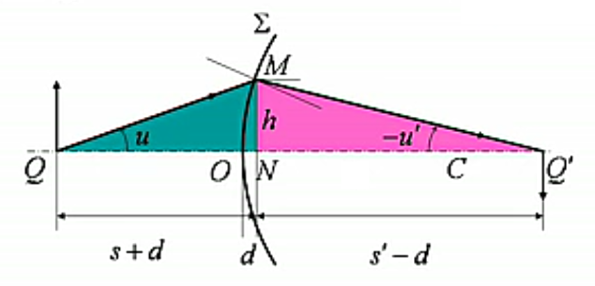
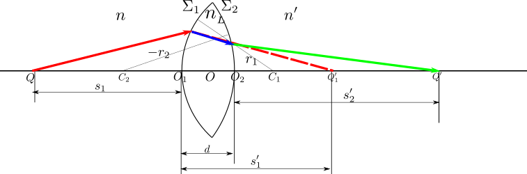
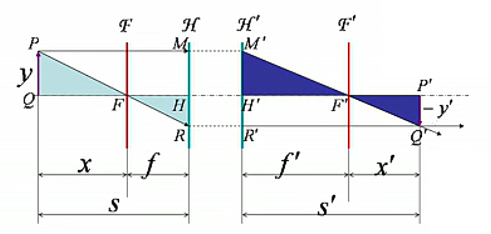
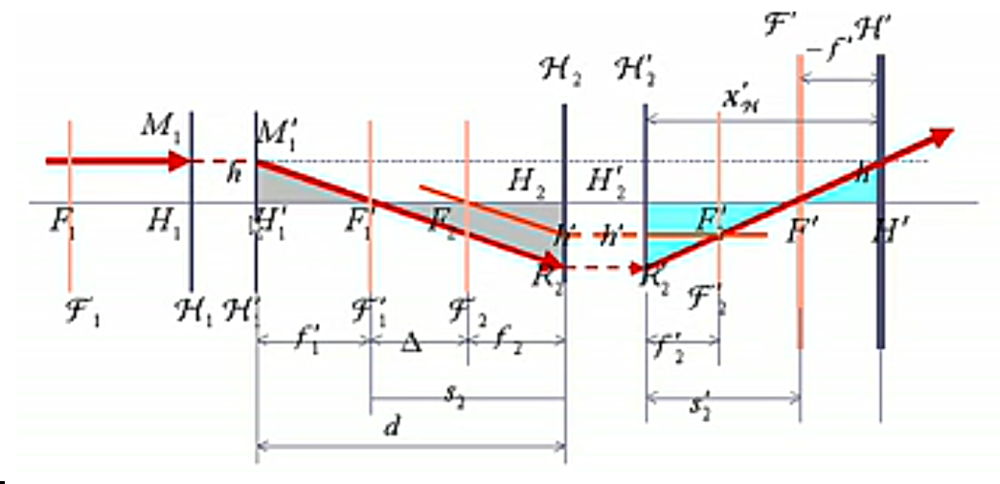
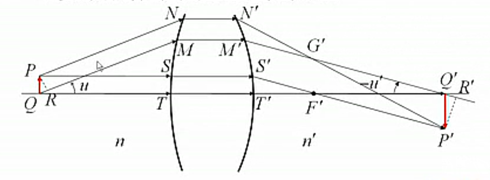

# 成像

[TOC]

## 理想成像

各光线本身或其延长线交于同一点的光束，叫 **同心光束**。理想成像要求空间每一点都能严格成像，也就是说 **物方的每个同心光束转化为像方的一个同心光束**。因此，能使同心光束保持其同心性不变的光学系统为理想光学系统。

**实物与虚物，实像与虚像**

* 发出同心光束的物点为实物点；物方同心光束延长后汇聚所形成的点为虚物点
* 经过光具组后的同心光束，汇聚在像方形成的点，为实像点；像方发散的同心光束反向延长后汇聚的点，为虚像点

## 近轴光在单个球面上的成像

考虑光在单个折射球面的成像问题，可以先讨论物点在光轴（通过光心的轴线）上的情况。*球面具有很好的对称性，即使物点在光轴外也可以通过旋转变换转换为轴上物点成像问题讨论。*研究单个球面成像问题可以先从光的折射问题入手分析。

几何光学就是应用光的折反射定律计算光线传播方向等问题，因此必须对距离、角度等几何参量作正负符号作人为规定，常用的 **几何光学符号约定**

* 物方和像方：以光线入射的方向作为物方，另一方为像方
* 球面曲率中心在像方，其曲率半径 $r>0$；球面曲率中心在物方，$r<0$
* 物距自顶点算起，物点在物方，物距 $s>0$；物点在像方，物距 $s<0$
* 像距自顶点算起，像点在像方，像距 $s'>0$；像点在物方，像距 $s'<0$
* 线段在光轴之上，$y>0$；线段在光轴之下，$y<0$
* 角度自光轴或球面法线算起，逆时针方向为正；顺时针方向为负

*实像、实物为正；虚像、虚物为负*

### 光在单个球面上的折射

   

如图，物点 $Q$ 发出的光线 $QM$ 可用 $(s,u)$ 表征，$s$ 是物点到顶点的距离，$u$ 是光线 $QM$ 与光轴的夹角；单个球面 $\Sigma$ 折射后的光线为 $MQ'$，也可用 $(s',u')$ 表征。目标就是研究 $(s',u')$ 与 $(s,u)$ 的关系，并给出物点 $Q$ 能成像的条件。

$$
\left.\begin{aligned}
   斯涅尔定律&\Rightarrow n\sin i=n'\sin i'\\
   几何关系&\Rightarrow i-u=i'+u'=\varphi\\
   正弦定理&\Rightarrow\begin{cases}
      \frac{p}{\sin\varphi}=\frac{s+r}{\sin i}=\frac{r}{\sin u}\\
      \frac{p'}{\sin\varphi}=\frac{s'-r}{\sin i'}=\frac{r}{\sin u'}
   \end{cases}\\
   余弦定理&\Rightarrow\begin{cases}
      p^2=(s+r)^2+r^2-2r(s+r)\cos\varphi\\
      p^2=(s'-r)^2+r^2-2r(s'+r)\cos\varphi
   \end{cases}
\end{aligned}\right\}\Rightarrow光线追迹踪问题
$$

*光线追踪常用于计算机图形学中，比如游戏场景中的光学引擎*

    <video src="./image/成像/MC光线追踪.mp4" width="600" height="360" controls="controls"></video>

将上述方程组整理可得

$$
\frac{s^2}{n^2(s+r)^2}-\frac{s'^2}{n'^2(s'-r)^2}=-4r\sin^2\frac{\varphi}{2}\left[\frac{1}{n^2(s+r)}-\frac{1}{n'^2(s'-r)}\right]
$$

即 $s'$ 并不是由物距 $s$ 唯一决定，不同的 $u$ 会使光线不能很好地汇聚于 $Q'$，也就是说，单个折射球面不能严格成像。

### 近轴光成像

仔细研究 $s'$ 的方程会得到两种保持同心性的情况（**两种理想成像**）

* **近轴光成像**：$\varphi\to0,\sin\frac{\varphi}{2}\to0\Rightarrow\frac{s}{n(s+r)}-\frac{s'}{n'(s'-r)^2}=0$
* **平面镜成像**：$r\to\infty,n'=-n\Rightarrow s'=-s$

考虑由近轴光线近似可得单个折射球面成像的公式为

$$
\varphi\to0\Rightarrow\frac{s}{n(s+r)}-\frac{s'}{n'(s'-r)^2}=0\Rightarrow\boxed{\frac{n'}{s'}+\frac{n}{s}=\frac{n'-n}{r}}
$$

其中，$\varPhi=\frac{n'-n}{r}$ 为折射球面的光焦度，讨论两种特殊情况

$$
\left\{\begin{aligned}
   平行光入射，汇聚于像方焦点&\Rightarrow s\to\infty\Rightarrow s'=\frac{n'r}{n'-n}=f'\\
   物方焦点发出，折射光为平行光&\Rightarrow s'\to\infty\Rightarrow s=\frac{nr}{n'-n}=f
\end{aligned}\right.
$$

因此可用 **物方焦距 $f$** 与 **像方焦距 $f'$** 表示单个折射球面物像位置关系，即 **高斯公式**

$$
\boxed{\frac{f'}{s'}+\frac{f}{s}=1}
$$

能不能通过变换把单个球面折射成像结论推广到单个球面反射成像呢，显然是可以的。反射定律改写为折射定律的形式时，需将像方折射率取反

$$
i=-i'\xrightarrow{n\sin i=n'\sin i'}n'=-n
$$

对于反射球面，物方空间与像方空间在同一侧，所以需将像距取反。

   

因此可将单个球面折射成像的物像位置关系改写为**反射成像**的情况

$$
\frac{n'}{s'}+\frac{n}{s}=\frac{n'-n}{r}\xrightarrow[s'\to-s']{n'\to-n}\boxed{\frac{1}{s'}+\frac{1}{s}=-\frac{2}{r}}
$$

单个反射球面成像的物方、像方的折射率相同，其焦距也相同

$$
f=f'=-\frac{r}{2}
$$

*实物光线被凸面镜反射，总是能在凹面镜内侧成像（缩小正立的虚像），镜面“视野”就能使更多物体成像，常常用于公路的急转弯处*

### 像的横向放大率

   

近轴光经单个折射球面成像后，像的横向放大率为

$$
\beta=\frac{y'}{y}=-\frac{s'\tan i'}{s\tan i}\approx-\frac{s'\sin i'}{s\sin i}=-\frac{ns'}{n‘s}
$$

### 拉格朗日-亥姆霍兹恒等式

   

单个折射球面成像对近轴光线的角放大率为

$$
\begin{aligned}
   \gamma=\frac{-u'}{u}&\approx\frac{\tan(-u')}{\tan u}\approx\frac{h/s'}{h/s}=\frac{s}{s'}=-\frac{ny}{n'y'}
\end{aligned}
$$

将上式变形即为 **拉格朗日-亥姆霍兹恒等式**

$$
ynu=y'n'u'
$$

它表明 $yun$ 这个乘积经过每次折射都不变，称之为 **拉格朗日-亥姆霍兹不变量**。拉格朗日-亥姆霍兹恒等式能很容易推广到多个共轴球面上

$$
ynu=y'n'u'=y''n''u''=\cdots
$$

因此拉格朗日-亥姆霍兹恒等式把整个光具组的物方量和像方量联系了起来。

## 薄透镜成像

透镜由两个折射球面组成，通过两折射球面球心的直线是透镜的光轴。薄透镜是两折射球面靠得很近的透镜，两折射球面顶点的间距 $d\ll r_1,r_2,|s|,|s'|$。因此薄透镜可以认为 $d=0$，即两折射球面顶点重合（光心，记为 $O$）。

### 逐次成像求解

   

薄透镜成像的过程为，物点发出的光经 $\Sigma_1$ 成像，所得像点作为像点再经 $\Sigma_2$ 成像。

$$
\left.\begin{aligned}
   经\Sigma_1成像\left\{\begin{aligned}
      &\frac{n_{_l}}{s'}+\frac{n}{s_1}=\frac{n_{_L}-n}{r_1}\\
      &s_1=s
   \end{aligned}\right.&\Rightarrow\frac{n_{_L}}{s'_1}+\frac{n}{s}=\frac{n_{_L}-n}{r_1}\\
   再经\Sigma_2成像\left\{\begin{aligned}
      &\frac{n'}{s_2'}+\frac{n_{_L}}{s_2}=\frac{n'-n_{_L}}{r_2}\\
      &s_2=-(s'_1-d)\\
      &s'_2=s'
   \end{aligned}\right.&\Rightarrow\frac{n'}{s'}+\frac{n_{_L}}{s'_1}=\frac{n'-n_{_L}}{r_2}
\end{aligned}\right\}\Rightarrow\frac{n'}{s'}+\frac{n}{s}=\frac{n_{_L}-n}{r_1}+\frac{n'-n_{_L}}{r_2}
$$

薄透镜光焦度 $\varPhi$ 为两个折射球面光焦度之和

$$
\varPhi=\varPhi_1+\varPhi_2=\frac{n_{_L}-n}{r_1}+\frac{n'-n_{_L}}{r_2}
$$

发现薄透镜的物像公式与单个折射球面的物像关系式形式相类似

$$
\frac{n'}{s'}+\frac{n}{s}=\varPhi
$$

### 薄透镜的焦距

薄透镜的像方焦距 $f'$ 和物方焦距 $f$ 在形式上与单个折射球面类似

$$
\left\{\begin{aligned}
   s'\to\infty\Rightarrow f=\frac{n}{\frac{n_{_L}-n}{r_1}+\frac{n'-n_{_L}}{r_2}}=\frac{n}{\varPhi}\\
   s\to\infty\Rightarrow f'=\frac{n'}{\frac{n_{_L}-n}{r_1}+\frac{n'-n_{_L}}{r_2}}=\frac{n'}{\varPhi}
\end{aligned}\right.
$$

一般情况下，$n=n'\approx1$ 有 **磨镜者公式**

$$
f=f'=\frac{1}{(n_{_L}-1)\left(\frac{1}{r_1}-\frac{1}{r_2}\right)}
$$

同单个折射球面一样可以用薄透镜的焦距表示物像位置关系，即 **高斯公式**

$$
\boxed{\frac{f'}{s'}+\frac{f}{s}=1}
$$

高斯公式中，物距和像距都是以光心为基点度量的。如果用焦点作为度量的基点，用到焦点的距离表示物像的位置，便可从高斯公式推导出 **牛顿公式**

$$
\begin{cases}
   s=x+f\\
   s'=x'+f'
\end{cases}\xrightarrow{高斯公式}\boxed{xx'=ff'}
$$

### 正透镜与负透镜

$$
\begin{aligned}
   f=f'>0\Rightarrow像点在透镜的右侧，实焦点\Rightarrow会聚透镜（正透镜）\\
   f=f'<0\Rightarrow像点在透镜的左侧，虚焦点\Rightarrow发散透镜（负透镜）
\end{aligned}
$$

在空气中，根据磨镜者公式可以看出，薄透镜焦距的正负性取决于两球面的曲率半径

* 中间厚边缘薄的透镜是会聚的正透镜
* 边缘厚中间薄的透镜是发散的负透镜

*若将薄透镜置于折射率大的介质中（比如水中的气泡所形成的透镜），则上述透镜的正负性完全相反*:smile:

**经过光心的光线**

由于对称性，在光心处，可以认为透镜的两个表面互相平行，又由于透镜很薄，$d\approx0$，因而经过透镜光心的光线可以看作是是透过了很薄的平行平板，故通过薄透镜光心的光线不改变方向。

**薄透镜的横向放大率**

$$
\beta=\beta_1\beta_2=\left(-\frac{ns'_1}{n_{_L}s}\frac{}{}\right)\left(-\frac{n_{_L}s'}{ns_2}\right)=-\frac{ns'}{n's}
$$

### 薄透镜成像作图

灵活运用薄透镜特殊光线之间一一对应的物像关系

* 平行于光轴的物方入射光线 $\Leftrightarrow$ 经过像方焦点的光线
* 经过物方焦点的入射光线 $\Leftrightarrow$ 平行于光轴的像方光线
* 经过光心的物方入射光线 $\Leftrightarrow$ 经过光心并与入射光线方向相同的像方光线

**注意** 在透镜组的逐次成像问题中，无论是作图还是计算求解都要特别注意物与像的虚实性

* 只要第一镜的像处于第二镜的物方，对于第二镜来说都是实物
* 只要第一镜的像处于第二镜的像方，对于第二镜来说都是虚物

以上两点都说明，**像本身的虚实性，与作为物的虚实性，没有关系**。透镜组的逐次成像计算时也要注意，如果像是下一个透镜的实物，可直接用公式进行计算；如果是虚物，则其物距是负值。

## 理想共轴球面系统成像

为了获得优质的成像，照相镜头、望远镜、显微镜、投影镜头等几乎所有的成像系统都采用了多个共轴的透镜和反射镜，形成 **共轴球面系统**。这样的系统中，成像是一个逐次的过程，其计算也是相当繁琐的，因此有必要找到复杂系统成像的基本规律。

### 共轴球面系统的基点和基面

能完美成像的共轴光具组为理想光学系统，研究理想共轴球面系统的成像问题，首先要确定基本的点和面。

**焦点**

* 物方无穷远处的物点在像方的共轭点就是像方焦点，记为 $F'$
* 像方无穷远处的像点在物方的共轭点就是物方焦点，记为 $F$

也就是说，焦点就是平行于系统光轴的光束的共轭点

**焦平面**

* 与无穷远处的像平面共轭的物平面为物方焦平面，记为 $\mathscr{F}$
* 与无穷远处的物平面共轭的像平面为像方焦平面，记为 $\mathscr{F}'$

**主平面**

横向（垂轴）放大率等于 $1$ 的一对共轭平面为主平面。物方主平面记为 $\mathscr{H}$，像方主平面记为 $\mathscr{H}'$。

对于单个折射球面或反射球面，其主平面就是过球面顶点的垂轴平面。对于薄透镜而言，通过光心且与光轴垂直的平面，是物方和像方的分界面，且横向放大率为 $1$，也就是说通过光心且与光轴垂直的平面是主平面（距离凸透镜 $2f$ 的一对共轭面，其横向放大率为 $-1$，不是主平面）。

**主点**

主平面与光轴的交点为主点，物方主点记作 $H$，像方主点记作 $H'$

**节点**

光轴上角放大率等于 $1$ 的一对共轭点称为节点，物方节点记作 $N$，像方节点记作 $N'$

### 共轴球面系统的物像关系

已知光学系统的相关参数，可以通过几何上的相似性推导物像位置关系，如图

   

$$
\begin{aligned}
   \left.\begin{aligned}
      \triangle PFQ\sim\triangle HFR&\Rightarrow\frac{s-f}{f}=\frac{y}{-y'}\\
      \triangle P'F'Q'\sim\triangle H'F'R' &\Rightarrow\frac{s'-f'}{f'}=\frac{-y'}{y}
   \end{aligned}\right\}&\Rightarrow\frac{s-f}{f}\frac{s'-f'}{f'}=1\\
   &\Rightarrow\left\{\begin{aligned}
      \frac{f}{s}+\frac{f'}{s'}&=1\\
      xx'&=ff'
   \end{aligned}\right.
\end{aligned}
$$

可以说薄透镜的高斯公式与牛顿公式在理想共轴球面系统中依然适用。

### 基点和基平面的确定

由已知的系统的基点和基平面求整个系统的基点和基平面。

   

如图，记第一系统像方焦点 $F'_1$ 到第二系统物方焦点 $F_2$ 间距为 $\Delta$，$\Delta$ 称作两系统的间隔（光学间隔）。记第一系统像方主点 $H'_1$ 到第二系统物方主点 $H_2$ 的间距为 $d$，显然

$$
f'_1+\Delta+f_2=d
$$

对于系统 $2$，$F'_1$ 与 $F'$ 共轭

$$
\frac{f'_2}{s'_2}+\frac{f_2}{s_2}=1\Rightarrow s'_2=\frac{f'_2s_2}{s_2-f_2}=\frac{f'_2s_2}{\Delta}
$$

根据几何上的相似性可得

$$
\left.\begin{aligned}
   \triangle M'_1H'_1F'_1\sim\triangle R_2H_2F'_1&\Rightarrow\frac{h}{h'}=\frac{f'_1}{s_2}\\
   \triangle N'H'F'\sim\triangle R'_2H'_2F'&\Rightarrow\frac{h}{h'}=\frac{-f'}{s'_2}
\end{aligned}\right\}\Rightarrow\frac{f'_1}{s_2}=\frac{-f'}{s'_2}\Rightarrow s'_2=-\frac{s_2f'}{f'_1}
$$

由此可计算出共轴球面系统的像方焦距 $f'$

$$
\boxed{f'=-\frac{f'_1f'_2}{\Delta}}
$$

有了系统的像方焦距 $f'$ 后便很容易确定系统的像方主平面位置

$$
\begin{aligned}
   s'_2&=-\frac{s_2f'}{f'_1}=\left(-\frac{\Delta+f_2}{f'_1}\right)\left(-\frac{f'_1f'_2}{\Delta}\right)=\frac{(\Delta+f_2)f'_2}{\Delta}\\
   x'_H&=s'_2-f'=\frac{(\Delta+f_2)f'_2}{\Delta}-\frac{f'_1f'_2}{\Delta}=\frac{(f'_1+\Delta+f_2)f'_2}{\Delta}\\
   &=\frac{df'_2}{\Delta}
\end{aligned}
$$

根据光路系统的对称性，可以通过替换共轭量得到系统的物方焦平面和物方主平面位置

$$
\begin{aligned}
   f'_1\to f_2&，f'_2\to f_1\\
   f'\to f&，x'_H\to x_H
\end{aligned}\Rightarrow\left\{\begin{aligned}
   f&=-\frac{f_1f_2}{\Delta}\\
   x_H&=\frac{df_1}{\Delta}
\end{aligned}\right.
$$

若是两个薄透镜的组合，$f'_1=f_1$，$f'_2=f_2$，则

$$
\begin{aligned}
   f=f'=-\frac{f_1f_2}{\Delta}，x_H=\frac{df_1}{\Delta}，x'_H=\frac{df_2}{\Delta}
\end{aligned}
$$

若透镜装置置于空气中则其光焦度为

$$
\begin{aligned}
   f&=-\frac{f_1f_2}{\Delta}=-\frac{f_1f_2}{d-f_1-f_2}\\
   \Rightarrow\varPhi&=\frac{1}{f_1}+\frac{1}{f_2}-\frac{d}{f_1f_2}=\varPhi_1+\varPhi_2-\varPhi_1\varPhi_2d
\end{aligned}
$$

### 阿贝正弦条件与齐明点

显微镜物镜需要傍轴小物能以大孔径成像（不能用近轴成像理论计算），从物像等光程性出发得到傍轴物点以大孔径成像条件被称为 **阿贝正弦条件**

   

如图，轴上物点 $Q$ 和傍轴物点 $P$ 分别成像于 $Q'$、$P'$。光线 $PS$ 与光轴平行，其共轭光线经过像方焦点 $F'$。光线 $PN$ 与 $QM$ 平行，它们对光轴的倾角为 $u$，它们的共轭光线 $N'P'$ 和 $M'Q'$ 交于某点 $G'$（$G'$在像方焦平面上）。作 $PR\bot QM$，$P'R'\bot M'Q'$，在傍轴条件下

$$
(F'Q')\approx(F'P')\hspace{1cm}(G'R')\approx(G'P')
$$

物像间的等光程性使得

$$
\left.\begin{aligned}
   &(QMM'Q')=(QTT'Q')&(PNN'P')=(PSS'P')\\
   &(PSS'F')=(QTT'F')&(PNN'G')=(RMM'G')
\end{aligned}\right\}\Rightarrow(QR)=(Q'R')
$$

$(QR)=ny\sin u$，$(Q'R')=n'\sin u'$，得到傍轴小物大孔径成像的阿贝正弦条件

$$
\boxed{ny\sin u=n'y'\sin u'}
$$

阿贝正弦条件是在光轴上已消球差的前提下，傍轴物点以大孔径光束成像的充分必要条件。即阿贝正弦条件可以不要求光线满足傍轴条件。满足阿贝正弦条件的一对共轭点，称作 **齐明点**。*齐明点在高倍显微镜中有重要应用，油浸物镜就是照此原理设计而成的。*

**注意** 阿贝成像条件 $ny\sin u=n'y'\sin u'$ 与拉格朗日-亥姆霍兹恒等式 $nyu=n'y'u'$ 看起来相似，但是阿贝条件是在特殊位置上大孔径光束的成像条件，光线不满足傍轴条件，而拉格朗日-亥姆霍兹恒等式是理想光具组的结论。