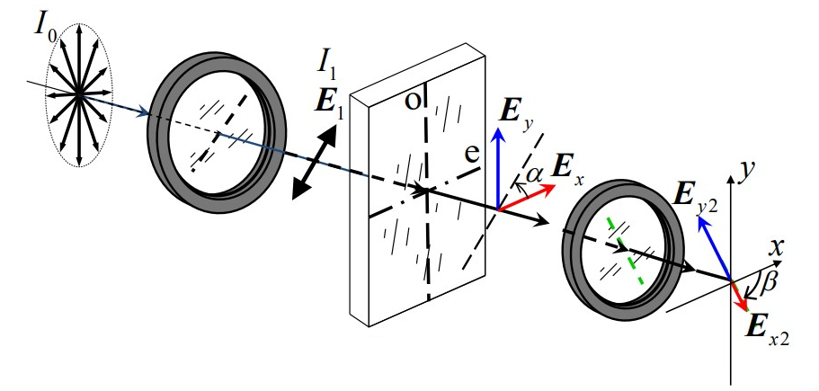
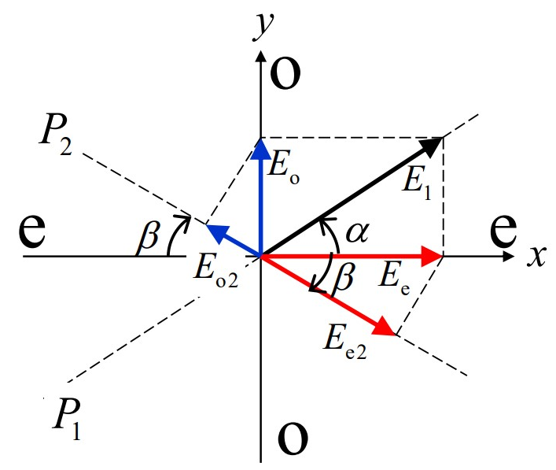
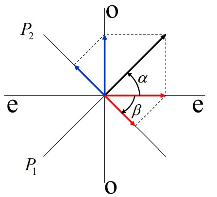
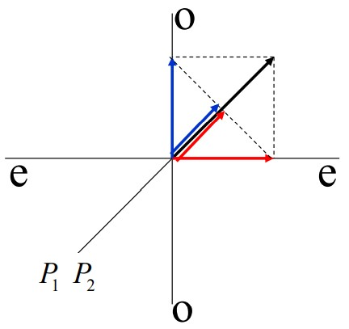
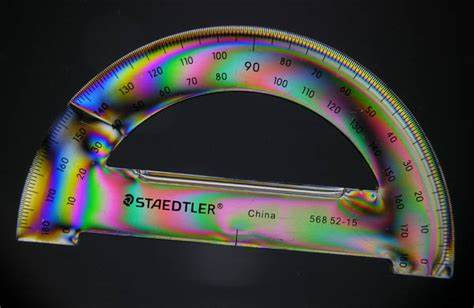
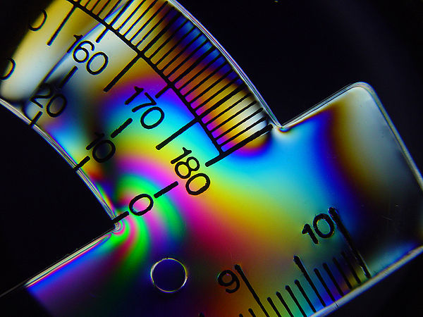

# 偏振光的干涉

[TOC]

## 平行偏振光的干涉

从波片出射的光，电矢量相互垂直，是不相干的，一般情况下合成为椭圆偏振光。但是可以让波片出射光经过一个线偏振器，从线偏振器透射出的光波电矢量是相互平行的，可以进行相干叠加。

    

沿着 o光、e光的振动方向（由波片决定）建立坐标轴，自然光（光强为 $I_0$）经第一个偏振片后产生线偏振光（电矢量和振幅为 $\vec{E}_1$ 和 $A_1$），在波片中，e 光、o光的振幅为

    

$$
\begin{aligned}
    A_e&=A_1\cos\alpha\\
    A_o&=A_1\sin\alpha
\end{aligned}
$$

从波片射出的光再经过偏振器，相应的振幅为

$$
\begin{aligned}
    A_{e2}&=A_1\cos\alpha\cos\beta\\
    A_{o2}&=A_1\sin\alpha\sin\beta
\end{aligned}
$$

从第二个偏振器出射的两列光电矢量振动方向平行，可进行相干叠加

$$
\begin{aligned}
    I&=A_{e2}^2+A_{o2}^2+2A_{e2}A_{o2}\cos\Delta\varphi\\
    &=A_1^2(\cos^2\alpha\cos^2\beta+\sin^2\alpha\sin^2\beta+2\cos\alpha\cos\beta\sin\alpha\sin\beta\cos\Delta\varphi)
\end{aligned}
$$

### 相位差的确定

两列光的相位差 $\Delta\varphi$ 除了 **晶体产生的相位差** 之外，还要考虑 **在坐标系（波片的光轴决定）中由于偏振片取向而产生的相位差**

***双折射晶体产生的相位差***

$$
\Delta\varphi_{c}=\frac{2\pi}{\lambda}(n_o-n_e)d
$$

***两偏振片取向不同带来的相位差***

第一块偏振片

$$
\begin{aligned}
    \vec{E}_1在一、三象限&\Rightarrow\Delta\varphi_1=0\\
    \vec{E}_1在二、四象限&\Rightarrow\Delta\varphi_1=\pi\\
\end{aligned}
$$

第二块偏振片

$$
\begin{aligned}
    \vec{E}_2在一、三象限&\Rightarrow\Delta\varphi_2=0\\
    \vec{E}_2在二、四象限&\Rightarrow\Delta\varphi_2=\pi\\
\end{aligned}
$$

因此，$\vec{E}_1$ 与 $\vec{E}_2$ 之间总的相位差 $\Delta\varphi=\Delta\varphi_1+\Delta\varphi_c+\Delta\varphi_2$

### 两种特例

    

两偏振片相互垂直，且与晶体光轴成 $45°$ 角

$$
\begin{aligned}
    \Delta\varphi_1&=0,\Delta\varphi=\pi\Rightarrow\Delta\varphi=\pi+\Delta\varphi_c\\
    \alpha&=\beta=\frac{\pi}{4}\Rightarrow I=\frac{A_1^2}{2}(1-\cos\Delta\varphi_c)=\frac{I_0}{2}\sin^2\frac{\Delta\varphi_c}{2}
\end{aligned}
$$

    

两偏振片相互平行，且与晶体光轴成 $45°$ 角

$$
\begin{aligned}
    \Delta\varphi_1&=0,\Delta\varphi_2=0\Rightarrow\Delta\varphi=\Delta\varphi_c\\
    \alpha&=\beta=\frac{\pi}{4}\Rightarrow I=\frac{A_1^2}{2}(1+\cos\Delta\varphi_c)=\frac{I_0}{2}\cos^2\frac{\Delta\varphi_c}{2}
\end{aligned}
$$

## 偏振干涉现象

### 厚度均匀的晶体

**单色光入射**

对于厚度均匀的双折射晶体，$\Delta\varphi_c=2\pi(n_e-n_o)d/\lambda$ 不变，但是转动晶体或偏振片会引起 $\Delta\varphi_1$、$\Delta\varphi_2$ 改变，从而改变接收屏上的光强；若引起 $\pi$ 的相位差，则屏上光强突变。

**白光入射**

不同波长的光， $\Delta\varphi_c$ 不同，因而光强也不同，屏上呈现彩色。转动晶体或偏振片，光强改变，色彩也会改变 —— **显色偏振**。

### 厚度不均匀的晶体

波片不等厚，$\Delta\varphi_c$ 随厚度而改变，接收屏上会出现干涉条纹。干涉条纹的分布和形状，都与波片的形状有关。

### 光测弹性

一些各向同性的透光介质，例如玻璃、塑料，当内部有应力时，就是各向异性的，也会产生双折射效应。利用偏振光的干涉装置，可以观察到干涉条纹或者显色偏振现象，可根据偏振干涉现象作应力分析。

    
    

