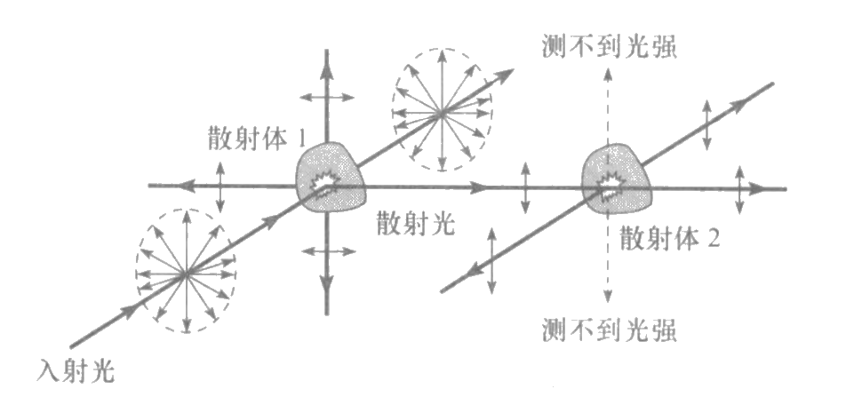
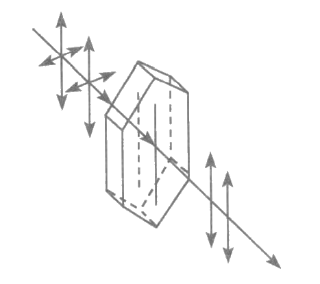
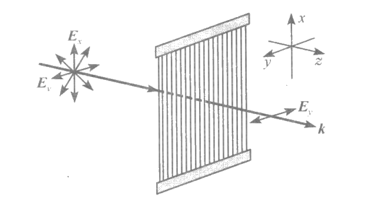
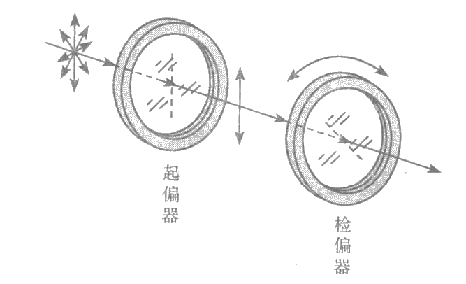
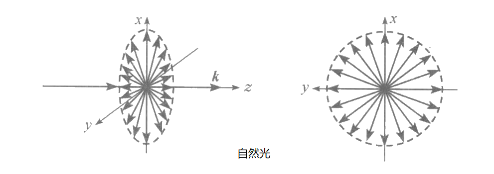
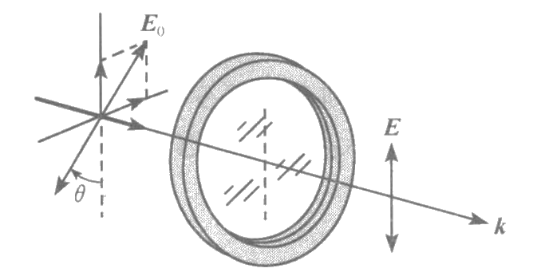
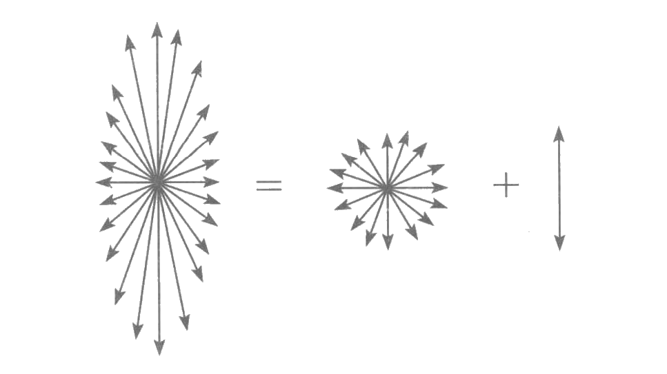
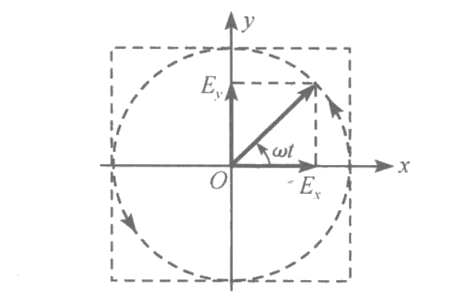
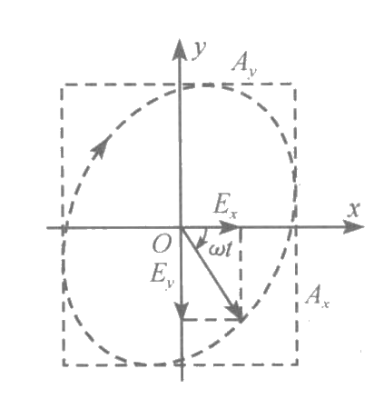
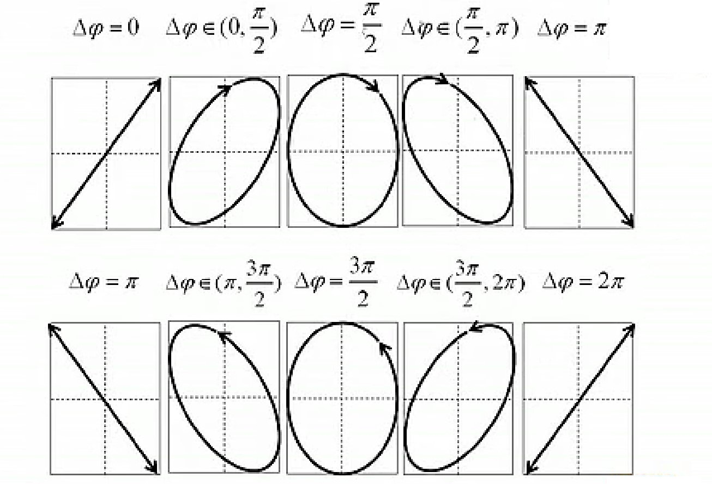

# 光的横波性

[TOC]

## 光是横波的实验基础

**双散射实验**

    

假设光是横波，第一次散射后各个方向都有光，在与入射光垂直的方向上传播的光，其振动只有单一的方向，再经过第二次散射后，在与振动平行的方向上，则没有光，而其他方向上仍可以测到光强。实验证实了光是横波的猜想。

**电气石晶体的二向色性**

马吕斯通过电气石晶体观察由其他物体表面反射的光，结果发现，将电气石晶体绕着光束转动时，透过晶体的光的强度会发生改变；晶体转动一周回到原来位置时，透过晶体的光强也回到原来数值，说明光是横波。

    

*天然的电气石晶体是六角形的片状，长对角线的方向称为它的光轴。当光射在这种晶体的表面上时，振动的电矢量与光轴平行时被吸收得比较少，光可以较多地通过；电矢量与光轴垂直时被吸收得较多，光通过得很少，这种性质叫做 **二向色性***:smile:。

## 偏振器

最初得偏振器件是用拉直的细导线做成的密排线栅。金属导线中的电子可以吸收电磁场的能量作相应的振动，受限于金属导线的尺度，振动只能沿金属线进行。因此，与导线同方向的电场分量被吸收，电矢量振动方向与导线垂直的光可以从线栅投过。

    

1928 年，美国哈佛大学的学生兰德采用聚乙烯醇薄膜浸碘的方法制作了人造偏振片，即用有机分子链制成导电线栅，比金属导体线栅更充分地吸收光的振动。

在偏振光中，有起偏和检偏的概念

* **起偏**：使没有偏振特性的光变为偏振光
* **检偏**：检验光的偏振特点，观察光强变化
* **透振方向**：从偏振器件通过的光的电矢量的振动方向

    

## 五种偏振态

### 自然光

普通光源发光是原子或离子在不同能量状态（能级）之间跃迁的结果。光源物质中，总有大量的原子同时发光[^数量级]，也就是说，每一任意小的时间间隔内总是有大量的原子进行 **自发辐射跃迁**。自发辐射跃迁的结果是随机的，不同原子所发的光波，都有随机的传播方向、振动方向、初相位和频率。产生的结果便是不相干，不同原子在同一时刻所发出的光波是没有关联的；同一原子在不同时刻所发出的光波也是没有关联的。

任何自发辐射光源所发出的光都是 **自然光**，自然光在各个方向振动相等、相位差随机。

    

自然光经起偏器变为偏振光，旋转起偏器，透射的光强都不发生改变。对光矢量沿透振方向和垂直透振方向作正交分解（自然光各波列不相干）

$$
\left.\begin{aligned}
    I_\parallel&=\int_0^{2\pi}(A_0\cos\theta)^2\mathrm{d}\theta=\pi A_0^2\\
    I_\perp&=\int_0^{2\pi}(A_0\sin\theta)^2\mathrm{d}\theta=\pi A_0^2\\
    I&=\int_0^{2\pi}A_0^2\mathrm{d}\theta=2\pi A_0^2=I_0
\end{aligned}\right\}\Rightarrow I_\parallel=\frac{1}{2}I_0 
$$

即自然光通过偏振器后，透射光强为入射光强的一半。

### 平面偏振光（线偏振光）

电矢量始终在一个平面内振动的光，或者电矢量振动的投影是一条直线的光，就是 **平面偏振光** 或是 **线偏振光**。使线偏振光垂直地射向偏振片，偏振片的透阵方向与入射光的偏振平面之间的夹角为 $\theta$

    

将电矢量 $\vec{E}_0$ 正交分解为平行于偏振片透阵方向的矢量 $\vec{E}_\parallel$ 和垂直于偏振片透阵方向的矢量 $\vec{E}_\perp$，得到透射光的光强为

$$
I(\theta)=\left\langle\left|\vec{E}_\parallel\right|^2\right\rangle=\left\langle\left|\vec{E}_0\right|^2\right\rangle\cos^2\theta=I_0\cos^2\theta
$$

线偏振光通过检偏器后透射光强随 $\theta$ 角变化的规律叫做 **马吕斯定律**。任何一个线偏振光都可以分解为两个振动方向互相正交的线偏振光，*但要注意两个正交分量只能是同向的或是反向的*。

$$
\begin{aligned}
    &\begin{cases}
        E_x=E_0\sin\theta\cos(\omega t-kz)\\
        E_y=E_0\cos\theta\cos(\omega t-kz)
    \end{cases}\Rightarrow电矢量在一、三象限\\
    &\begin{cases}
        E_x=E_0\sin\theta\cos(\omega t-kz)\\
        E_y=E_0\cos\theta\cos(\omega t-kz+\pi)
    \end{cases}\Rightarrow电矢量在二、四象限
\end{aligned}
$$

### 部分偏振光

**部分偏振光** 的偏振特性介于自然光和线偏振光之间，也就是说部分偏振光可以看成自然光与线偏振光的叠加。

    

部分偏振光的电矢量振幅在不同方向有不同的大小，因此用检偏器检验部分偏振光时，透射光的强度随其透振方向而改变。设光强的极大值和极小值分别为 $I_{\max}$ 和 $I_{\min}$，两者相差越大，部分光的偏振程度越高，因此，人们用 **偏振度 $P$** 来衡量部分偏振光偏振程度大小

$$
P=\frac{I_{\max}-I_{\min}}{I_{\max}+I_{\min}}
$$

### 圆偏振光

**圆偏振光** 的特点：在一个垂直于波矢的固定平面内，光矢量旋转，大小不变，矢端轨迹是圆。

*理解圆偏振光的物理图像时由其要注意，圆偏振光某一光矢量的矢端随时间变化的轨迹不是螺旋线（是圆）；在某一时刻，所有光矢量的端点是螺旋线。*

圆偏振光可看作是两个相位相差 $\frac{\pi}{2}$ 的互相垂直的平面偏振光的叠加

    

迎着光的传播方向观察，如果光矢量是顺时针方向旋转的，称为右旋偏振光；如果光矢量逆时针方向旋转，称为左旋偏振光。

$$
\begin{cases}
    E_x(z,t)=E_0\cos(\omega t-kz)\\
    E_y(z,t)=E_0\cos(\omega t-kz+\Delta\varphi)
\end{cases}\Rightarrow\left\{\begin{aligned}
    \Delta\varphi=+\frac{\pi}{2}\Rightarrow又旋\\
    \Delta\varphi=-\frac{\pi}{2}\Rightarrow左旋
\end{aligned}\right.
$$

*圆偏振光的振动周期很小，约为 $10^{-14}\mathrm{s}$，导致用偏振片检验圆偏振光，不论透振方向如何，出射光的强度总是相同。因此，偏振片无法区分自然光与圆偏振光*:smile:

### 椭圆偏振光

**椭圆偏振光** 的特点：在一个垂直与波矢的固定平面内，光矢量旋转，大小作周期性改变，矢端轨迹是椭圆。

    

把椭圆偏振光的电矢量作正交分解

$$
\begin{aligned}
    &\begin{cases}
            E_x=A_x\cos(\omega t-kz)\\
            E_y=A_y\cos(\omega t-kz+\Delta\varphi)
    \end{cases}\\
    \Rightarrow&\frac{E_x^2}{A_x^2}+\frac{E_y^2}{A_y^2}-\frac{2E_xE_y}{A_xA_y}\cos\Delta\varphi=\sin^2\Delta\varphi
\end{aligned}
$$

椭圆长轴或短轴与坐标轴的夹角 $\alpha$ 可以表示为

$$
\tan2\alpha=\frac{2A_xA_y}{A_x^2-A_y^2}\cos\Delta\varphi
$$

电矢量的椭圆长短轴的取向以及旋转方向是由相位差 $\Delta\varphi$ 决定的

    

**特点**

* $\Delta\varphi$ 第一、二象限 $\Rightarrow$ 右旋
* $\Delta\varphi$ 第三、四象限 $\Rightarrow$ 左旋
* $\Delta\varphi=\pm\frac{\pi}{2}\Rightarrow$ 正椭圆，$A_x=A_y\Rightarrow$ 圆偏振光
* $\Delta\varphi=0,\pi\Rightarrow$ 线偏振光

*和圆偏振光一样，一般的椭圆偏振光也不能与部分偏振光用偏振片区别开来*

[^数量级]:固体物质中原子的数密度约为 $10^{23}\mathrm{cm}^{-3}$，假设发光的原子占 $0.1\%\sim1\%$，则发光原子的数密度约为 $10^{20}\mathrm{cm}^{-3}$