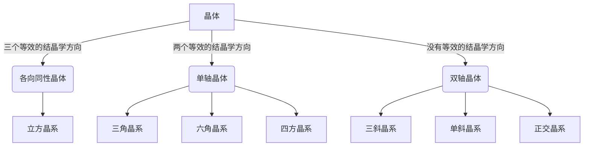
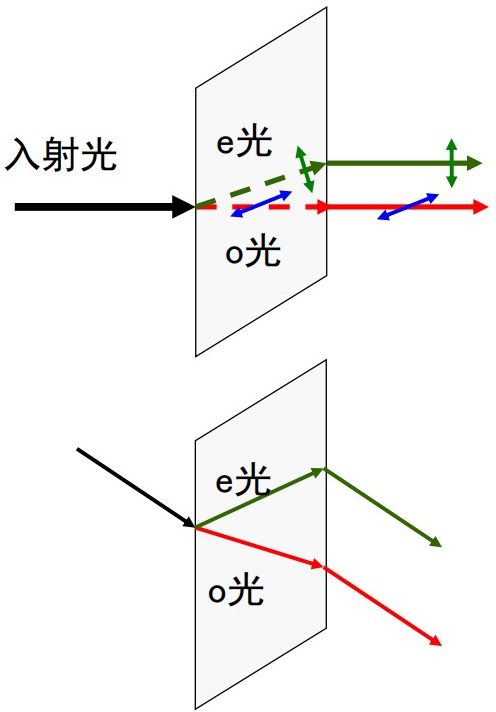
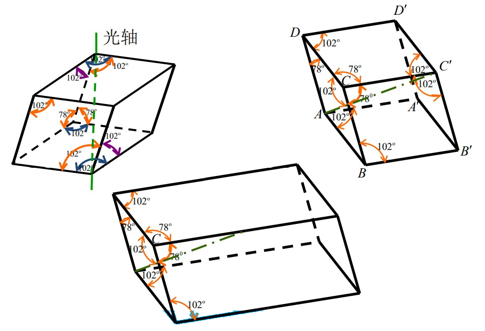
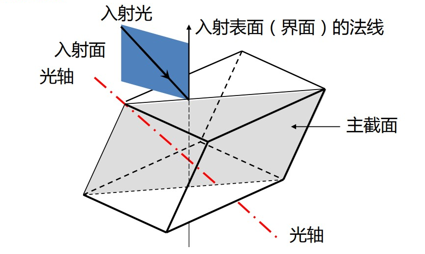
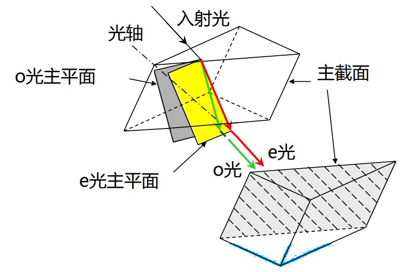

# 双折射

[TOC]

## 晶体的光学特征

按照对称性，可将晶体分为 14 种布拉菲格子，这 14 种布拉菲格子又可以归类为 7 大晶系。如果按照光学性质，可将晶体分为三类

## 双折射现象和双折射晶体

    

一束入射到介质中的光经折射后变为两束光，称为 **双折射**。折射后的两束光都是线偏振光

* 一束遵守折射定律，称为 **寻常光（o 光）** *ordinary*
* 另一束不遵守折射定律，不一定在入射面内，不满足 $n_1\sin\theta_1=n_2\sin\theta_2$，称为 **非常光（e光）** *extraordinary*

**注意** o光、e光只是折射介质中的概念，从晶体中射出后，不再称 o光、e光

能够产生双折射的晶体都具有各向异性的结构，常见的双折射晶体如下

* **单轴晶体**：方解石晶体[^方解石晶体]、石英、红宝石、冰，等等
* **双轴晶体**：云母、蓝宝石、橄榄石、硫黄，等等

## 双折射晶体的特征参量

### 光轴

在双折射晶体中有一个特殊的方向，光 **沿此方向入射时不发生双折射**，这个<u>方向</u>就被称作晶体的 **光轴**。

天然的方解石晶体是平行六面体，在方解石的八个顶点中，有一对顶点是由三个 102° 的钝角构成，称为钝顶点。过钝顶点并且与该顶点的三条棱有相等夹角的直线就是方解石晶体的光轴。

    

### 主截面

**入射界面（晶体表面）的法线** 与 **光轴** 形成的平面称为 **主截面**（与晶体相关，与光线无关）。

    

### 主平面

**主平面** —— **晶体中** 的 **光线** 与 **光轴** 所形成的平面。实验表明

* **o光主平面**：**o光振动方向垂直于o光主平面**，即 o光电矢量垂直于光轴。
* **e光主平面**：**e光振动方向平行于e光主平面**，即 e光的电矢量在 e光主平面内

    

*一般情况下，入射面*

[^方解石晶体]:方解石晶体，即 $\mathrm{CaCO_3}$ 的三角晶系，是一种典型的双折射晶体（单轴），常含杂质，无色的称冰洲石晶体。