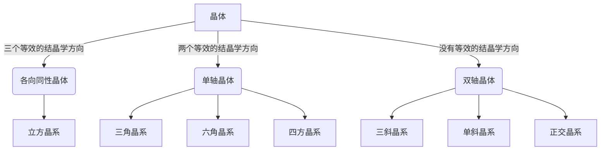

# 双折射

[TOC]

## 晶体的光学特征

按照对称性，可将晶体分为 14 种布拉菲格子，这 14 种布拉菲格子又可以归类为 7 大晶系。如果按照光学性质，可将晶体分为三类

## 双折射现象和双折射晶体

    

一束入射到介质中的光经折射后变为两束光，称为 **双折射**。折射后的两束光都是线偏振光

* 一束遵守折射定律，称为 **寻常光（o 光）** *ordinary*
* 另一束不遵守折射定律，不一定在入射面内，不满足 $n_1\sin\theta_1=n_2\sin\theta_2$，称为 **非常光（e光）** *extraordinary*

**注意** o光、e光只是折射介质中的概念，从晶体中射出后，不再称 o光、e光

能够产生双折射的晶体都具有各向异性的结构，常见的双折射晶体如下

* **单轴晶体**：方解石晶体[^方解石晶体]、石英、红宝石、冰，等等
* **双轴晶体**：云母、蓝宝石、橄榄石、硫黄，等等

## 双折射晶体的特征参量

### 光轴

在双折射晶体中有一个特殊的方向，光 **沿此方向入射时不发生双折射**，这个<u>方向</u>就被称作晶体的 **光轴**。

天然的方解石晶体是平行六面体，在方解石的八个顶点中，有一对顶点是由三个 102° 的钝角构成，称为钝顶点。过钝顶点并且与该顶点的三条棱有相等夹角的直线就是方解石晶体的光轴。

    

### 主截面

**入射界面（晶体表面）的法线** 与 **光轴** 形成的平面称为 **主截面**（与晶体相关，与光线无关）。

    

### 主平面

**主平面** —— **晶体中** 的 **光线** 与 **光轴** 所形成的平面。实验表明

* **o光主平面**：**o光振动方向垂直于o光主平面**，即 o光电矢量垂直于光轴。
* **e光主平面**：**e光振动方向平行于e光主平面**，即 e光的电矢量在 e光主平面内

    

    

*一般情况下，入射面、主截面、o光主平面、e光主平面是不重合的。但是，通过选择合适的入射方向，可以使入射面与主截面重合，即光轴处于入射面之中，此时，o光主平面、e光主平面重合，且均与主平面重合。*

## o光和e光的光强

**线偏振光入射**

    

$$
\begin{cases}
    E_o=E\sin\theta\\
    E_e=E\cos\theta
\end{cases}\Rightarrow\begin{cases}
    I_o=I\sin^2\theta\\
    I_e=I\cos^2\theta
\end{cases}
$$

**自然光入射**

    

$$
I_o=I_e=\frac{1}{2}I
$$

## 单轴晶体中的波面

单轴晶体只有一个光轴，晶体中的电子存在两个固有的振动频率

* 一个是 **与光轴平行方向** 的振动 $\omega_1$
* 另一个使 **与光轴垂直方向** 的振动 $\omega_2$

    

由于沿着不同的方向有不同的固有振动频率，因而光在单轴晶体中传播时，沿着不同的方向会有不同的速度（定量地描述晶体中的描述需要量子电动力学，一般只做定性讨论）

* **o光** 传播时，电矢量垂直于光轴，所以沿各个方向传播时振动频率相同，则速度也相同，其波面为 **球面**
* **e光** 向不同方向传播时，电矢量相对于光轴的方向不同，其振动频率也不同，所以速度也不同，其波面为 **旋转椭球面**

    

    

**注意**

* 这里所说的传播速度都是光在介质中的相速度（有可能大于 $c$，但并不违反相对论原理）
* o光的波面是球面，其传播方向处处与其波面垂直
* **除了两个特殊的方向，e光的传播方向与其波面不垂直**

### 正晶体与负晶体

由于e光在不同方向传播速度不同，折射率也不同。e光沿着与光轴垂直方向传播时的速度为 $v_e$，定义其主折射率为

$$
n_e=\frac{c}{v_e}
$$

o光的折射率与方向无关

$$
n_o=\frac{c}{v_o}
$$

根据两种光折射率的相对大小，将晶体分为正晶体和负晶体

|  | 传播速度 | 折射率 | e光波面 | 举例 |
| :--: | :--: | :--: | :--: | :--: |
| 负晶体 | $v_e>v_o$ | $n_e<n_o$ | 扁椭球面 | 冰洲石 |
| 正晶体 | $v_e<v_o$ | $n_e>n_o$ | 长椭球面 | 石英 |

    

### 单轴晶体的惠更斯作图法

1. 作入射光的波面（垂直于入射光的平面 $AB$），光线2 到达界面 $B'$ 时，$A$ 点的光已在介质中传播的时间为 $t=BB'/c$
2. 作o光波面（以 $A$ 为中心，$v_ot$ 为半径的球面），根据o光的波面确定 o光的方向 $AA'_o$
3. 作e光波面（光轴与o光波面的交点也是光轴与e光波面的交点，为椭球面的一个轴，另一
轴与该轴垂直，长度为 $v_et$），根据e光的波面确定e光的方向 $AA'_e$

    

### 几个特例

**光轴垂直于界面，正入射 $\Rightarrow$ o光、e光波面不分开，不发生双折射**

    

**光轴平行于界面，正入射 $\Rightarrow$ o光、e光方向相同，速度不同，波面分开，发生双折射**

    

**光轴垂直于入射面，斜入射 $\Rightarrow$ 入射面垂直于主截面，发生双折射**

    

[^方解石晶体]:方解石晶体，即 $\mathrm{CaCO_3}$ 的三角晶系，是一种典型的双折射晶体（单轴），常含杂质，无色的称冰洲石晶体。