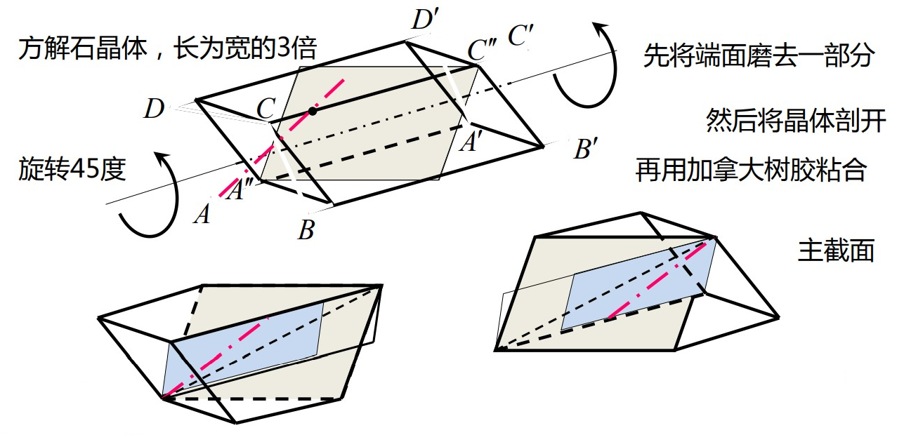
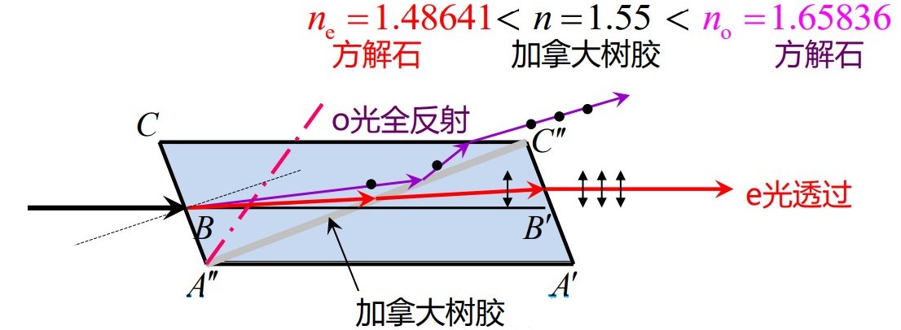
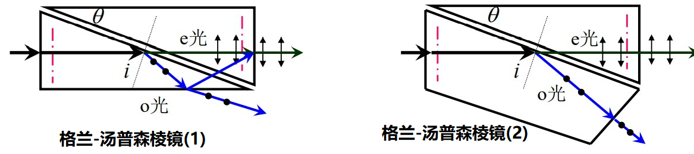
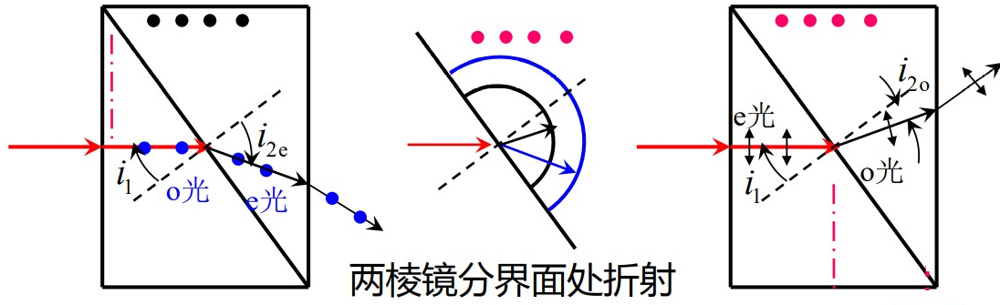
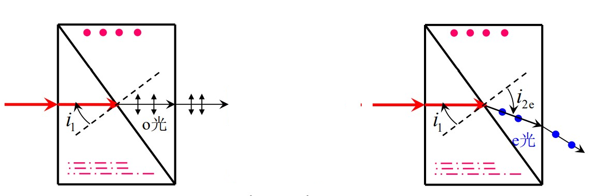
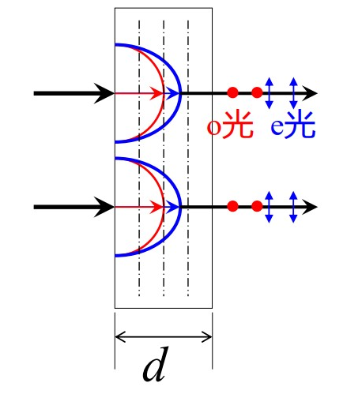
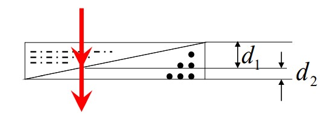
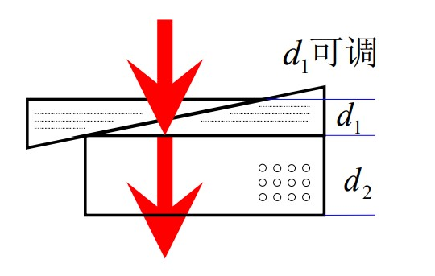

# 晶体光学器件

[TOC]

## 偏振棱镜

### 尼科耳棱镜

尼科耳棱镜是由长为宽的三倍的方解石晶体，磨去端面后，将晶体沿与主截面垂直的平面剖开为相等的两部分，再用加拿大树胶粘合而成。

    

晶体中 o光和 e光对具有不同的折射率，对于 $\mathrm{Na}$ 黄光，$n_e<n<n_o$。在加拿大树胶的粘合处，如果角度合适，可以使 o光全反射，e光透射，最终两列平面偏振光分开。

    

在使用尼科耳棱镜获得线偏振光，需要控制入射角的范围，使 o光发生全反射，e光光路基本不变。实验中，通常将尼科耳棱镜上表面涂黑，吸收全反射的 o光；且加拿大树胶极易吸收紫外线，所以该棱镜不适用于紫外波段。

### 格兰-汤普森棱镜

格兰-汤普森棱镜由两块方解石的直角三棱镜组成，两棱镜的光轴相互平行，两棱镜的斜面可以用甘油、树脂等胶合，也可以直接接触（中间有空气层）。

    

在两棱镜的分界面处，o光发生全反射，e光直接射出（为保证出射光有较好的偏振度，常常将底部涂黑，或者让 o光直接透射出去）。

### 渥拉斯顿棱镜

渥拉斯顿棱镜由两块冰洲石的直角三棱镜（粘合）而成，两棱镜的光轴互相垂直。因此，第一镜中 o光进入第二镜时，变为 e光；第一镜中 e光进入第二镜时，变为 o光（**o 光、e 光只是在晶体中传播的说法**）。

    

两列偏振光出射角度不同，在空间上是分开的

$$
\begin{cases}
    n_o\sin i_1=n_e\sin i_{2e}\\
    n_e\sin i_1=n_o\sin i_{2o}
\end{cases}\Rightarrow\left\{\begin{aligned}
    \sin i_{2e}=\frac{n_o}{n_e}\sin i_1\\\\
    \sin i_{2o}=\frac{n_e}{n_o}\sin i_1
\end{aligned}\right.
$$

### 洛匈棱镜

洛匈棱镜的结构与渥拉斯顿棱镜有些相似，也是由两块冰洲石的直角三棱镜（粘合）而成，两棱镜的光轴互相垂直。但第一块棱镜的光轴与光入射的表面垂直，因此第一镜中无双折射，只有 o光；第二镜中才有双折射。

    

$$
\begin{cases}
    n_o\sin i_1=n_o\sin i_{2o}\\
    n_o\sin i_1=n_e\sin i_{2e}\\
\end{cases}\Rightarrow\left\{\begin{aligned}
    &i_{2o}=i_1\\\\
    &\sin i_{2e}=\frac{n_o}{n_e}\sin i_1
\end{aligned}\right.
$$

## 波晶片

    

波晶片通常用石英制成，也称作波片，是从石英晶体中切割出来的薄片。薄片的两个表面互相平行，而且石英的光轴也与表面平行。当平行光正入射时，o光、e光的传播方向一致，但传播速度不同，导致 o光的相位比 e光的相位滞后或超前。

o光、e光从波片出射时的光程差

$$
\Delta L=L_e-L_o=(n_e-n_o)d
$$

因此，e光相对于 o光相位延迟

$$
\Delta\varphi=\frac{2\pi}{\lambda}(n_e-n_o)d
$$

**三种常用的波片**

$$
\begin{aligned}
    &\Delta L=\pm\frac{\lambda}{4}+\frac{1}{2}m\lambda\Rightarrow\Delta\varphi=2m\pi\pm\frac{\pi}{2}\Rightarrow\frac{\lambda}{4}波片\\
    &\Delta L=\pm\frac{\lambda}{2}+m\lambda\Rightarrow\Delta\varphi=2m\pi\pm\pi\Rightarrow\frac{\lambda}{2}波片\\
    &\Delta L=\pm m\lambda\Rightarrow\Delta\varphi=\pm2m\pi\Rightarrow全波片
\end{aligned}
$$

## 相位补偿器

波片具有固定的厚度，因而只适用于特定的波长，而且只能产生固定的相位差。**相位补偿器** 克服了这一点，它可以改变波片的厚度，产生任意的相位差。

### 巴比涅补偿器

巴比涅补偿器类似于渥拉斯顿棱镜，但相位补偿器要薄很多。棱镜斜面处光近似垂直入射，透过的光并没有分开，还基本保持原有的方向，也避免了全反射的发生。

    

光在两棱镜中经过的厚度不同，根据渥拉斯顿棱镜的特点，从补偿器出射的光之间的光程差为

$$
\Delta L=(n_od_1+n_ed_2)-(n_ed_1+n_od_2)=(n_o-n_e)(d_1-d_2)
$$

平移补偿器可以改变 $(d_1-d_2)$ 的数值，使出射光两分量之间有不同的相位差。巴比涅补偿器不能适用于较宽的光束

* 光束的不同部分所经历的厚度 $d_1$、$d_2$ 不同，导致相位差不同
* 光在斜面处总有折射，快光和慢光的传播方向也会互相偏离

### 所列尔补偿器

    

所列尔补偿器结构如图，两直角三棱镜的光轴平行，可以沿斜面滑动，增加一块与三棱镜光轴垂直的晶片。所列尔补偿器可以很好地克服巴比涅补偿器地缺陷，保持光地方向不变。正入射情况下，从底面出射的两列光的光程差

$$
\Delta L=(n_o-n_e)(d_1-d_2)
$$

相位差

$$
\Delta\varphi=\frac{2\pi}{\lambda}(n_o-n_e)(d_1-d_2)
$$