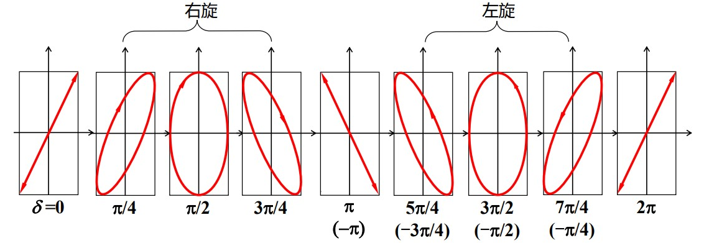
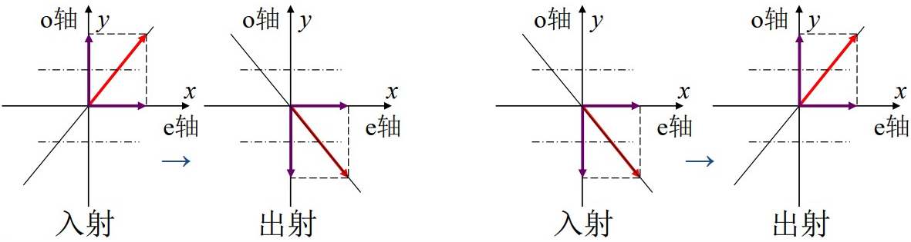
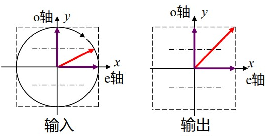
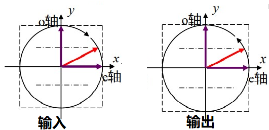
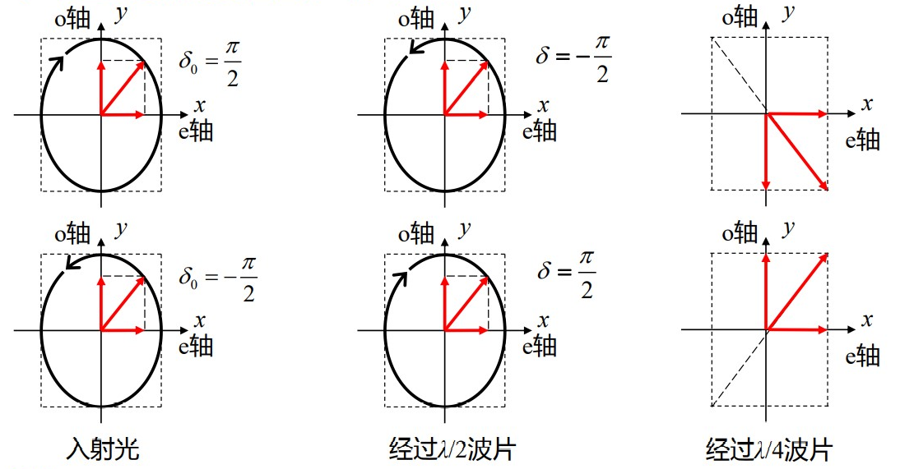

# 波片与光的偏振态

[TOC]

## 椭圆偏振光的演化

椭圆偏振光产生于两个同频率、相位差恒定且振动方向正交的线偏振光的叠加。线偏振光和圆偏振光都可看作椭圆偏振光的特例。

$$
\begin{cases}
    E_x=A_x\cos\omega t\\
    E_y=A_y\cos(\omega t+\delta)
\end{cases}\Rightarrow\frac{E_x^2}{A_x^2}+\frac{E_y^2}{A_y^2}-2\frac{E_x}{A_x}\frac{E_y}{A_y}\cos\delta=\sin^2\delta
$$

    

**这张图是重点，这张图是重点，这张图是重点（重要的事情说三遍!!）**

* $\delta=0$，线偏振光，且向一、三象限倾斜
* $0<\delta<\pi/2$，右旋椭圆偏振光，且向一、三象限倾斜
* $\delta=\pi/2$，右旋椭圆偏振光，正椭圆
* $\pi/2<\delta<\pi$，右旋椭圆偏振光，且向二、四象限倾斜
* $\delta=\pi$，线偏振光，且向二、四象限倾斜
* $\pi<\delta<2\pi/2(或-\pi<\delta<-\pi/2)$，左旋椭圆偏振光，且向二、四象限倾斜
* $3\pi/2<\delta<2\pi(或-\pi/2<\delta<0)$，左旋椭圆偏振光，且向一、三象限倾斜
* $\delta=2\pi$，线偏振光，且向一、三象限倾斜

## 波片对光偏振态的改变

波片的相位延迟作用使得从波片中出射的两列振动互相垂直的光波之间有一定的相位差。这两列光合成，使得出射光具有不同的偏振态，即合成光的偏振态取决于它们之间的相位差。

### 自然光

自然光是相位是随机的光波的叠加，在波片中的 o光、e光的相位也是随机的。因此，经波片后仍然是相位随机的多列波的叠加，即自然光经波片后仍是自然光。

### 线偏振光

线偏振光在波片中可分为正交的 o光、e光

$$
一、三象限振动\begin{cases}
    E_x=A_x\cos\omega t\\
    E_y=A_y\cos(\omega t+0)
\end{cases}\hspace{1cm}二、四象限振动\begin{cases}
    E_x=A_x\cos\omega t\\
    E_y=A_y\cos(\omega+\pi)
\end{cases}
$$

经过波片出射的正交分量产生额外的相位差 $\delta$（在快轴分量中相位超前 $\delta$ 或是在慢轴分量相位延迟 $\delta$）

#### 经过 $\lambda/4$ 波片

以 $y$ 方向为快轴，在该分量产生 $\pi/2$ 的额外相位差

$$
\begin{aligned}
    &\begin{cases}
        E_x=A_x\cos\omega t\\
        E_y=A_y\cos(\omega t+0)
    \end{cases}\xrightarrow{\pi/2相位差}\begin{cases}
        E_x=A_x\cos\omega t\\
        E_y=A_y\cos(\omega t+\pi/2)
    \end{cases}\Rightarrow右旋椭圆偏振光\\
    &\begin{cases}
        E_x=A_x\cos\omega t\\
        E_y=A_y\cos(\omega+\pi)
    \end{cases}\xrightarrow{\pi/2相位差}\begin{cases}
        E_x=A_x\cos\omega t\\
        E_y=A_y\cos(\omega t-\pi/2)
    \end{cases}\Rightarrow左旋椭圆偏振光
\end{aligned}
$$

同一种晶体的波片，当厚度不同时，对偏振态的改变不同。对于 $\lambda/4$ 波片，不同的厚度会导致两种不同的相位差，从而产生不同的偏振态

$$
\Delta\varphi=\frac{2\pi}{\lambda}(n_o-n_e)d=\begin{cases}
    2m\pi+\pi/2\Rightarrow右（左）旋偏振态\\
    2m\pi-\pi/2\Rightarrow左（右）旋偏振态\\
\end{cases}
$$

**所以，$\lambda/4$ 波片不仅要标注所适用的波长，还要标注光程差是 $\lambda/4$，还是 $3\lambda/4$，并要指出哪个方向是快轴。** 

#### 经过 $\lambda/2$ 波片

线偏振光经过 $\lambda/2$ 波片时会产生 $\pi$ 的额外相位差。出射光间的相位差是 $\pi$ 或者 $0$，还是线偏振光。由于 $\pi$ 的额外相位差，电矢量的振动方向翻转。

    

### 圆偏振光

#### 经过 $\lambda/4$ 波片

圆偏振光的两正交分量间的相位差是 $\pm\pi/2$，经过 $\lambda/4$ 波片，产生 $\pm\pi/2$ 的额外相位差。因此，出射光的正交分量间的相位差是 $0$、$\pi$，即圆偏振光经 $\lambda/4$ 波片变为线偏振光，且电矢量与光轴成 $45°$

    

#### 经过 $\lambda/2$ 波片

圆偏振光经过 $\lambda/2$ 波片，产生 $\pm\pi$ 的额外相位差。因此出射光还是圆偏振光，由于反相，出射光的旋转方向与入射光相反。

    

### 椭圆偏振光

椭圆偏振光的正交分量间有任意的固定相位差

$$
\begin{cases}
    E_x=A_x\cos\omega t\\
    E_y=A_y\cos(\omega t+\delta_0)
\end{cases}
$$

经过波片，产生额外的相位差，出射光的相位差仍是固定的任意值，仍是椭圆偏振光

$$
\begin{cases}
    E_x=A_x\cos\omega t\\
    E_y=A_y\cos(\omega t+\delta_0+\delta)
\end{cases}
$$

#### 经过 $\lambda/4$ 波片

经过 $\lambda/4$ 波片产生 $\pm\pi/2$ 的额外相位差，需要根据入射分量间的相位差 $\delta_0$ 作具体的分析（**虽然复杂，但是记住那张图就不怕**）

#### 经过 $\lambda/2$ 波片

椭圆偏振光经过 $\lambda/2$ 波片产生 $\pm\pi$ 的额外相位差，导致偏振光旋转方向相反，椭圆倾斜方向相反（**看最前面的图**）

#### 正椭圆偏振光

正椭圆偏正光经过 $\lambda/2$ 波片会使偏振光旋转方向相反；正椭圆偏振光经过 $\lambda/4$ 会变成线偏振光。

    

## 鉴别光的偏振态

| 光的种类 | 仅使用偏振器，并使其旋转 | $\lambda/4$ 片 + 偏振器 |
| :--: | :--: | :--: |
| 自然光 | 光强不变，不消光 | 光强不变，不消光 |
| 圆偏振光 | 光强不变，不消光 | 消光 |
| 线偏振光 | 光强改变，消光 | 光强改变，消光 |
| 部分偏振光 | 光强改变，但不消光 | 光强改变，但不消光 |
| 椭圆偏振光 | 光强改变，但不消光 | 有可能消光 |

**注意** 区分椭圆偏振光和部分偏振光时，需要旋转 $\lambda/4$ 波片，使其光轴与椭圆偏振光的长轴（或短轴重合），说白了就是让斜椭圆变成正椭圆，这样出射光才是线偏振光，可用偏振器鉴别。