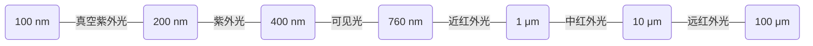
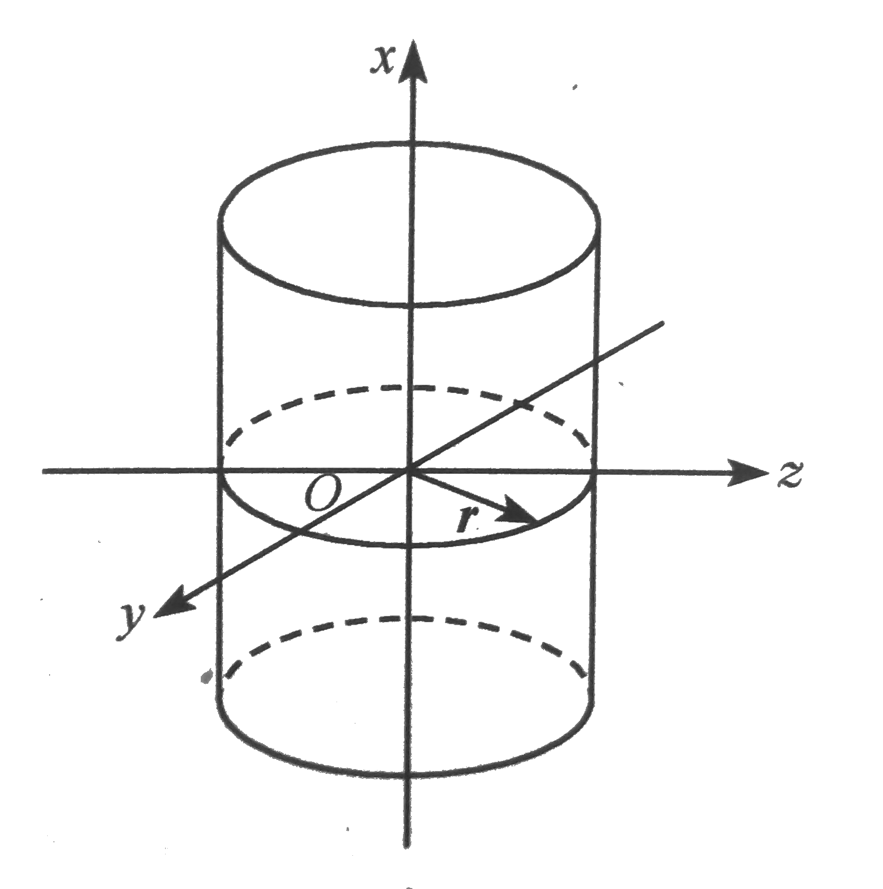
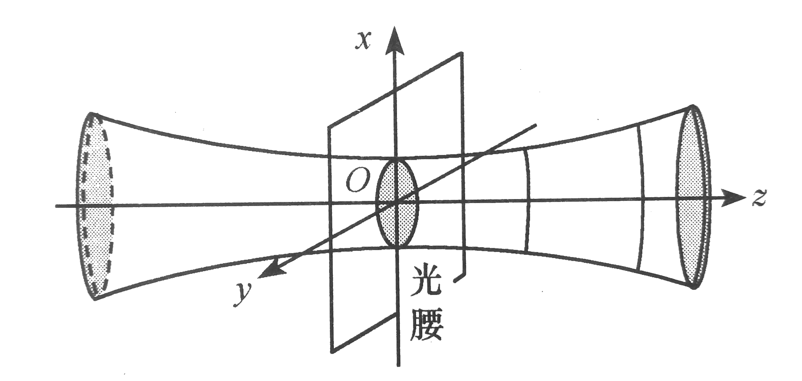
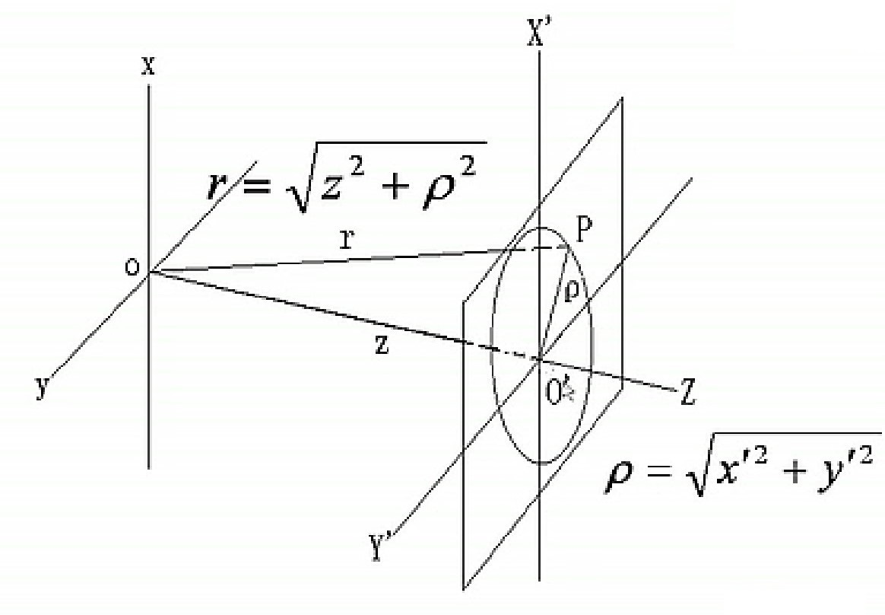

# 光波场

**波动光学的建立**

* 1678 年，惠更斯提出光的波动学说
* 1801 年，托马斯•杨在光通过双孔的实验中，首次观察到光的干涉现象
* 1808 年，马吕斯观察到了光的偏振现象，说明光是横波
* 1865 年，麦克斯韦提出电磁波理论，预言光是电磁波
* 1887 年，赫兹证实光是电磁波，光的电磁波模型建立

[TOC]

## 光是交变电磁波

光是电磁波，或者说，光是电磁辐射谱的一段，**光的波长范围** 可划分如下

*真空紫外光（VUV）在空气中被强烈吸收，只能在真空中传播*

从传播的角度看，光是波动，是振动的传播，可用速度、方向、振幅等参数描述。从物理量分布的角度看，光是空间场，用电场强度、磁感应强度等物理量描述。光是交变的电磁场（电场强度、磁感应强度随着时间变化），因此时间、空间是描述光波场的重要参量。

## 波的双重周期性

**时间周期性**

波场中任一点的物理量（电场强度 $\vec{E}$ 和磁感应强度 $\vec{B}$）随时间作周期性变化，具有时间上的周期性。

$$
\begin{aligned}
    时间周期&\Rightarrow T\\
    时间频率&\Rightarrow \nu=\frac{1}{T}\Rightarrow 圆频率\omega=2\pi\nu
\end{aligned}
$$

**空间周期性**

某一时刻，波场物理量的分布（电场强度 $\vec{E}$ 和磁感应强度 $\vec{B}$），随空间作周期性变化，具有空间上的周期性。

$$
\begin{aligned}
    空间周期&\Rightarrow \lambda\\
    空间频率&\Rightarrow \widetilde{\nu}=\frac{1}{\lambda}\Rightarrow角波数 k=2\pi\widetilde{\nu}
\end{aligned}
$$

## 定态光波

实际波动问题往往是非常复杂的（波源的复杂性与空间的复杂性），光学中研究的问题大多是无源场问题，并且总是在有限的时间和空间中对光进行研究。因此人们为简化波的研究时引入 **定态波场**  的概念

* 空间各点的扰动是同频率的简谐振动
* 波场中各点扰动的振幅不随时间变化，在空间形成一个稳定的振幅分布

定态波场的数学表达为

$$
\begin{aligned}
    U(\vec{r},t)&=A(\vec{r})\cos[\omega t-\varphi(\vec{r})]\\
    \xrightarrow[不随时间变化]{定态}&\begin{cases}
        A(\vec{r})\to振幅的空间分布\\
        \varphi(\vec{r})\to相位的空间分布
    \end{cases}
\end{aligned}
$$

满足定态波场要求的光波应当充满全空间，是无限长的单色波列。但当波列的持续时间比其扰动周期长得多时，可将其当作无限长波列处理。*定态光波不一定是简谐波，其空间各点的振幅可以不同。任何复杂的非单色波都可以分解为一系列单色波的叠加。*

### 常见的定态光波

#### 平面波（波面是平面）

**振幅** $A(\vec{\vec{r}})$ 为常数

$$
A(\vec{r})=const
$$

**空间相位** $\varphi(\vec{r})$ 为直角坐标的线性函数

$$
\varphi(\vec{r})=\vec{k}\cdot\vec{r}+\varphi_0=k_xx+k_yy+k_zz+\varphi_0
$$

**光波的余弦表达式**

$$
E(\vec{r},t)=A\cos(\omega t-\vec{k}\cdot\vec{r}+\varphi_0)
$$

#### 球面波（波面是球面）

**振幅** $A(\vec{r})$ 与该点离波源的距离成反比

$$
A(\vec{r})=\frac{a}{r}
$$

**空间相位** $\varphi(\vec{r})$ 球面对称

$$
\varphi(\vec{r})=kr+\varphi_0
$$

**光波的余弦表达式**

$$
E(\vec{r},t)=\frac{a}{r}\cos(\omega t-kr+\varphi_0)
$$

#### 柱面波（波面为圆柱面）

    

**振幅**

$$
A(r)=\frac{a}{r}
$$

**空间相位**

$$
\varphi(r)=kr+\varphi_0
$$

**光波的余弦表达式**

$$
E(r,t)=\frac{a}{r}\cos(\omega t-kr+\varphi_0)
$$

#### 高斯光束

    

**振幅**

$$
A(\vec{r})=\frac{A_0}{\omega(z)}\exp\left[\frac{x^2+y^2}{\omega^2(z)}\right]
$$

**空间相位**

$$
\varphi(\vec{r})=k\left[z+\frac{x^2+y^2}{2r(z)}\right]+\varphi_0
$$

在原点处，波面为平面，称为 **“光腰”**；在光腰外，波面都是球面，越远处球面曲率越大

## 光的传播

光波是横波，在真空和各向同性介质中，电场强度 $\vec{E}$、磁感应强度 $\vec{B}$、波矢 $\vec{k}$ 是两两正交的。对于平面波，其矢量表达式为

$$
\begin{aligned}
    \vec{E}(\vec{r},t)&=\vec{E}_0(\vec{\vec{r}})\cos(\omega t-\vec{k}\cdot\vec{r}+\varphi_0)\\
    \vec{B}(\vec{r},t)&=\vec{B}_0(\vec{r}_0)\cos(\omega t-\vec{k}\cdot\vec{r}+\varphi_0)
\end{aligned}
$$

光的传播，是振动的传播，就是将光波场中物理量的振动从一点传播到另一点。电场强度 $\vec{E}$ 和磁感应强度 $\vec{B}$ 的取值取决于波场的相位 $\varphi(\vec{r},t)=\cos(\omega t-\vec{k}\cdot\vec{r})$，所以说振动的传播其实就是相位的传播。在振动传播的过程中，相位保持不变

$$
\omega t-\vec{k}\cdot\vec{r}+\varphi_0=const\Rightarrow\vec{v}_p=\frac{\mathrm{d}\vec{r}}{\mathrm{d}t}=\frac{\omega}{k}
$$

$\vec{v}_p$ 反应的是相位传播的速度，所以也称作 **相速度**。相速度就是一般人们所讲的光速，从麦克斯韦方程组出发得到电场强度 $\vec{E}$ 与磁感应强度 $\vec{B}$ 的波动方程，从波动方程中推得到光速

$$
v=\frac{1}{\sqrt{\varepsilon\mu}}=\frac{1}{\sqrt{\varepsilon_r\varepsilon_0\mu_r\mu_0}}\xrightarrow{真空中的光速}c=\frac{1}{\sqrt{\varepsilon_0\mu_0}}
$$

人们把光在真空中的速度 $c$ 与在介质中的传播速度 $v$ 之比称为 **折射率**，记为 $n$

$$
n=\frac{c}{v}=\sqrt{\varepsilon_r\mu_r}
$$

对于透光的介质 $\mu_r\approx1$，故 $n\approx\sqrt{\varepsilon_r}$。光走过的路径（路程）与介质折射率的乘积称为 **光程**，波动光学中很重要的一点是 **相位由光程决定**

$$
\begin{aligned}
    \varphi(x)&=\omega t-kx+\varphi_0\\
    k&=\frac{2\pi}{\lambda}，\lambda=\frac{\lambda_0}{n}
\end{aligned}\Rightarrow\varphi(x)=\omega t-\frac{2\pi}{\lambda_0}(nx)+\varphi_0
$$

## 光强

电磁场具有能量，电磁波传播能量，光学中常用 **光通量** 与 **光强** 描述光传播的能量。

**光通量** —— 单位时间内，通过某一截面的能量，或通过某一截面的 **光功率**，就是波动学中讲的 **能流**

单位时间内通过垂直于传播方向单位面积的能量为 **能流密度**，电磁学理论用坡印廷矢量 $\vec{S}$ 描述能流密度

$$
\vec{S}=\vec{E}\times\vec{H}
$$

坡印廷矢量表示的是能流密度的瞬时值，这一数值以光的频率作周期性变化（没有测量意义）。所以人们引入能流密度的平均值 —— **光强 $I$**

$$
\begin{aligned}
    I&=\langle|\vec{S}|\rangle=\left\langle\vec{E}\times\frac{\vec{B}}{\mu_r\mu_0}\right\rangle\\
    &=\left\langle\vec{E}\times\frac{\vec{k}\times\vec{E}}{\omega\mu_r\mu_0}\right\rangle=\frac{1}{T}\int_0^T\frac{k}{\omega\mu_r\mu_0}E^2\mathrm{d}t\\
    &=\frac{1}{T}\int_0^T\sqrt{\frac{\varepsilon_0\varepsilon_r}{\mu_0\mu_r}}E_0^2\cos^2(\omega t-\vec{k}\cdot\vec{r}+\varphi_0)\mathrm{d}t\\
    &=\frac{n}{2c\mu_0\mu_r}E_0^2\approx\frac{n}{2c\mu_0}E_0^2
\end{aligned}
$$

因此，光强正比于电场强度振幅的平方

$$
I\propto nE_0^2
$$

## 光波的复振幅描述

波动的表达式可以用正弦函数或余弦函数表示，也可以用复指数表示。对于定态光波

$$
\begin{aligned}
    &U(\vec{r},t)=A(\vec{r})\cos[\omega t-\varphi(\vec{r})]\\
    \Leftrightarrow&\widetilde{U}(\vec{r},t)=A(\vec{r})e^{\pm i[\omega t-\varphi(\vec{r})]}
\end{aligned}
$$

指数上的正负号选择与谐振动无关，因此

$$
\begin{aligned}
    \widetilde{U}(\vec{r},t)&=A(\vec{r})e^{i\varphi(\vec{r})}e^{-i\omega t}\\
    &=\widetilde{U}(\vec{r})e^{-i\omega t}
\end{aligned}
$$

复指数表达式中，$e^{-i\omega t}$ 为时间因子，$\widetilde{U}(\vec{r})$ 为定态部分，称为 **复振幅**。复振幅包含了振幅 $A(\vec{r})$ 与相位 $\varphi(\vec{r})$ 的空间分布，即确定了定态光波在空间的分布情况，因此描述定态光波时人们常使用复振幅。光强也可以用复振幅表示

$$
I(\vec{r})=A^2(\vec{r})=\widetilde{U}^*(\vec{r})\widetilde{U}(\vec{r})
$$

*复振幅表示波动不仅在波动光学中使用，在电工学交流电路分析、量子力学波函数中都有应用，所以说复振幅是复变函数走向实际应用的典例*:smile:

## 有关光波的概念

**波面**：相位相等的空间点构成的曲面，也称作波阵面

**波前**：光学中，波前表示探测器的表面（比如与观察光斑的屏幕），衍射实验中的狭缝也是波前

**波前函数**：波前上的波函数

**等幅面**：振幅相等的空间点构成的曲面

**共轭波**：波前函数（复振幅）互为共轭的波

**波线**：与波面垂直的直线，表示波的传播方向，波线与波矢的方向是相同的。在几何光学中，波线就是光线

## 傍轴条件与远场条件

实际中，光源往往是点光源，在空间中形成球面波，但是探测器表面往往为平面，需要知道光波在一个平面波前上的光强、振动以及相位的分布，即平面上的波前函数。因此，往往需要将球面波近似为平面波处理。

为简化问题，讨论物点在光轴上的情况

    

球面波在接收屏 $P$ 点的振幅为

$$
\begin{aligned}
    A(P)&=\frac{a}{\sqrt{z^2+\rho^2}}=\frac{a}{|z|}\frac{1}{\sqrt{1+\left(\frac{\rho}{z}\right)^2}}\\
    &=\frac{a}{|z|}\frac{1}{1+\frac{1}{2}\left(\frac{\rho}{z}\right)^2+\cdots}
\end{aligned}
$$

若 $\rho^2\ll z^2$ 时

$$
\left(\frac{\rho}{z}\right)^2\ll1\Rightarrow A(P)=\frac{a}{|z|}
$$

接收屏上各点振幅均相等，$\rho^2\ll z^2$ 称为 **傍（近）轴条件**，傍轴条件下可作傍轴近似将球面波简化为

$$
\widetilde{U}(x',y',0)=\frac{E_0}{|z|}\exp\left[ik\left(z+\frac{x'^2+y'^2}{2z}\right)+i\varphi_0\right]
$$

球面波在接收屏上 $P$ 点的相位为

$$
\begin{aligned}
    \varphi(P)&=k\sqrt{z^2+\rho^2}=k|z|\sqrt{1+\left(\frac{\rho}{z}\right)^2}\\
    &=k\left(|z|+\frac{\rho^2}{2|z|}+\cdots\right)
\end{aligned}
$$

若 $\rho^2/\lambda\ll|z|$ 时

$$
\frac{k\rho^2}{2|z|}\ll \frac{k\lambda}{2}=\pi\Rightarrow\varphi(P)=k|z|
$$

接收屏上各点相位均相等，$\rho^2/\lambda\ll|z|$ 称为 **远场条件**，远场条件下可作远场近似将球面波简化为平面波

$$
\widetilde{U}(x',y',0)=\frac{E_0}{|z|}\exp(ikz+i\varphi_0)
$$

*光的波长 $\lambda$ 尺度远小于空间 $|z|$ 尺度，因此满足远场条件的情况一定也满足傍轴条件。*
