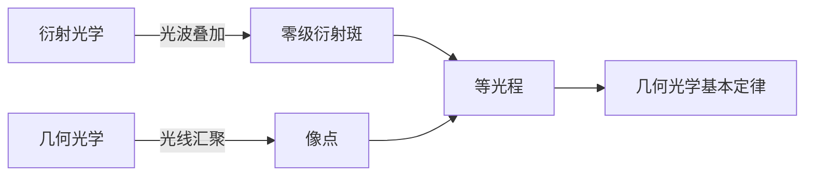
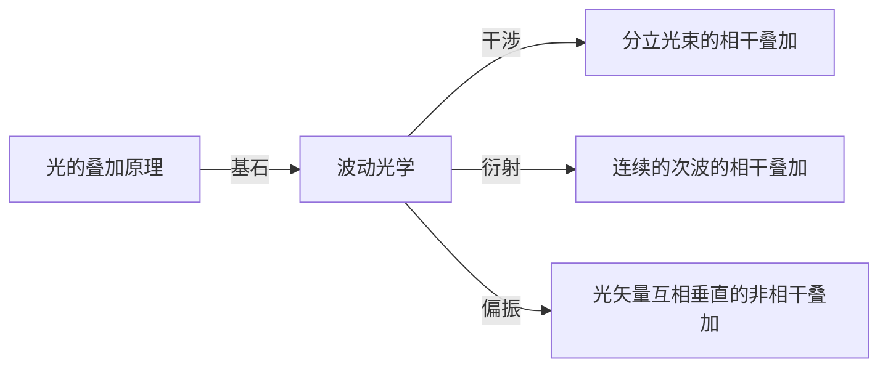

# 波动光学漫谈

[TOC]

## 几何光学与衍射光学

零级衍射斑的中心正是几何光学的像点，零级衍射斑的角宽度

$$
\begin{aligned}
    单缝衍射&\Rightarrow\Delta\theta=\frac{\lambda}{a}\\
    圆孔衍射&\Rightarrow\Delta\theta=1.22\frac{\lambda}{D}
\end{aligned}
$$

* $a$ 和 $D$ 是衍射孔径的几何尺度，即中央衍射斑的半角宽度都与衍射孔径的尺度成反比
* 只要衍射孔径尺度比光的波长尺度大得多，衍射效应将不显著，几何光学规律起主导作用

用夫琅禾费衍射的分析方法一样可以分析反射、折射情况，并且得到与几何光学相同的结果

虽然几何光学是衍射光学在大尺度下的近似，但并不是说光波模型一定比光线模型号。几何光学的直观性，易用性使其在某些场合不可被替代:smile:。

## 干涉与衍射

* 干涉是分立光束之间的相干叠加，这些光束是有限条，或虽然有无限多条，但是光束之间是离散的、不连续的、可数的，直接用波的叠加原理处理。
* 衍射是连续分布的无限多个点光源（次波中心）发出的光波的相干叠加。要用惠更斯-菲涅耳原理（即菲涅耳-基尔霍夫衍射积分）处理。

**因此，无论是衍射还是干涉，光波在相遇点都是振动的叠加，都遵循波的叠加原理**

* 干涉时，光的能量在空间均匀分布，各个亮条纹有相差不大的能量
* 衍射时，光的能量主要集中在一个特殊的衍射级上，更接近几何成像的情况

## 波动光学之禅

