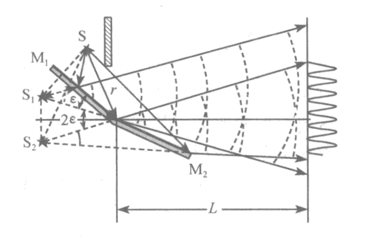
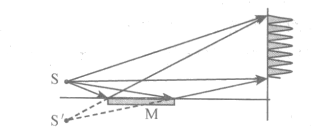
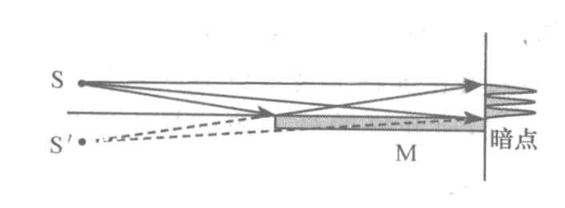
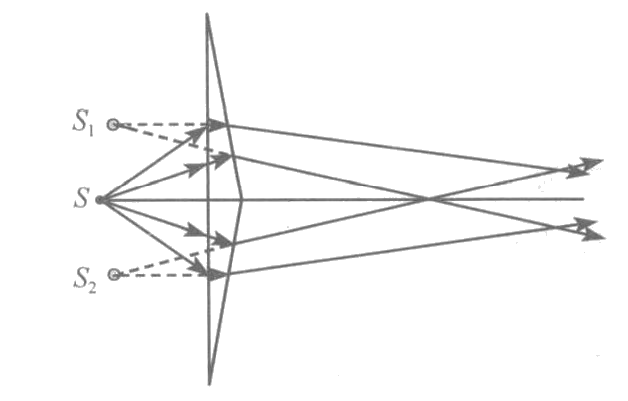
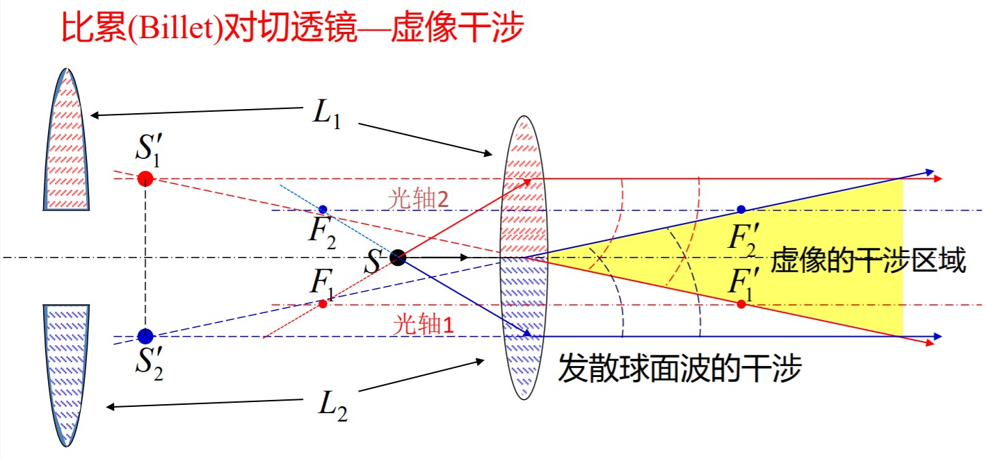

# 分波前的干涉装置

[TOC]

## 菲涅耳双面镜

    

如图，两个反射镜 $M_1$，$M_2$ 之间有较小的夹角 $\varepsilon$，光源 $S$ 与接收装置间有一个不透光的挡板，从光源 $S$ 发出的波列经两镜反射后分割为两光束，在它们的交叠区域出现等间距的干涉条纹。从屏幕上看，经反射镜 $M_1$，$M_2$ 射过来的光就相当于分别是从 $S$ 的虚像 $S_1$，$S_2$ 射过来的。可利用杨氏装置的结果得到条纹间距

$$
\Delta x=\frac{L+r}{2r\varepsilon}\lambda
$$

## 劳埃德镜

    

如图，在平面反射镜上方有一光源，则光源发出的光，一部分直接到达接收屏，另一部分经镜面反射后到达接收屏，在它们重叠的区域产生干涉。光源 $S$ 与它的几何像 $S'$，等效于杨氏干涉装置中的双缝。

### 劳埃德镜中的半波损失

    

如果让反射镜的前端抵住接收屏，则两列光到镜与屏幕接触点的光程是相等的，即接触点应该是零级亮条纹的位置，而事实上出现了暗纹。说明两列波在此处的并不同相而是刚好反相，这正是光在分界面反射时产生半波损失的结果。

## 菲涅耳双棱镜

    

将两个完全相同的三棱镜的底面相对，黏合起来，就组成了一个菲涅耳双棱镜。从光源 $S$ 发出的光经棱镜折射后，就相当于是从两个虚像点 $S_1$、$S_2$ 射过来的，在重叠区域产生干涉。根据几何关系可关系可证明，虚光源相当于 $S$ 在竖直方向上下移动了

$$
\frac{d}{2}=(n-1)\alpha l
$$

$n$ 为双棱镜折射率，$\alpha$  为双棱镜的两个底角大小，$l$ 为光源 $S$ 到棱镜的距离。两虚光源的间距 $d$ 就相当于杨氏干涉装置中的缝间距。

## 比累对切透镜

比累对切透镜是通过将透镜中间部分切去，剩余两部分粘合后形成。两部分光轴不重合，所成像点也不重合，就能在光波重叠区域产生干涉。

    
    

将切开部分沿光轴方向错开就是梅斯林透镜，梅斯林透镜也能在光波重叠区域形成干涉条纹。~~梅斯林透镜好像不怎么实用，我就不写了~~:smile: