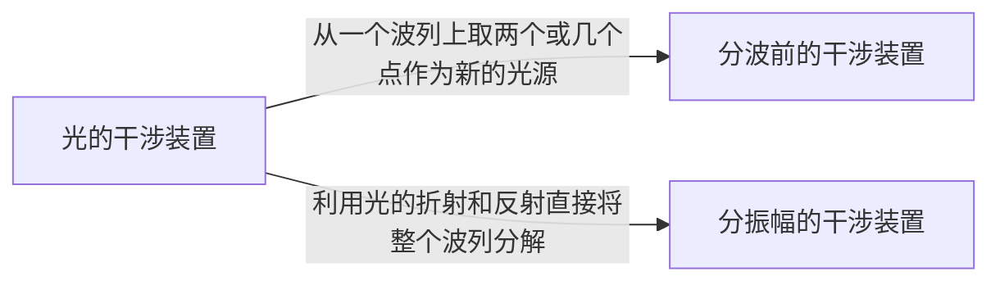

# 杨氏双缝干涉实验

1801 年，托马斯•杨成功地进行了光的双缝干涉实验，**第一次以直接的实验事实证明了光的波动性**，从而结束了以惠更斯为代表的波动说和以牛顿为代表的微粒说长达 100 余年的争论，从此确立了光的波动说。

[TOC]

## 相干光的获得

人们可以很方便地获得机械波的干涉图样（~~往水里扔两个石头就行~~），但是光的干涉却非常难实现，光的特性和光源的发光机制使得相干光的获得变得很不容易。

对于定态光波场，任意**两列波**之间的相位差 $\Delta\varphi_{mn}$ 都是稳定的，叠加后可以形成干涉（光强在空间中重新分布）

$$
I_{mn}=A_m^2+A_n^2+2A_mA_n\frac{1}{\tau}\int_0^\tau\cos\Delta\varphi_{mn}=I_m+I_n+2A_mA_n\cos\Delta\varphi_{mn}
$$

但是波场中有无数的波列，**所有光波**叠加时相位差 $\Delta\varphi_{mn}$ 是任意的，叠加后不能形成干涉（各处光强平均，没有明暗分布）

$$
\sum_{m,n}I_{mn}=\sum_{m,n}(I_m+I_n)+\sum_{m,n}2A_mA_n\cos\Delta\varphi_{mn}=\sum_{m,n}I_m+I_n
$$

也就是说如果不是非常多的波列叠加，则干涉现象是可以实现的，但对于普通光源，无法人为控制其自发辐射跃迁的过程（激光的受激辐射跃迁是可以人为控制的），大量的原子随机发光产生任意相位差，也就不能形成干涉。

因此托马斯•杨大胆地用分光波的装置（双缝）将每一列波分成两份，让每一个波列 **自己与自己叠加**，由于每一次叠加的光波都是从一个波列中分得的，因此这些光波都能产生相干叠加，形成干涉。

    

## 杨氏干涉分析

杨氏双缝干涉实验包含两个物理过程，光源发出大量光波，其中每一列光波经双缝分波后进行 **相干叠加**，形成一个干涉花样

$$
I_i=A_{i1}^2+A_{i2}^2+2A_{i1}A_{i2}\cos\Delta\varphi_i
$$

*相位差 $\Delta\varphi_{i}$ 由光源、双缝、场点的相对位置决定*

同一时间有大量原子跃迁，发出大量的互不相干的波列，这些波列自我干涉后进行 **非相干叠加**

$$
\begin{aligned}
    I=\sum_{i=1}^NI_i&=\sum_{i=1}^N(A_{i1}^2+A_{i2}^2+2A_{i1}A_{i2}\cos\Delta\varphi_i)\\
    &=\sum_{i=1}^N(A_{i1}^2+A_{i2}^2)+2\cos\Delta\varphi_i\sum_{i=1}^NA_{i1}A_{i2}
\end{aligned}
$$

最终在光屏上形成明暗交错的干涉条纹

    

### 对杨氏双缝干涉实验的评价

* **简单**：只有一个分光波的装置（双缝）
* **巧妙**：每个波列与自身之间相干叠加，不同波列之间光强叠加（非相干）
* **深刻**：
  1. 找到了相干光
  2. 干涉是自身的一部分与另一部分的叠加（量子力学态叠加）
  3. 杨氏双缝干涉实验是量子力学的基石之一（波粒二象性、玻恩统计解释、不确定性原理）

## 干涉花样

### 两个点光源的干涉

考虑两个点光源 $S_1$ 与 $S_2$（假设初始相位相同）在空间点 $P(x,y,z)$ 相遇，相位差 $\Delta\varphi$ 正比于光程差 $\Delta L$

    

$$
\begin{aligned}
    \Delta L&=n_2r_2-n_1r_1\\
    \Delta\varphi&=\frac{2\pi}{\lambda}(n_2r_1-n_1r_1)
\end{aligned}
$$

在真空中，$n_1=n_2=1$

$$
\begin{aligned}
    \Delta L&=r_2-r_1\\
    \Delta\varphi&=\frac{2\pi}{\lambda}(r_2-r_1)
\end{aligned}
$$

干涉的光强为

$$
I=A_1^2+A_2^2+2A_{1}A_{2}\cos\Delta\varphi=A_1^2+A_2^2+2A_{1}A_{2}\cos\frac{2\pi}{\lambda}(r_2-r_1)
$$

在空间中会出现明暗交错的条纹

$$
\begin{aligned}
    干涉相长&\Rightarrow\Delta L=r_2-r_1=m\lambda\\
    干涉相消&\Rightarrow\Delta L=r_2-r_1=(2m+1)\frac{\lambda}{2}\\
    干涉级数&\Rightarrow m=0,\pm1,\pm2,\cdots
\end{aligned}
$$

交错的亮条纹和暗条纹在空间形成一系列双叶旋转的双曲面。在平面接收屏上为一组双曲线，明暗交错分布，尝试计算在接收屏上的光强（狭缝处光强相等以简化计算），在空间建立如图坐标系，缝屏距 $z=D$，双缝坐标为 $x=\pm\frac{d}{2},y=0$，

    

$d\ll D$，可作傍轴近似，点光源发出的球面波在屏上的复振幅为

$$
\begin{aligned}
    \widetilde{U}_1&=\frac{A}{D}\exp\left\{ik\left[D+\frac{(d/2)^2+x'^2+y'^2}{2D}\right]\right\}\exp\left(\frac{-ikd}{2D}x'\right)\\
    \widetilde{U}_2&=\frac{A}{D}\exp\left\{ik\left[D+\frac{(d/2)^2+x'^2+y'^2}{2D}\right]\right\}\exp\left(\frac{ikd}{2D}x'\right)
\end{aligned}
$$

复振幅叠加后发现光强的分布非常简单

$$
I=4I_0\cos^2\left(\frac{kd}{2D}x'\right)\hspace{1cm}I_0=\left(\frac{A}{D}\right)^2
$$

光强分布的表达式说明，在接收屏上一个不大的区域内，干涉花样是一系列等间隔的平行直条纹

$$
\begin{aligned}
    亮纹中心&\Rightarrow\frac{kd}{2D}x'=m\pi\Rightarrow x'_m=m\frac{D}{d}\lambda\\
    暗纹中心&\Rightarrow\frac{kd}{2D}x'=\left(m+\frac{1}{2}\right)\pi\Rightarrow x'=\left(m+\frac{1}{2}\right)\frac{D}{d}\lambda
\end{aligned}
$$

相邻亮（暗）条纹间距

$$
\frac{kd}{2D}\Delta x'=\pi\Rightarrow\Delta x'=\frac{D}{d}\lambda
$$

也可以通过（近轴）几何近似的方法获得得到条纹中心位置

    

$$
\left\{\begin{aligned}
    \Delta L&\approx d \theta\\
    x&\approx D\theta
\end{aligned}\right.\Rightarrow\left\{\begin{aligned}
    亮纹中心： &\Delta L=m\lambda\Rightarrow x=m\frac{D}{d}\lambda\\
    暗纹中心： &\Delta L=\left(m+\frac{1}{2}\right)\lambda\Rightarrow x=\left(m+\frac{1}{2}\right)\frac{D}{d}\lambda
\end{aligned}\right.
$$

### 干涉条纹的反衬度

在接收屏上一选定的区域中，取光强最大值 $I_{\max}$ 和最小值 $I_{\min}$，反衬度 $\gamma$ 定义为

$$
\gamma=\frac{I_{\max}-I_{\min}}{I_{\max}+I_{\min}}
$$

反衬度衡量了干涉花样的明暗反差，干涉实验中

$$
I_{\max}=(A_1+A_2)^2\hspace{1cm}I_{\min}=(A_1-A_2)^2
$$

则

$$
\gamma=\frac{2A_1A_2}{A_1^2+A_2^2}=\frac{2\frac{A_1}{A_2}}{1+\left(\frac{A_1}{A_2}\right)^2}
$$

* 当 $A_1=A_2$ 时，$\gamma=1$，即两列光的强度相当时，反衬度最大（亮暗条纹最明显）
* 当 $A_1\gg A_2$ 或 $A_1\ll A_2$ 时，$\gamma\approx0$，即两列光的强度相差悬殊时，反衬度最小

## 光的干涉装置

杨氏干涉装置虽然简单，但是找到了用普通光源 **产生相干光的根本途径 —— 分割同一波列**，再使之相遇产生干涉。

*分波前的干涉装置都由杨氏干涉装置演化而来，因此杨氏干涉装置是最典型的分振幅的干涉装置。*

