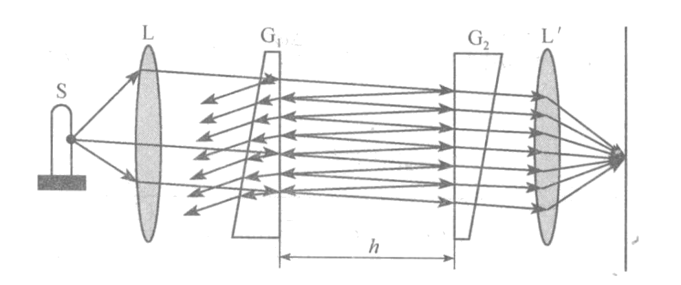
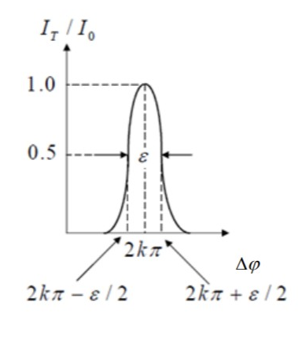
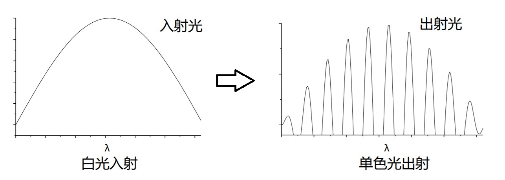
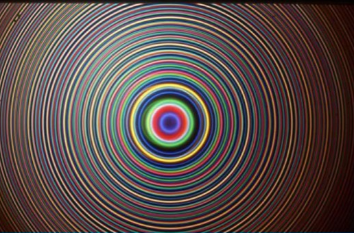

# 法布里-珀罗干涉仪

[TOC]

## 干涉装置

法布里-珀罗干涉仪是一种 **多光束干涉装置**[^多光束干涉]。法布里-珀罗干涉仪的结构如图所示，$G_1$、$G_2$ 是两块用光学玻璃或石英晶体制成的直角梯形，相对的两个表面彼此严格平行，并镀有高反射率薄膜。

    

这样就在中间形成了一个具有高反射率表面的平行空气薄膜。从 $G_1$ 入射的光线将在它的两个表面之间反复反射，最后从 $G_2$ 透射的光波叠加在接收屏上 **形成和迈克尔孙干涉仪相似的等倾干涉条纹，但法布里-珀罗干涉仪是多光束干涉装置，产生的亮条纹要比迈克尔孙干涉仪更细锐**。

*法布里-珀罗干涉仪最早用于分析光谱线的精细结构，近年来又被应用到激光器上 —— 法布里-珀罗腔*

## 光强分布

### 反射光强分布

第一列反射光的振幅为 $A_1=Ar$，第 $n$ 列反射光的振幅为 $A_n=Ar^{2n-3}(1-r^2)$；第一列反射光需要考虑半波损失，其余相邻反射光间有相同的光程差

$$
\Delta L=2n_2h\cos i_2\Rightarrow\Delta\varphi=\frac{2\pi}{\lambda}\Delta L=\frac{4\pi n_2h\cos i_2}{\lambda}
$$

设入射点处的相位为 $\varphi_0$，第一列反射波的相位为 $\varphi_0+\pi$，第 $n$ 列反射波的相位为 $\varphi_0+(n-1)\Delta\varphi$，则反射光波的复振幅叠加为

$$
\begin{aligned}
    \widetilde{U}_R&=\widetilde{U}_1+\widetilde{U}_2+\widetilde{U}_3+\widetilde{U}_4+\cdots\\
    &=Are^{i(\varphi_0+\pi)}+\sum_{n=2}^{\infty}Ar^{2n-3}(1-r^2)e^{i[\varphi_0+(n-1)\Delta\varphi]}\\
    &=Are^{i\varphi_0}\left(\frac{-1+e^{i\Delta\varphi}}{1-r^2e^{i\Delta\varphi}}\right)
\end{aligned}
$$

薄膜的光强反射率 $R=|r|^2=|r'|^2$，则反射光强分布为

$$
\begin{aligned}
    I_R&=\widetilde{U}_R\widetilde{U}^*_R=A^2R\left(\frac{-1+e^{i\Delta\varphi}}{1-Re^{i\Delta\varphi}}\right)\left(\frac{-1+e^{-i\Delta\varphi}}{1-Re^{-i\Delta\varphi}}\right)\\
    &=\frac{I_0}{1+\frac{(1-R)^2}{4R\sin^2\frac{\Delta\varphi}{2}}}
\end{aligned}
$$

### 透射光强分布

第 $n$ 列透射光的振幅为 $A'_n=Ar^{2(n-1)}(1-r^2)$，且相邻透射光的光程差相同

$$
\Delta L=2n_2h\cos i_2\Rightarrow\Delta\varphi=\frac{2\pi}{\lambda}\Delta L=\frac{4\pi n_2h\cos i_2}{\lambda}
$$

所有透射波叠加可以不考虑半波损失，则透射波叠加的复振幅

$$
\begin{aligned}
    \widetilde{U}'_T&=\sum_{n=1}^{\infty}Ar^{2(n-1)}(1-r^2)e^{i[\varphi_0+(n-1)\Delta\varphi]}\\
    &=A(1-r^2)e^{i\varphi_0}\frac{r}{1-r^2e^{i\Delta\varphi}}
\end{aligned}
$$

透射光强分布为

$$
I_T=\widetilde{U}'_T\widetilde{U}'^*_T=\frac{I_0}{1+\frac{4R\sin^2\frac{\Delta\varphi}{2}}{(1-R)^2}}
$$

## 光波场特性

### 半值宽度

    

半值宽度（半峰半宽）指光强降为峰值一半时峰的角宽度，半值宽度衡量了干涉条纹的细锐程度。法布里-珀罗干涉仪的透射光强分布关系中看出，$\Delta\varphi=2k\pi$ 处有最大光强 $I_0$，半值宽度要求 $I_T/I_0=1/2$

$$
\frac{I_T}{I_0}=\frac{1}{2}\Rightarrow\frac{4R\sin^2\frac{2k\pi\pm\varepsilon}{2}}{(1-R)^2}=1
$$

得到多光束干涉（法布里-珀罗干涉仪）条纹的半值宽度

$$
\varepsilon=\frac{2(1-R)}{\sqrt{R}}
$$

将该结果与双光束干涉（迈克尔孙干涉仪）的条纹半值宽度对比

$$
\begin{cases}
    \widetilde{U}_1=Are^{i(\varphi_0+\pi)}\\
    \widetilde{U}_2=Artt'e^{i(\varphi_0+\Delta\varphi)}
\end{cases}\Rightarrow I_R\approx 2A^2r^2(1+\cos\Delta\varphi)\Rightarrow\varepsilon=\pi
$$

可见多光束干涉的亮条纹比双光束干涉更细锐

### 条纹半角宽度

$$
\begin{aligned}
    \Delta\varphi_k=\frac{2\pi}{\lambda}\Delta L=\frac{4\pi n_2h\cos i_2}{\lambda}&\Rightarrow\mathrm{d}(\Delta\varphi_k)=-\frac{4\pi n_2h\sin i_2}{\lambda}\mathrm{d}i_2\\
    \mathrm{d}(\Delta\varphi_k)=\varepsilon&\Rightarrow\Delta i_k=\frac{\lambda\varepsilon}{4\pi n_2h\sin i_2}
    =\frac{\lambda}{2\pi n_2h\sin i_2}\frac{1-R}{\sqrt{R}}
\end{aligned}
$$

光强反射率 $R$ 大，$\Delta i_k$ 小，条纹锐；中央条纹宽，周围细。

$$
\begin{aligned}
    多光束干涉&\Rightarrow\Delta i_k=\frac{\lambda}{2\pi n_2h\sin i_2}\frac{1-R}{\sqrt{R}}\\
    双光束干涉&\Rightarrow\Delta i_k=\frac{\lambda}{4n_2h\sin i_2}
\end{aligned}
$$

法布里-珀罗干涉条纹比一般的薄膜干涉细锐得多，即出射的条纹发散角很小。在激光器设计中，小的发散角意味着激光的平行性好。

### 谱线宽度

对于非单色光，在多光束干涉情况下只有特定波长的光会被干涉加强

$$
k\lambda_k=2n_2h\cos i_2\Rightarrow\lambda_k=\frac{2n_2h\cos i_2}{k}
$$

在 $\lambda_k$ 附近，计算可见波长范围（谱线宽度）$\Delta\lambda_k$

$$
\mathrm{d}(\Delta\varphi_k)=-\frac{4\pi n_2h\cos i_2}{\lambda_k^2}\mathrm{d}\lambda_k\xrightarrow{\mathrm{d}(\Delta\varphi_k)=\varepsilon}\Delta\lambda_k=\frac{\lambda^2}{2\pi n_2h\cos i_2}\frac{1-R}{\sqrt{R}}=\frac{\lambda}{k\pi}\frac{1-R}{\sqrt{R}}
$$

法布里-珀罗腔间距 $h$ 越大，反射镜的反射率 $R$ 越大，谱线宽度 $\Delta \lambda_k$ 越小。因此，法布里-珀罗腔常用于激光模式（频率）选择，保证激光的单色性。

    

### 光谱精细结构分析

法布里-珀罗干涉仪的亮条纹比其他薄膜干涉条纹细锐得多，使得其在光谱精细结构分析中大有应用。根据泰勒判据[^泰勒判据]

$$
\left.\begin{aligned}
    波长变化引起的角距离&\Rightarrow\delta i=\frac{k}{2n_2h\sin i_2}\delta\lambda\\
    条纹半角宽度&\Rightarrow\Delta i_k=\frac{\lambda}{2\pi n_2h\sin i_2}\frac{1-R}{\sqrt{R}}
\end{aligned}\right\}\xrightarrow[瑞利判据]{\delta i_k\geqslant\Delta i_k}\delta\lambda\geqslant\frac{\lambda}{k\pi}\frac{1-R}{\sqrt{R}}
$$

    

即可分辨波长的最小间隔

$$
\delta\lambda=\frac{\lambda}{k\pi}\frac{1-R}{\sqrt{R}}
$$

因此，法布里-珀罗干涉仪的色分辨本领

$$
A=\frac{\lambda}{\delta\lambda}=\frac{\sqrt{R}}{1-R}k\pi
$$

[^多光束干涉]:如果薄膜的两个表面对光的反射率很高，则各列反射光的强度相差不是很大，这时除了第一和第二反射光之外，其他的反射波列对干涉的贡献就不可忽略；同样，所有透射波列之间，也会产生明显的干涉。

[^泰勒判据]:泰勒判据 —— 相邻的不同波长的两条纹的角距离等于每一个条纹的半角宽度时，为可以分辨的极限