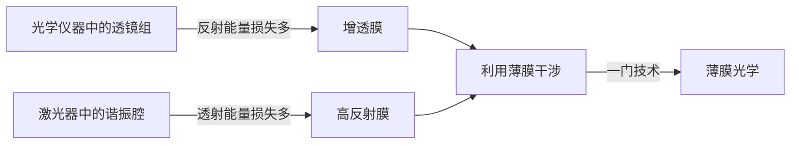

# 薄膜干涉

一列光波在薄膜的上表面处分为反射和折射两部分，折射部分在下表面又产生反射和折射，反射光到达上表面又有反射与折射……最后在薄膜上表面有一系列光波，在薄膜下表面也有一系列透射波。由于这些光都是从同一列光分得的，所以是相干的；这些光是将入射光的能量（振幅）分为几部分得到的，因此薄膜上下表面的光波会发生 **分振幅干涉**。

    

从上表面反射的光，可以向任意方向传播，从薄膜内部透射出来的光同样可以向任意方向传播，所以可以在空间各处产生干涉。<u>普遍地讨论薄膜的干涉是非常复杂的问题，实际应用中意义最大的是厚度不均匀薄膜表面的 **等厚干涉** 和厚度均匀薄膜在无穷远产生的 **等倾干涉**。</u>

[TOC]

## 反射波透射波间的干涉

    

薄膜有上下两个界面，一般情况下薄膜上部折射率与下部折射率相等 $n_1=n_2$。光从折射率为 $n_1$ 向折射率为 $n$ 的介质入射时，对振幅的反射率为 $r$，透射率为 $t$；光从折射率为 $n$ 向折射率为 $n_1$ 的折射率入射时，对振幅的反射率为 $r'$，对振幅的透射率为 $t'$。设入射波的振幅为 $A$，根据斯托克斯倒逆关系

$$
\begin{cases}
    r'=-r\\
    tt'=1-r^2
\end{cases}
$$

得到各列反射波与透射波的振幅为

$$
\begin{cases}
    A_1=Ar\\
    A_2=Atr't'=Ar'(1-r^2)\\
    A_3=Atr'^3t'=Ar'^3(1-r^2)\\
    \cdots\cdots\\
    A_n=Ar^{2n-3}(1-r^2)\\
    \cdots\cdots
\end{cases}\hspace{2cm}\begin{cases}
    A'_1=Att'=A(1-r^2)\\
    A'_2=Atr^2t'=Ar^2(1-r^2)\\
    A'_3=Atr^4t'=Ar^4(1-r^2)\\
    \cdots\cdots\\
    A'_n=Ar^{2(n-1)}(1-r^2)\\
    \cdots\cdots
\end{cases}
$$

透明介质的反射率很小 $r\ll1$

* 反射波中 $A_1\approx A_2\gg A_3\gg A_4\gg\cdots\Rightarrow$ 只有第一列和第二列反射波之间有显著的干涉
* 透射波中 $A'_1\gg A'_2\gg A'_3\gg A'_4\gg\cdots\Rightarrow$ 不能产生有效的干涉效应

对于反射率较高的薄膜需要考虑所有反射波（透射波）之间的干涉，即法布里-珀罗干涉仪（多光束干涉）的处理方法。

## 等倾干涉

对于厚度一定的薄膜，互相平行的反射光（透射光）经透镜会聚进行相干叠加，这些进行干涉的光相对于薄膜有相同的倾角（相对于透镜也有相同的倾角），因而这种干涉叫做 **等倾干涉**。

    

### 干涉级

    

如图，光在入射点 $A$ 发生反射与折射，折射进入薄膜的光波在下表面 $B$ 处反射，经上表面 $C$ 处射出。两平行光束经透镜会聚后相干叠加，其光程差为

$$
\begin{aligned}
    \delta&=n_2(\overline{AB}+\overline{BC})-n_1\overline{AD}+\frac{\lambda}{2}
\end{aligned}
$$

考虑到介质折射率不同，反射时会出现半波损失，计算得到两反射波的光程差

$$
\delta=2n_2h\cos i_2+\frac{\lambda}{2}=2h\sqrt{n_2^2-n_1^2\sin i_1^2}+\frac{\lambda}{2}
$$

则入射角相同，光程差相同，对应同一干涉级，也就是同一干涉条纹

$$
\begin{aligned}
    干涉明纹&\Rightarrow2h\sqrt{n_2^2-n_1^2\sin i_1^2}+\frac{\lambda}{2}=k\lambda\\
    干涉暗纹&\Rightarrow2h\sqrt{n_2^2-n_1^2\sin i_1^2}+\frac{\lambda}{2}=(2k+1)\frac{\lambda}{2}
\end{aligned}
$$

### 干涉条纹与光源

具有相同倾角的平行光经透镜会聚于接收屏（焦平面）上形成一个圆环。因此无论是点光源还是扩展光源，无论光源处于什么位置，在接收屏上的干涉花样都是同心圆环条纹，且圆环的中心位于透镜的光轴上。

    

### 等倾干涉条纹的特征

#### 中央亮纹

亮条纹应满足

$$
2h\sqrt{n_2^2-n_1^2\sin i_1^2}=2n_2h\cos i_2=(2k+1)\frac{\lambda}{2}
$$

中央条纹对应 $i_1=i_2=0$ 即垂直入射的光束，$k$ 取最大值（**中央亮纹的干涉级数最大**）

#### 光学厚度

对同一级干涉条纹（同一 $k$），厚度 $h$ 增大时，相应的入射角 $i_1$ 增大，即圆环膨胀；厚度 $h$ 减小时，相应的入射角 $i_1$ 减小，即圆环收缩。干涉级不仅与薄膜的绝对厚度 $h$ 有关，还与薄膜的折射率 $n_2$ 有关，因此把 $n_2h$ 定义为薄膜的 **光学厚度**。

#### 条纹间距与角宽度

相邻条纹的角距离 $\Delta i$ 描述干涉级 $k$ 变化所引起的角度该变量（**条纹间距**）

$$
-2n_2h\sin i_2\Delta i_2=\lambda\Rightarrow\Delta i_2=-\frac{\lambda}{2n_2h\sin i_2}
$$

相邻两暗条纹间的角距离描述了 **亮条纹的角宽度**

$$
\begin{aligned}
    2n_2h\cos i_2&=(2k+1)\frac{\lambda}{2}\\
    2n_2h\cos (i_2+\Delta i_2)&=k\lambda
\end{aligned}\Rightarrow\Delta i_2=\frac{\lambda}{4n_2h\sin i_2}
$$

从条纹间距和条纹角宽度的关系式中看出

* 膜的厚度增加，条纹间隔减小，干涉条纹越密
* 中心处，入射角度小，条纹角宽度大，即条纹中心疏，周围密

## 等厚干涉

    

如果薄膜上下表面不平行，而是有一夹角 $\alpha$，在光波相交处均有干涉，整个空间都有干涉条纹，人们通常研究光波在薄膜表面叠加所形成的干涉。

如图在薄膜两表面夹角 $\alpha$ 很小的情况下，两列反射波的光程差

$$
\begin{aligned}
    \delta&=n_2(\overline{AB}+\overline{BC})-n_1\overline{DC}+\frac{\lambda}{2}\\
    &\approx2n_2h\cos i_2+\frac{\lambda}{2}=2h\sqrt{n_2^2-n_1^2\sin i_1^2}+\frac{\lambda}{2}
\end{aligned}
$$

则亮纹条件为

$$
2h\sqrt{n_2^2-n_1^2\sin i_1^2}s=(2k+1)\frac{\lambda}{2}\hspace{0.5cm}或\hspace{0.5cm}2n_2h\cos i_2=(2k+1)\frac{\lambda}{2}
$$

暗条纹条件为

$$
2h\sqrt{n_2^2-n_1^2\sin i_1^2}s=k\lambda\hspace{0.5cm}或\hspace{0.5cm}2n_2h\cos i_2=k\lambda
$$

薄膜表面干涉条纹的形状，与光源入射方式和观察方式有很大的关系。实际中采用最多的正入射方式，这种情况下，两列波的光程差为

$$
\delta=2n_2h+\frac{\lambda}{2}
$$

两列波叠加产生干涉条纹

$$
\begin{aligned}
    亮纹条件&\Rightarrow2n_2h=(2k+1)\frac{\lambda}{2}\\
    暗纹条件&\Rightarrow2n_2h=k\lambda
\end{aligned}
$$

由于同一级亮条纹出现在薄膜厚度相等的地方，因而这种干涉被称作 "**等厚干涉**"。

### 楔形膜

    

如图所示的楔形薄膜，相邻两根亮条纹间的厚度差为

$$
\Delta h=\frac{\lambda}{2n_2}
$$

如果楔角为 $\alpha$，则从表面看到条纹间距

$$
\Delta l=\frac{\Delta h}{\alpha}=\frac{\lambda}{2n_2\alpha}
$$

在楔形膜尖端处，只有半波损失，反射光永远是暗纹，透射光永远是亮纹。

*楔形膜的等厚干涉图样常用于小尺度的检测，比如细丝、钢珠直径，热胀系数，表面光洁度等。*

    

#### 条纹偏离等厚线

    

严格的等后干涉要求正入射，楔形膜的等厚条纹应该是相互平行的等间隔直条纹。但实际上眼睛的瞳孔对光束进行了限制，两侧的光只有倾斜才能进入人眼，倾斜情况下 $i_2\neq0$

$$
\hspace{0.5cm}2n_2h\cos i_2=(2k+1)\frac{\lambda}{2}
$$

只有在膜增加一定厚度的地方才能出现同一级亮条纹，眼睛看到的现象就是条纹向膜厚的地方弯曲。

### 牛顿环

    

在一个玻璃平板上放一个平凸透镜，则两者之间形成一厚度不均匀的空气薄膜，产生等候干涉的条纹为一系列以接触点为中心的同心环。这种干涉条纹是牛顿首先观察到并加以描述的，故称 **牛顿环**。

如图曲率半径为 $R$ 的平凸透镜与平面玻璃接触于点 $O$。对于空气薄膜厚度为 $h$ 处的干涉条纹的半径为 $r$，可根据几何关系得到 $h$ 与 $r$ 的关系

$$
\begin{cases}
    h=R(1-\cos\alpha)\\
    r=R\sin\alpha\\
    \cos\alpha=\sqrt{1-\sin^2\alpha}
\end{cases}\xrightarrow{r\ll R}h=\frac{r^2}{2R}
$$

**反射光在空气膜上表面干涉**

一列在球面被反射，另一列在平面被反射（存在半波损失），根据亮纹条件得到牛顿环半径

$$
2h=(2k+1)\frac{\lambda}{2}\Rightarrow r_{k}=\sqrt{\left(k+\frac{1}{2}\right)\lambda R}
$$

接触点 $O$ 处只存在半波损失，为暗纹中心。实验中常用牛顿环测算透镜曲率半径

$$
R=\frac{r_{k+m}^2-r_k^2}{m\lambda}
$$

    
    

**透射光在空气膜下表面干涉**

一列直接透过，另一列在平面和球面间反射后透过，由于两次反射相当于没有半波损失，牛顿环的半径为

$$
2h=k\lambda\Rightarrow r_k=\sqrt{k\lambda R}
$$

透射的牛顿环花样与反射的牛顿环花样刚好互补。

## 增透膜和高反射膜

