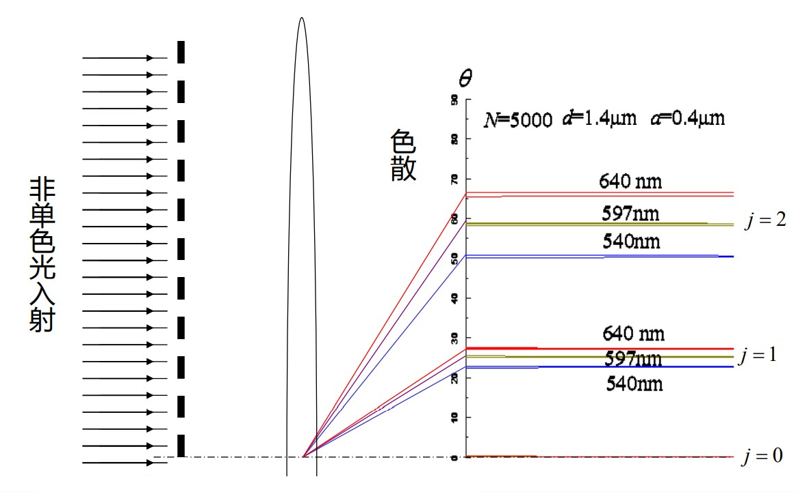
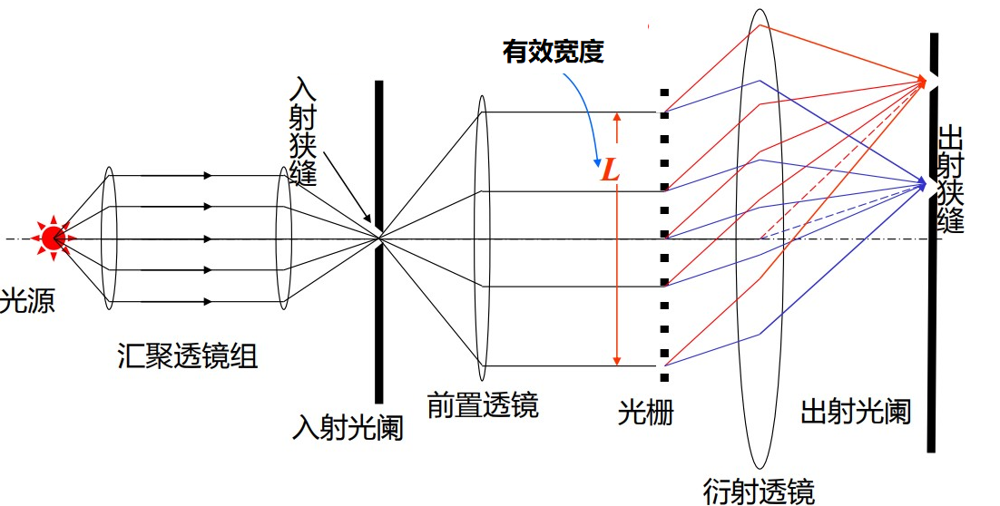
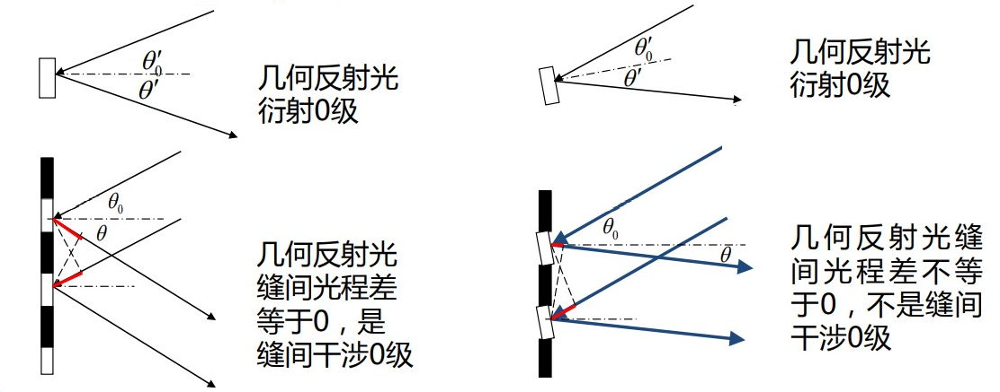
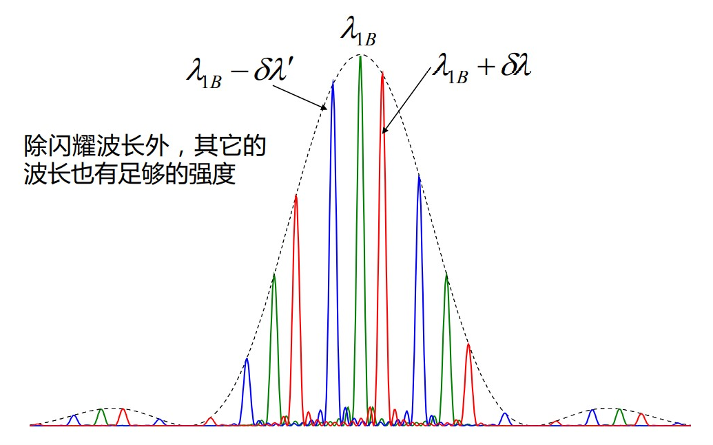

# 光栅光谱

[TOC]

## 光栅的分光原理

$$
\boxed{d\sin\theta=k\lambda}
$$

光栅方程可以告诉我们两点

* 对于单色光，经过衍射，不同的衍射级次具有不同的衍射角，即 $\theta=\theta(k)$
* 对于复色光，在同一级衍射谱中，不同的波长具有不同的衍射角，即 $\theta=\theta(\lambda)$

不同波长的光经光栅后会在空间散开，说明光栅具有色散能力

    

*区别于棱镜光谱仪的是光栅光谱仪有多套光谱，分别对应于光栅的不同衍射级次，而棱镜光谱仪只有一套。*

## 谱线的角宽度和光栅的色分辨本领

### 谱线的角宽度

**主极大的半角宽度** —— 中心到邻近暗线间的角距离，也就是极大值到相邻极小值的角距离，它描述了每一级衍射光谱线在空间的展宽。

$$
\left\{\begin{aligned}
    主极大&\Rightarrow d\sin\theta_k=k\lambda\\
    相邻极小&\Rightarrow d\sin(\theta_k+\Delta\theta_k)=\left(k\pm\frac{1}{N}\right)\lambda
\end{aligned}\right.\Rightarrow\boxed{\Delta\theta_k=\frac{\lambda}{Nd\cos\theta}=\frac{\lambda}{L\cos\theta}}
$$

*$L=Nd$ 为光栅的 **有效宽度**，光栅上只有被入射光覆盖的部分才能起到衍射的作用，所以有效宽度指的是光栅上入射光斑的宽度。*

    

### 光栅的色分辨本领

在同一级衍射谱中，不同的波长成分有不同的衍射角。如果波长差为 $\delta\lambda$ 的两根光谱线靠得较近，则有可能相互重叠而无法分辨。有光栅方程可以得到波长差为 $\delta\lambda$ 的同级衍射谱线在空间的角距离 $\delta\theta$

$$
d\sin\theta=k\lambda\Rightarrow d\cos\theta\delta\theta=k\delta\theta\Rightarrow\delta\theta=k\frac{\delta\lambda}{d\cos\theta}
$$

瑞利判据要求波长差引起的角距离大于半角宽度，谱线才可分辨

$$
\delta\theta\geqslant\Delta\theta\Rightarrow\boxed{\delta\lambda\geqslant\frac{\lambda}{kN}}
$$

只有波长差满足该条件，才可分辨。通常用（色）分辨本领表示光栅对不同波长光谱线的分辨能力

$$
A=\frac{\lambda}{\delta\lambda_{\min}}=kN
$$

由此可见，$N$ 越大，$k$ 越大，分辨本领越大；分辨本领与光栅常数 $d$ 无关

## 光栅的色散与自由光谱范围

### 光栅的色散

**角色散率 $\frac{\mathrm{d}\theta}{\mathrm{d}\lambda}$** —— 两条光谱在空间分开的角距离

**线色散率 $\frac{\mathrm{d}l}{\mathrm{d}\lambda}$** —— 两条光谱线在焦平面分开的距离，对于夫琅禾费衍射,则有 $\frac{\mathrm{d}l}{\mathrm{d}\lambda}=f\frac{\mathrm{d}\theta}{\mathrm{d}\lambda}$

无论是角色散率还是线色散率，它们都描述了光栅的分光能力。根据光栅公式可以导出角色散率

$$
\frac{\mathrm{d}\theta}{\mathrm{d}\lambda}=\frac{k}{d\cos\theta}
$$

可以看出

* 角色散率与光栅常数 $d$、级数 $k$ 有关，与 $N$ 无关
* $k=0\Rightarrow\frac{\mathrm{d}\theta}{\mathrm{d}\lambda}=0$，即零级光谱无色散，原因是零级谱的干涉光程差等于零

### 光栅的量程

由于 $|\sin\theta|<1$，所以根据光栅方程 $d\sin\theta=k\lambda$

$$
\lambda<\frac{d\sin\theta}{k}<d
$$

即波长大于光栅常数的光不满足光栅方程，即可以测量的最长波长为光栅的周期 $d$

### 自由光谱范围

光栅光谱仪中可能发生临近光谱重叠现象，为避免这种情况需要限制光栅光谱仪的工作波段。设入射光的波长范围表示为 $\lambda_m\sim\lambda_M=\lambda_m+\Delta\lambda$，经过光栅衍射后要求它们的光谱线不重叠

$$
\begin{cases}
    d\sin\theta_1=(k+1)\lambda_m\\
    d\sin\theta_2=k(\lambda_m+\Delta\lambda)
\end{cases}\xrightarrow{\theta_1>\theta_2}\lambda_M-\lambda_m<\frac{\lambda_m}{k}
$$

这一波长范围，称作 **自由光谱范围**，即光栅可以自由工作的波长范围

## 闪耀光栅

平面式光栅的零级光谱无色散，但该级却具有最大的能量。其主要原因在于单元衍射因子、缝间干涉因子的主极大的相互重叠。**能量集中是衍射的结果，即大部分能量都集中在几何像点上（衍射零级斑）；而色散是干涉的结果，来自不同狭缝的光具有不同的光程。对于平面光栅，单元衍射零级的位置与缝间干涉零级的位置恰好是重合的。**

因此，中央主极大具有很大能量却不能用来做光谱分析。也就是说，如果有一种光栅，**它能够让干涉零级与衍射的零级在空间上分开，把光能集中到一个有色散的衍射级上**，那就可以利用这一衍射级很好地做光谱分析，**闪耀光栅** 实现了这一点。

### 闪耀光栅原理

光栅衍射的光强分布为（入射光不一定垂直于光栅平面的情况）

$$
I=I_0\left(\frac{\sin u}{u}\right)^2\left(\frac{\sin N\beta}{\sin\beta}\right)^2\hspace{5ex}\begin{aligned}
    u&=\frac{\pi a}{\lambda}(\sin\theta'\pm\sin\theta'_0)\\\\
    \beta&=\frac{\pi d}{\lambda}(\sin\theta\pm\sin\theta_0)
\end{aligned}
$$

* 干涉因子中的 $\theta,\theta_0$ 是反射光和入射光相对于整个光栅平面法线的角度
* 衍射因子中的 $\theta',\theta'_0$ 是反射光和入射光相对于反射面的角度

在平面式光栅中，反射面平行于整个光栅平面（两者可以不加以区分），结果便是干涉零级与衍射零级重合。闪耀光栅中，反射面与光栅平面错开了 $\theta_B$（闪耀角），衍射零级的位置不再出现干涉零级，产生色散。

    

对于闪耀光栅，光栅公式为

$$
d(\sin\theta\pm\sin\theta_0)=k\lambda
$$

满足光栅公式的波长称作 **$k$ 级闪耀波长**，若其他波长的光谱线出现在闪耀波长附近，由于衍射零级有很大的宽度，使得其他波长谱线也有足够的强度。

    

*光栅公式 $d\sin\theta=k\lambda$ 虽然形式简单，但能分析很多问题。这和布拉格方程有异曲同工之妙*

$$
2d\sin\theta=k\lambda
$$

*形式简单，但它是 X 射线晶体衍射分析的基础，布拉格父子也因为这个简单的公式获得 1915 年的诺贝尔物理学奖。*

vvv