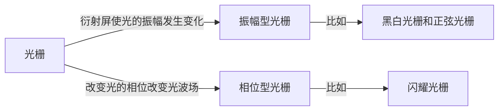

# 多缝夫琅禾费衍射

[TOC]

## 衍射光栅

    

**衍射光栅** —— 具有周期性空间结构或光学性能（如透射和折射等）的衍射屏

光栅的种类有很多，有透射光栅和反射光栅，有平面光栅或凹面光栅，有黑白光栅（朗琴光栅）和正弦光栅，有一维光栅、二维光栅和三维光栅，等等。

**光栅的衍射场鲜明地表现出 “多光束干涉” 的基本特征** —— 参与叠加的单元越多，则叠加后光场的方向性越强，单色性越好。正是因为这点，光栅衍射常被用来分析光谱，也可用来分析结构。

## 黑白光栅

### 实验装置

在一个不透光的屏上，周期性地分布着一系列透光狭缝，这就是一种最简单的黑白光栅[^黑白光栅]。采用夫琅禾费衍射方式，平行光向光栅入射，光栅之后，有一焦距为 $f$ 的会聚透镜，将衍射光会聚到位于透镜焦平面处的接收屏上。

   

**光栅参数**

* $a$：每一个单元透光部分的宽度
* $b$：每一个单元不透光部分的宽度
* $d$：光栅的结构周期，通常称作光栅常数

### 衍射强度

    

光栅衍射（多缝夫琅禾费衍射）是两个过程综合的结果

* 光栅的每一个单元是次波的叠加，即衍射过程
* 不同的单元之间是分立的衍射波之间的叠加，即干涉过程

若采用衍射积分方法分析，则在近轴条件下，先对每一狭缝求衍射积分，再将各个缝的衍射积分相加。

近轴条件下，第 $n$ 个狭缝的衍射积分

$$
\begin{aligned}
    \widetilde{U}_n(P)&=K\iint_{\Sigma_n}\widetilde{U}_0(Q)F_n(\theta_0,\theta)\frac{e^{ikr_n}}{r_n}\mathrm{d}\Sigma_n\\
    &=\frac{K\widetilde{U}_0(0)}{f}\int_{\Sigma_0}e^{ikr_n}\mathrm{d}\Sigma_n
\end{aligned}
$$

设有 $N$ 道狭缝，则每一个狭缝的光在 $P$ 进行干涉叠加的复振幅为

$$
\widetilde{U}(P)=\frac{K\widetilde{U}_0(0)}{f}\sum_{n=1}^N\left(\int_{\Sigma_0}e^{ikr_n}\mathrm{d}\Sigma_n\right)
$$

    

在第 $n$ 个狭缝中，位置在 $x_n$ 的点光源发出的光与狭缝中心发出的光到达 $P$ 点的光程差为 $\Delta r_n=-x_n\sin\theta$，即 $r_n=L_n-x_n\sin\theta$，可根据单缝衍射的分析思路得到

$$
\begin{aligned}
    \widetilde{U}(P)&=\frac{K\widetilde{U}_0(0)}{f}\sum_{n=1}^N\left(\int_{-a/2}^{a/2}e^{ikr_n}\mathrm{d}x_n\right)\\
    &=\underset{单缝衍射}{\boxed{K\frac{\widetilde{U}_0(0)}{f}\int_{-a/2}^{a/2}e^{-ikx_n\sin\theta}\mathrm{d}x_n}}\cdot\underset{多光束干涉}{\boxed{\sum_{n=1}^Ne^{ikL_n}}}\\
    &=\widetilde{U}(\theta)\widetilde{N}(\theta)
\end{aligned}
$$

根据单缝衍射的结果直接得到 **单元衍射因子**

$$
\widetilde{U}(\theta)=aK\frac{\widetilde{U}_0(0)}{f}\boxed{\frac{\sin u}{u}}\hspace{5ex}u=\frac{\pi a}{\lambda}\sin\theta
$$

通过相邻狭缝中心的光的光程相差 $\Delta L=-d\sin\theta$，等比级数求和得到 **$N$元干涉因子**

$$
\widetilde{N}(\theta)=e^{i(N-1)\beta}\boxed{\frac{\sin N\beta}{\sin\beta}}\hspace{5ex}\beta=\frac{\pi d}{\lambda}\sin\theta
$$

最后得到黑白光栅的衍射光强分布

$$
\boxed{I(\theta)=I_0\left(\frac{\sin u}{u}\right)^2\left(\frac{\sin N\beta}{\sin\beta}\right)^2}
$$

光栅衍射的光强分布相当于单缝衍射因子对多缝干涉因子的调制，只有在单缝衍射的中央主极大内才有比较强的光强分布。**多缝衍射体现了“多光束干涉”的特点 —— 出现了一系列细锐的衍射峰**

   

### 衍射花样

#### $\left(\frac{\sin N\beta}{\sin\beta}\right)^2$ —— 缝间干涉因子的特点

**主极大**

*位置*

$$
\left(\frac{\sin N\beta}{\sin\beta}\right)'=0\xrightarrow{其中一组解}\begin{cases}
    \sin N\beta=0\\
    \sin\beta=0
\end{cases}\Rightarrow\beta=k\pi\Rightarrow\sin\theta=k\frac{\lambda}{d}\hspace{5ex}k=0,\pm1,\pm2,\cdots
$$

*数目*

$$
\sin\theta\leqslant1\Rightarrow k_{\max}=\left[\frac{d}{\lambda}\right]
$$

*强度*

$$
I=N^2I_0\left(\frac{\sin u}{u}\right)^2
$$

每一主极大值代表接收屏上的一根亮条纹，即衍射光谱线，$k$ 为谱线级数，夫琅禾费最早研究光栅的衍射谱线，总结了至今通用的 **光栅公式**。

$$
\boxed{\sin\theta=k\frac{\lambda}{d}}
$$

光谱线的位置与狭缝个数 $N$ 无关，由 $d,k,\lambda$ 决定，谱线位置与衍射因子无关。谱线强度与 $N^2$ 成正比，同时受到衍射因子调制。

**极小值**

*位置*

$$
\frac{\sin N\beta}{\sin\beta}=0\Rightarrow\begin{cases}
    N\beta=0\\
    \beta\neq0
\end{cases}\Rightarrow\sin\theta=\left(k+\frac{m}{N}\right)\frac{\lambda}{d}\hspace{5ex}\left(\begin{aligned}
    k&=0,\pm1,\pm2,\cdots,\pm n\\
    m&=1,2,3,\cdots,N-1
\end{aligned}\right)
$$

*数目*：每两个相邻的主极大之间有 $N-1$ 个极小值

**次极大**

*位置*：$\left(\frac{\sin N\beta}{\sin\beta}\right)'=0$ 的另一组解

*数目*：每两个相邻暗线之间存在一个次极大，因此每两个相邻衍射谱线之间存在 $N-2$ 个次极大

#### $\left(\frac{\sin u}{u}\right)^2$ —— 单缝衍射因子的作用

多缝衍射的光强分布受单缝衍射因子的调制，在干涉因子的主极大值与衍射因子的极小值重合的位置产生 **缺级**

$$
\begin{cases}
    干涉极大位置\Rightarrow \sin\theta_1=k_1\lambda/d\\
    衍射极小位置\Rightarrow\sin\theta_2=k_2\lambda/a
\end{cases}\xrightarrow{\theta_1=\theta_2}\frac{k_1}{k_2}=\frac{d}{a}
$$

   

## 正弦光栅[^正弦光栅]

正弦光栅的瞳函数为

$$
\widetilde{U}(x)=\widetilde{U}_0\left(1+\cos\frac{2\pi}{d}x\right)
$$

多缝衍射的精髓在于单元衍射与 $N$ 元干涉的过程，正弦光栅衍射与黑白光栅衍射的区别仅在于单元衍射因子的不同。对于正弦光栅，其单元衍射因子为

$$
\begin{aligned}
    \widetilde{U}(\theta)&=K\widetilde{U}_0\frac{e^{ikr_0}}{f}\int_{-d/2}^{d/2}\left(1+\cos\frac{2pi}{d}x\right)e^{-ikx\sin\theta}\mathrm{d}x\\
    &=dK\widetilde{U}_0\frac{e^{ikr_0}}{f}\left[\frac{\sin\beta}{\beta}+\frac{1}{2}\frac{\sin(\beta-\pi)}{\beta-\pi}+\frac{1}{2}\frac{\sin(\beta+\pi)}{\beta+\pi}\right]
\end{aligned}
$$

可根据单元衍射因子分析正弦光栅的光谱

   

* 相当于具有三个缝宽为 $d$ 的单缝衍射因子，狭缝的中心分别在 $\beta=0,\pi,-\pi$ 处
* 三个单缝中心正是多元衍射因子 $\widetilde{\N}(\theta)$ 的 $0$ 级和 $\pm1$ 级的位置，所以只有三级衍射，其余级次全部抵消

[^黑白光栅]:黑白光栅：透光部分与遮光部分截然分开，狭缝处，透过率为 $1$，其他部分，透过率为 $0$。
[^正弦光栅]:正弦光栅：具有可以用正弦或余弦函数表示的振幅透过率，其透过率往往表示为 $t\propto1+\cos\frac{2\pi}{d}x$