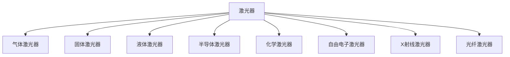
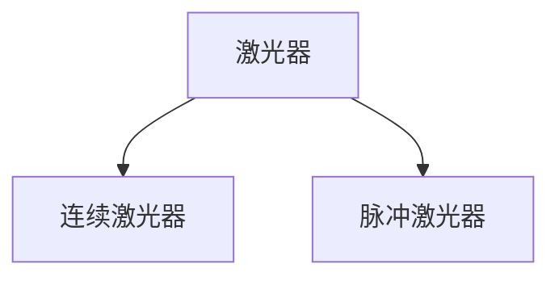
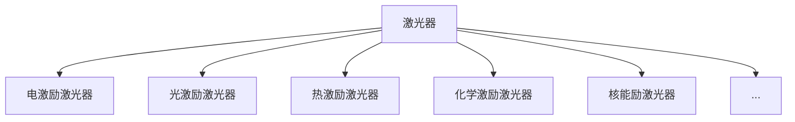
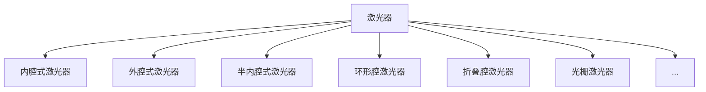
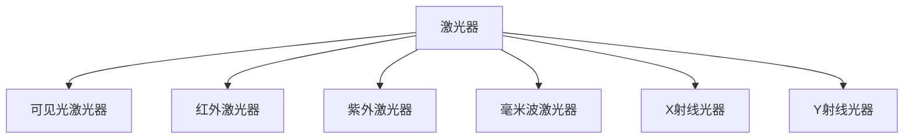
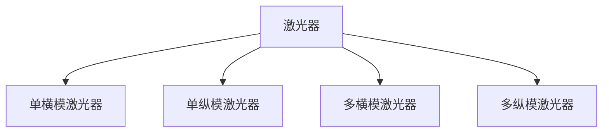
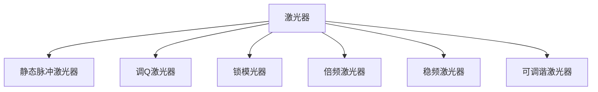

## 激光器的分类

### 按工作物质分

### 按工作方式分

### 按激励源分

### 按谐振腔结构分

### 按输出激光的波谱分

### 按激光束模式分

### 按激光技术分

## 激光原理核心

### 什么是激光

受激辐射光放大

### 激光器工作原理

泵浦源提供能量将低能态的粒子抽运到高能态，工作物质的亚稳态特性使粒子较长时间处于高能态，实现粒子数反转。自发辐射释放的光子作用于高能态的粒子，使其受激辐射产生同态光子。这些同态光子经反射镜多次在工作物质中通过，实现光放大，产生激光。

### 激光器的核心

在最节省材料、最节省空间的前提下，最大效率地产生大量同态光子。